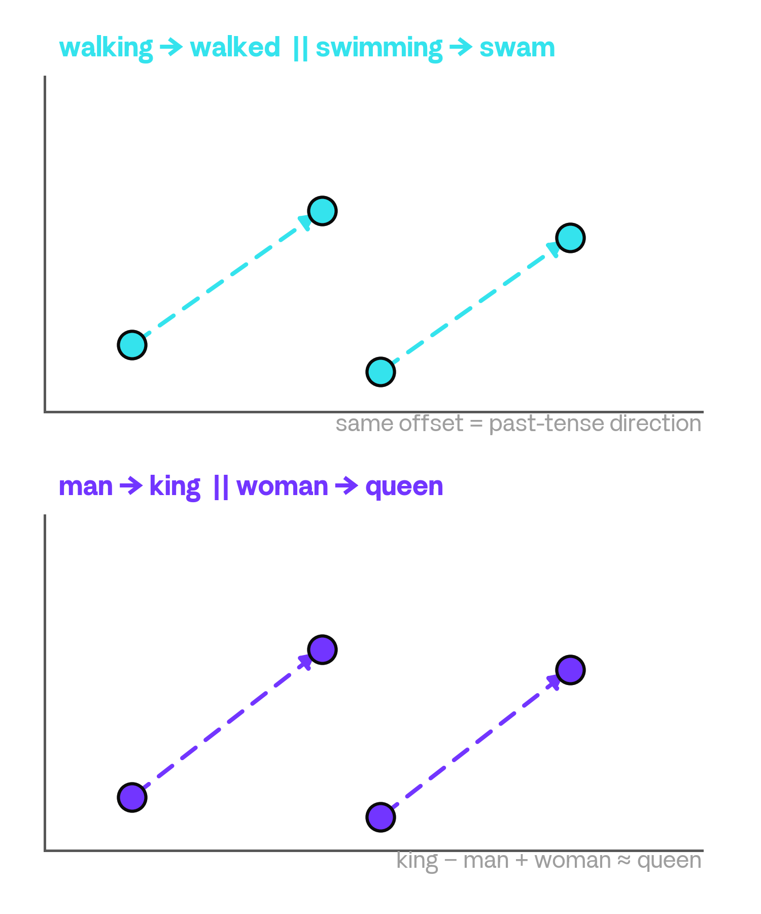

<!-- _class: cover -->

<!--
封面文字（課名、講者、日期）都在 assets/bg/cover.png 裡。
給 Harry 的 Affinity 排版意圖：
- Title L1（白）：機器，是怎麼讀懂一句話的?
- Title L2（灰）：從 MLP 到 Transformer 的演進
- Meta：Harry 張祺煒 · SITCON Camp 2026｜ML · 2026-07-10
-->

---

<!-- _class: toc -->
<!-- footer: Outline -->

<!--
大綱文字在 assets/bg/toc.png 裡。
給 Harry 的 Affinity 排版意圖（五組：灰色編號 + 白色問句 + 灰色子項，
右對齊虛線導引到頁碼；頁碼對應合併版 deck/course2.md（39 頁））：

01. 文字怎麼變數字?
    - Tokenizer 探索站 ……… P. 05
    - Embedding 探索站 ……… P. 10
    - 語意裡的偏見 ……… P. 12
02. 直接餵給 MLP 會怎樣?
    - bag-of-embeddings ……… P. 16
    - 順序撞牆站 ……… P. 19
    - 順序丟不得 → RNN ……… P. 21
03. 怎麼把「順序」吃進去?
    - next-token 站 ……… P. 24
    - RNN 視覺化 ……… P. 27
    - RNN 的兩道牆 ……… P. 28
04. 能不能讓每個字直接互看?
    - attention ……… P. 30
    - PE / residual ……… P. 33
    - Q / K / V ……… P. 35
05. 這些零件能拼出什麼?
    - 三架構一條線 ……… P. 37
    - 銜接第三堂 ……… P. 38
-->

---

<!-- _class: divider -->
<!-- footer: 文字怎麼變數字 -->


<!-- 分節文字（Section 01. + 問句「文字，怎麼變成數字?」）都烘在 divider-01.png 裡。 -->

<!--
講者備忘：這是 Loop 0 的進場。整個 Loop 的路線一句話講完：先用 tokenizer 把句子切成 token，再用 embedding 把 token 變成有語意的數字，最後用 bias 例子收尾。這頁只丟問題，不給答案。
自學備註：這一節要回答的核心問題就是標題這句「文字怎麼變成數字」。模型內部只有數字，所以任何文字任務的第一步，都是把字變成一排數字。接下來三站會依序拆解：tokenizer（切）、embedding（編碼與語意）、以及語意裡藏著的偏見。
-->

---

<!-- _class: statement -->

# 上一堂的模型，看不懂字

上一堂，模型只吃得下數字。

這堂課的輸入，是**一句話**。

_要餵文字進模型，得先把字變成數字。_

<!--
講者備忘：先點出落差再帶工具，別急著給答案。問學生：上一堂餵的是數字，這堂想餵一句話，中間差了什麼? 讓他們自己說出「文字要先變成數字」。
自學備註：上一堂 MLP 吃的是數值特徵，這堂的輸入卻是自然語言。這中間的鴻溝就是 Loop 0 要補的：把一句話轉成模型能吃的數字。這頁只負責把牆立起來，怎麼跨過去留給後面的站。
-->

---

# 換你動手 _Tokenizer 探索站_

丟一段字進去，看它被切成哪些 **token**：

- 換不同的字、標點、中英文混著寫
- 注意：一個「字」常被拆成好幾塊

<span class="chip">🛠 apps/course2 · Tokenizer 探索站</span>

<!--
講者備忘：開站後閉嘴讓學生玩，教學發生在工具裡不在這頁。巡場時丟提示：空格和大小寫也算數、罕見字會被切得很碎、同一個詞在句首句中切法可能不同。
自學備註：tokenizer 是把原始文字切成一顆顆 token 的規則。重點是切法不直覺：一個中文「字」常被拆成好幾塊，英文長詞也會被拆成字塊。動手換不同輸入，就能親眼看到「模型讀到的單位」和「你以為的字」不一樣。
-->

---

# 模型眼中，只有 Token 和編號

```text
Text        今天天氣很好
            今天 · 天氣 · 很 · 好

Token IDs   [37271, 42342, 33091, 2574]
```

同一句話的兩種視角：字是給你看的，模型只看得到 **token** 和它的編號。

<!-- TODO(Harry)：換成 platform.openai.com/tokenizer 的兩格截圖（左 Text 彩色切塊、右 Token IDs 陣列），取代這個示意用 code block。 -->

<!--
講者備忘：強調上下兩排是「同一句話」的兩種視角。追問：這些編號有大小關係嗎? 37271 比 2574「大」代表什麼嗎? 引導出答案：不代表任何東西，只是查表用的座號。
自學備註：token 的 id 只是一個編號，不是語意。id 相鄰不代表意思相近，id 大小也沒有意義。它純粹是「在詞表裡的第幾格」。正因為編號本身沒有語意，才需要下一步的 one-hot 與 embedding，把「編號」變成「有意義的數字」。
-->

---

# 細與多的折衷 _為什麼切成這樣?_

<div class="caps">
<div class="cap">
<span class="cap-emoji">⧉</span>
<div class="cap-label"><span class="cap-title">照字母切</span><span class="cap-sub">Character-level</span></div>
<div class="cap-div"></div>
<div class="cap-text">'hello' → ['h', 'e', 'l', 'l', 'o']，切最細，一句話變超長。</div>
</div>
<div class="cap">
<span class="cap-emoji">📚</span>
<div class="cap-label"><span class="cap-title">照整詞切</span><span class="cap-sub">Word-level</span></div>
<div class="cap-div"></div>
<div class="cap-text">'祺煒' → [UNK]，詞表爆炸，還老是遇到新詞。</div>
</div>
<div class="cap">
<span class="cap-emoji">✂️</span>
<div class="cap-label"><span class="cap-title">照字塊切</span><span class="cap-sub">Subword</span></div>
<div class="cap-div"></div>
<div class="cap-text">'tokenizer' → ['token', 'izer']，長度與詞表兩邊都顧到。</div>
</div>
</div>

<!--
講者備忘：只講動機，不講 BPE 或歷史。三個膠囊都是先給例子再解釋。'祺煒' 是真的會 OOV 的人名，可以問在場同學：你的名字丟進去會不會也變成 [UNK]? 讓折衷感更具體。
自學備註：為什麼不照字母、也不照整詞? 照字母切，序列會變得超長，模型很難讀完。照整詞切，詞表會爆炸，而且永遠有沒收錄過的新詞變成 [UNK]。subword 取中間：常用字整塊、罕見字拆成字塊，長度和詞表大小兩邊都顧到，這就是現在主流 tokenizer 的做法。
-->

---

# 先攤平成一排 0 和 1 _One-hot Encoding_


###### 圖：跟字典一樣長；每個字互相垂直、兩兩等距，看不出語意

<!--
講者備忘：這是牆。指著圖問：這樣編碼，「貓」和「狗」的距離，跟「貓」和「桌子」的距離一樣嗎? 答案是一樣，這就是問題所在。
自學備註：one-hot 把每個 token 變成一排 0，只有自己那格是 1。向量長度等於整個詞表，又長又稀疏。更關鍵的是任兩個 one-hot 向量都互相垂直、距離都相等，所以看不出任何語意關係，「貓」離「狗」和離「桌子」一樣遠。這個缺陷正是 embedding 要解決的。
-->

---

# 壓短、變密、從資料學 _Token Embedding_


###### 圖：embedding 把語意壓進位置；相近語意的字，位置也相近

<!--
講者備忘：這是解法，對比上一頁的牆。不寫公式，重點只有一句：語意 = 學出來的位置。相近意思的字，位置也相近。
自學備註：embedding 用一張可學習的表，把每個 token 對應到一排較短、較密的數字（維度遠小於詞表）。這些數字不是人規定的，而是模型從大量語料訓練出來的。訓練的結果是：語意相近的字，在這個空間裡的位置也相近。於是「編號」終於變成了「有語意的數字」。
-->

---

# 換你動手 _Embedding 探索站_

這排有語意的數字，就住在一個空間裡。逛一逛：

- 挑一個字，找出離它最近的鄰居
- 注意：哪些字會**靠在一起**

<span class="chip">🛠 apps/course2 · Embedding 探索站</span>

<!--
講者備忘：教學發生在站上。巡場時建議學生試 貓／狗、國王／皇后 這類配對，看它們是不是真的靠在一起。別在這頁講解，讓他們自己逛出「距離即語意」的感覺。
自學備註：上一頁說 embedding 把語意壓進位置，這一站就是去驗證它。挑一個字看它的最近鄰，你會發現鄰居多半語意相關（貓的鄰居可能是狗、貓咪、寵物）。這說明「語意」在這個空間裡是以「距離」呈現的。
-->

---

# 方向是有意義的 _king − man + woman ≈ queen_



###### 圖：man → king，woman → queen；walking → walked 也是同一種平移

<!-- TODO(Harry)：換成兩張 3D 投影截圖（上：時態 walking→walked ∥ swimming→swam；下：性別／皇室 man→king ∥ woman→queen），取代這張暫代的平面示意圖 embedding_analogy.png。 -->

<!--
講者備忘：這是站上沒有的新內容，debrief 的教學重量在這頁。重點是不只「距離」有意義，「方向」也有意義。同一種語意變化（加上皇室、變成過去式）在空間裡是同一個平移向量。可以現場帶一次 king 減 man 加 woman，讓學生猜結果會落在哪。
自學備註：embedding 空間裡，向量的方向也帶語意。從 man 到 king 的位移，和從 woman 到 queen 的位移幾乎平行，所以 king 減 man 加 woman 會落在 queen 附近。同理 walking 到 walked、swimming 到 swam 是同一種「變過去式」的平移。這種類比關係說明語意是有結構的，不只是零散的距離。
-->

---

<!-- _class: statement -->

# 學到語意，也學到了什麼?

方向是從語料學來的。

語料裡有什麼，向量就學到什麼：語意，也包括**偏見**。

_Bolukbasi et al., 2016 · arXiv 1607.06520_

<!--
講者備忘：接著上一頁的類比往下推一步。man:king :: woman:? 這種算術，換個詞就會跑出刻板連結（例如把某些職業和特定性別綁在一起）。這不是模型故意的，是語料裡本來就有的偏見被一起學了進去。引用留在行內，不另開參考頁。
自學備註：既然方向是從語料學來的，語料裡的偏見也會一起被學進向量。Bolukbasi 等人 2016 年的論文（標題就是「Man is to Computer Programmer as Woman is to Homemaker?」）示範了用同樣的類比算術，會得到帶刻板印象的結果。這提醒我們：embedding 學到的是語料的樣子，好的壞的一起學。
-->

---

# 文字，就這樣變成了數字 _Loop 0 小結_

- 切詞成塊：一句話先切成 subword，才有能處理的單位
- 編號無意：one-hot 每個字等距，看不出語意
- 距離即語意：embedding 讓相近的字自然靠在一起
- 偏見殘留：語料裡的偏見，也一起被學進向量

<!--
講者備忘：四點對到 Loop 0 的四個節拍：斷詞、one-hot、embedding 距離、bias。這頁刻意不放 lime，把唯一的強調留給下一頁的橋接問句。快速帶過即可，當作進 Loop 1 前的整理。
自學備註：回顧整個 Loop 0。文字先被 tokenizer 切成 subword，成為能處理的單位；one-hot 只是給編號，看不出語意；embedding 把語意壓成位置，讓距離和方向都有意義；但語料裡的偏見也一起被學了進去。四步走完，一句話就變成了一排排有語意的數字。
-->

---

<!-- _class: statement -->

# 現在，每個字都是一排數字了

那……**就能餵給上一堂的 MLP 了嗎?**

<!--
講者備忘：這是 cliffhanger，故意不回答。丟出問句就停，讓懸念帶進 Loop 1。學生若搶答「可以」，先不評論，下一個 Loop 會讓他們自己撞到順序的牆。
自學備註：每個字現在都是一排數字了，看起來就能直接餵給上一堂學過的 MLP。真的可以嗎? 這個開放問題正是 Loop 1 的起點，答案留到下一節揭曉。
-->

---

<!-- _class: divider -->
<!-- footer: MLP 吃文字 -->


<!-- 分節文字（Section 02. + 問句「直接餵給 MLP，會怎樣?」）都烘在 divider-02.png 裡。 -->

<!--
講者備忘：這一節是整堂課的核心 beat，也是承接 Loop 0 結尾留下的懸念，
上一堂已經知道文字能變成 token 與 embedding，這裡順著問下去：
那就把它直接餵給上一堂教過的 MLP，會怎樣? 進場先把問句丟出來就好，
不要在這頁就爆雷順序會撞牆，讓學生帶著「應該行得通吧」的期待往下走。
自學備註：divider 只有藝術底圖加一句問句，沒有內文、沒有 lime；
footer 也在這裡切成「MLP 吃文字」，之後整節沿用。
-->

---

# 全部平均，變一個向量 _bag-of-embeddings_


###### 圖：一句話 → 查每個 token 的 embedding → 取平均 → 丟進上一堂的 MLP → 正面 / 負面

<!--
講者備忘：這頁是橋接，把上一堂的 embedding 接到上上一堂的 MLP，
用國會發言的情感分析當例子。做法很直接：一句話裡每個 token 各查一條
embedding，全部加起來取平均，一整句就縮成一個固定長度的向量，
再丟進上一堂那顆 MLP，輸出正面或負面。這裡先講「怎麼做、能不能動」，
先別提順序的問題，那道牆留到後面幾頁。
自學備註：把整句壓成一個平均向量，就叫 bag-of-embeddings，一袋字。
圖檔只畫到「句子 → 查 embedding → 取平均成一個向量」這段；
再往後的 → MLP → 情緒 那條尾巴不在 PNG 裡，寫在圖說那行文字上。
-->

---

<!-- _class: statement -->

# 什麼都沒改，丟進去

上一堂的 MLP，原封不動。

它 **居然會動**。

_國會發言進去，情緒出來。_

<!--
講者備忘：這是一個刻意安排的 payoff beat。強調模型一個字都沒改，
就是上一堂那顆做分類的 MLP，我們只是在前面接了「取平均」這一步，
它竟然真的跑得出情緒。先讓「居然會動」這個驚訝落地，
下一頁再往上加準度，讓假安全感一步一步堆高。
自學備註：lime 只落在「居然會動」，因為這頁的重點是那份意外感，
不是數字。國會發言是分類任務的輸入，輸出是正面 / 負面的情緒判斷。
-->

---

# 而且準度，還不錯 _假安全感_

_🔗 Iyyer et al. 2015, Deep Unordered Composition Rivals Syntactic Methods, ACL_

```text
Model      RT     SST-f  SST-b  IMDB   Time(s)
DAN-ROOT   -      46.9   85.7   -      31
DAN-RAND   77.3   45.4   83.2   88.8   136
DAN        80.3   47.7   86.3   89.4   136
NBOW-RAND  76.2   42.3   81.4   88.9   91
NBOW       79.0   43.6   83.6   89.0   91
```

那**不就 MLP 就好了嗎?**

<!--
講者備忘：這頁把假安全感推到最高點。表裡的 DAN 和 NBOW 就是
「詞袋平均加前饋網路」，跟我們剛剛做的 bag-of-embeddings 是同一套路，
而這些是 Iyyer 等人 2015 年 ACL 論文裡真實發表的數字，不是我編的。
準度看起來很體面，於是很自然會冒出「那不就 MLP 就好了嗎?」這個結論。
下一頁馬上戳破它。
自學備註：表格是原始論文的引用結果，橫欄是 RT、SST-fine、SST-binary、
IMDB 四個資料集的準度，加上訓練秒數；「-」是論文自己沒有跑的空格，
不是我漏填。lime 落在整句「不就 MLP 就好了嗎?」，這是全句反問式的
false-security，故意讓它站上最高點。
-->

---

# 先別急著下結論 _順序撞牆站_

同一句話，把字**打散順序**再丟一次：

- 開關 shuffle，看 MLP(bag) 的輸出變不變
- 切成 RNN 再跑一次，比較兩邊

<span class="chip">🛠 apps/course2 · 順序撞牆站</span>

<!--
講者備忘：這是 hand-off，真正的教學發生在站上，投影片只負責把問題丟出去。
帶學生打開順序撞牆站後就閉嘴，讓他們自己動旋鈕：把同一句話的字序打散，
看輸出會不會變。關鍵要讓他們親眼看到 MLP(bag) 在 shuffle 前後輸出
逐字相同，順序資訊被整個丟掉了。巡場時可以丟「不好」對「好不」這種
順序帶訊號的例子當提示。
自學備註：shuffle 開關會把 token 的順序隨機打亂；因為 bag-of-embeddings
是取平均，任何排列的平均都一樣，所以 MLP(bag) 的輸出不會變。
切到 RNN 重跑，就能對照出「有沒有把順序吃進去」的差別。
-->

---

# 故事 vs. 事故 _同一袋字_

<div class="cols">
<div>

### 故事

_📖 一則故事_

</div>
<div>

### 事故

_💥 出事了_

</div>
</div>

同一袋「故」＋「事」，MLP(bag) 卻**分不出來**。

<!--
講者備忘：這頁把牆變具體。同樣是「故」和「事」兩個字，只是順序對調，
語意天差地遠，一個是一則故事、一個是出事了。可是對 bag-of-embeddings
來說，兩者的平均向量一模一樣，MLP 收到的輸入完全相同，輸出當然也相同。
自學備註：兩欄結構刻意對稱，用同一袋字凸顯差別只在順序；
取平均把順序抹掉後，「故事」和「事故」在模型眼中就是同一個輸入，
所以它分不出來。lime 只留給「分不出來」。
-->

---

# 問題不在準度，在假設

- MLP 的設計裡，沒有「順序」這回事
- 「故事」＝「事故」   _在它眼中一模一樣_
- 我們需要一個**假設順序有意義**的架構 → RNN

<!--
講者備忘：這頁把牆收束成一句話：問題不在準度不夠，而在假設。
MLP 這個架構本身就沒有「順序」這個概念，這不是 bug，是它的設計裡
根本沒有這個假設。強調任何排列的平均都相同，所以資料再多也補不回
被抹掉的順序，唯一的出路是換一個「假設順序有意義」的架構，也就是 RNN。
這句 lime 就是 Loop 2 的門。
自學備註：缺少順序假設跟訓練不足是兩回事；再多資料也救不回一個
在數學上就把順序丟掉的模型。lime 落在「假設順序有意義」，直接接到
下一節的 RNN。
-->

<!-- ☕ 這裡休息 10 分鐘：撞牆後的自然斷點。不是一張投影片；Loop 2 的 divider 就是回來上課的 re-entry。 -->

---

<!-- _class: divider -->
<!-- footer: RNN -->


<!-- 分節文字（Section 03. + 問句「怎麼把「順序」吃進去?」）都烘在 divider-03.png 裡。 -->

<!--
講者備忘：這頁同時是 10 分鐘休息後的回場點。開場先把 Loop 1 的結論重新掛上：
MLP 把整句攪成詞袋，沒有任何「順序」的假設，所以「狗咬人」和「人咬狗」在它眼裡
是同一句話。等這個牆重新落地，再把這一節的驅動問題丟出來：那我們該怎麼把順序
真的吃進模型裡?
自學備註：Section 03 要引入 RNN。核心是讓模型一次讀一個 token、並把「記憶」
往後帶，讓前後文的順序第一次開始有意義。
-->

---

<!-- _class: statement -->

# 先玩個遊戲 _猜下一個字_

給你目前的字，猜**下一個字**是什麼。

_「今天天氣真＿＿＿」，你腦中已經有答案了。_

<!--
講者備忘：先不要講架構，直接玩。念出「今天天氣真＿＿＿」，讓學生喊出答案
（好、熱、冷……），等他們喊完再點破：他們其實是用前面看過的字去押下一個字。
接著幫這個遊戲取名字：前文決定下一個字，這就是語言模型整天在玩的遊戲。
自學備註：語言模型的核心任務就是 next-token prediction，給定目前為止的字，
預測下一個最可能的字。前文決定下一個字，這個直覺是這一節之後所有架構的起點。
-->

---

# 換模型來猜 _next-token 站_

丟一句話進去，讓模型押下一個字：

- 調 context 視窗大小，決定它能看多少前文
- 觀察：看得越多，押得**越有把握**

<span class="chip">🛠 apps/course2 · next-token 站</span>

<!--
講者備忘：這頁只負責把問題丟出去，介面參考 Brilliant 的 next-token 互動，
開站後就閉嘴讓學生玩。巡場時給一個任務：找一個句子，讓很小的 context 視窗
押錯、但把視窗放寬後就押對，讓「看得越多越準」變成他們自己驗證出來的結論。
自學備註：context 視窗決定模型能看到多少前文。視窗越大，可用的線索越多，
模型對下一個字的把握（機率）就越高。這頁鋪陳「前文有用」，也悄悄預告了
「前文會越來越長」這個下一頁要處理的問題。
-->

---

<!-- _class: statement -->

# 猜字靠前文 _但句子會一直變長_

猜下一個字，得靠前面看過的字。

_總不能每次都把整段從頭讀一遍。_

模型需要一種能力：把前面**記住、一路帶著走**。

<!--
講者備忘：這是 next-token 站的收束。先講清楚：要猜下一個字，得靠前面看過的字。
接著停一下，讓「不能每次都把整段從頭讀一遍」這個矛盾自己浮出來，再把需求命名為
「記住、一路帶著走」。「記憶」兩個字要讓它落地，因為下一頁的 hidden state
就是這個需求的答案。
自學備註：如果每猜一個字都要把整段前文從頭讀過，計算量會隨句子長度暴增。
比較好的做法是維持一份可以更新、可以往後帶的「記憶」，這正是 RNN 的
hidden state 要做的事。
-->

---

# RNN _一次吃一個 token，把記憶往後傳_

```text
token1 --(hidden state)--> token2 --(hidden state)--> token3 --> ...
```

每讀一個字，就把前面的記憶**更新一次**再傳下去。

<!--
講者備忘：這是靜態版的解說，下一站會把它動畫化，所以這裡只要把鏈條講清楚：
每讀一個 token，就更新一次記憶，再把記憶傳給下一步。強調每一跳用的都是
「同一條記憶通道」，這個一直往後傳、反覆更新的迴圈（recurrence）就是 RNN
的全部把戲。記得接回上一頁的「記住帶著走」。
自學備註：RNN 逐一讀入 token，維持一個 hidden state 當作記憶。每一步用
「當前 token + 上一步的 hidden state」算出新的 hidden state，再往後傳。
因為每一步共用同一組權重、同一條記憶通道，所以叫 recurrent（遞迴）。
-->

<!--
TODO：未來換成 Affinity 手繪 RNN 鏈圖（token 藥丸 + hidden state 箭頭），
放進 slides/figures/ 後改用 COOKBOOK §2.8 figure 原型。
-->

---

# 讓記憶動起來 _RNN 視覺化站_

剛剛是靜態圖，現在看它跑：

- 看 hidden state 一站一站**沿著句子往後流**
- 順便盯著訓練時的 loss 怎麼動

<span class="chip">🛠 apps/course2 · RNN 視覺化站</span>

<!--
講者備忘：一樣是純 hand-off，動畫本身就是教學，不要在這裡先把牆講出來。
巡場時埋兩個觀察點讓學生自己看到：一是句子一長，最前面的資訊會被一路沖淡；
二是訓練時的 loss 會亂跳。這兩個觀察就是下一頁要幫他們命名的兩道牆。
自學備註：這一站把 hidden state 沿序列往後流動的過程視覺化，同時顯示訓練時
的 loss 曲線。先看到現象，下一頁再解釋成因，學生會更有感。
-->

---

# RNN 的兩道牆 _所以還需要下一個架構_

<div class="caps">
<div class="cap">
<span class="cap-emoji">🧠</span>
<div class="cap-label"><span class="cap-title">記憶健忘</span><span class="cap-sub">long-context forgetting</span></div>
<div class="cap-div"></div>
<div class="cap-text">句子一長，前面的資訊被一路沖淡。</div>
</div>
<div class="cap">
<span class="cap-emoji">⚡</span>
<div class="cap-label"><span class="cap-title">訓練不穩</span><span class="cap-sub sm">exploding / vanishing gradients</span></div>
<div class="cap-div"></div>
<div class="cap-text">梯度一路相乘，不是爆炸就是消失，loss 亂跳。</div>
</div>
</div>

<!--
講者備忘：這頁把上一站看到的兩個現象命名成 RNN 的兩道牆。第一道是記憶健忘：
固定大小的 hidden state 是個瓶頸，句子一長，前面的資訊就被後來的內容一路沖淡。
第二道是訓練不穩：梯度要沿著整條鏈相乘往回傳，數值不是越乘越大而爆炸、就是
越乘越小而消失，反映在 loss 上就是亂跳、練不起來。收尾的橋接：RNN 把順序做對
了，但代價是記憶得一站一站傳下去，下一節就問，能不能讓每個字直接互看?這就
帶出 Transformer。
自學備註：hidden state 是固定維度，等於用一個固定大小的容器裝越來越長的歷史，
早期資訊會被稀釋，這是 long-context forgetting。訓練時 backprop through time
會讓梯度沿鏈連乘，導致 exploding / vanishing gradients。這兩點正是 attention
與 Transformer 要解決的問題。
-->

---

<!-- _class: divider -->
<!-- footer: Transformer -->


<!-- 分節文字（Section 04. + 問句）都烘在 divider-04.png 裡。 -->

<!--
講者備忘：這張是 Loop 3 的進場，直接回應上一個 loop 收在 RNN 的那道健忘牆。
先把問題丟出來，讓學生停在「有沒有別條路」的懸念上，別急著給答案；
attention 這個詞留到下一張才揭曉。
自學備註：RNN 靠記憶一站一站往後傳，傳到句子後面就淡了。這裡問的是
能不能換個路子：讓每個字繞過接力，直接看到句子裡所有字。
-->

---

<!-- _class: statement -->

# 不用一站一站傳 _解法切入_

RNN 的記憶，越傳越淡。

換個想法：每個字，直接看所有字。這就是 **attention**。

<!--
講者備忘：一句話講完就好，不要展開任何數學。重點是把「直接連線」取代
「逐站接力」這個畫面種進學生腦裡。
自學備註：RNN 的記憶沿著時間軸一格一格往後搬，越搬越稀薄。attention
換掉這個接力：句子裡每個字都拉一條線直接看到其他所有字，要參考誰就
直接看誰，不必等記憶慢慢傳過來。這就是 Transformer 的核心想法。
-->

---

# 換你動手 _Transformer 站・attention 連線_

點一個字，看它的 **attention** 連到哪些字：

- 換不同的字，看連線怎麼跳
- 注意：相關的字，是不是直接連上了?

<span class="chip">🛠 apps/course2 · Transformer 站</span>

<!-- 站截圖 TBD：Transformer 站 attention 連線視圖，放在下半版。 -->

<!--
講者備忘：開站後就閉嘴，讓學生自己點字玩。巡場時提示他們看一件事：
沒有任何「逐站傳遞」在發生，每個字是直接連到相關的字。
自學備註：在 Transformer 站點一個字，畫面會畫出它的 attention 連到哪些字。
多換幾個字，觀察連線怎麼跳；相關的字通常會被直接連上，而不是繞一大圈
接力過來。
-->

---

<!-- _class: statement -->

# attention 的盲點 _下一道牆_

健忘解決了：每個字都看得到所有字。

但它對**順序**無感。

_把句子打散重排，attention 算出來一模一樣。_

<!--
講者備忘：先肯定 attention 補好了健忘，再翻面點出它的盲點，帶出下一道牆。
可以讓學生先猜：把句子重排，輸出會不會變。
自學備註：attention 只在意「哪些字彼此相關」，不在意「字排在第幾個」。
所以把同一堆字打散重排，它算出來的結果一模一樣。這其實是 Loop 1 詞袋牆
在更高一層的翻版，也是接下來 positional embedding 要補的洞。
-->

---

<!-- _class: statement -->

# 補丁一：把順序塞回去 _Positional Embedding_

attention 分不出誰在前、誰在後。

補一塊 **positional embedding**：把「第幾個」塞回去。

_動手：關掉 PE、打亂順序，看輸出變不變。_

<!--
可壓縮：時間緊時，本張與下一張（residual）先砍（course-spec 明示可略）。
講者備忘：這是可壓縮段的第一塊，時間夠才鋪。重點放在「補一塊把位置塞回去」
的直覺，不要碰任何公式。
自學備註：attention 看得到所有字，卻分不出誰在前、誰在後。positional
embedding 補的就是這塊：把「第幾個」這個位置資訊塞回每個字裡。動手驗證時，
PE 開著把順序打亂、輸出會跟著變；PE 關掉再打亂、輸出卻不變，證明順序資訊
真的被塞回去了。
-->

---

<!-- _class: statement -->

# 補丁二：給資訊一條捷徑 _Residual Connection_

想更聰明就疊更深，但疊深之後 loss 亂跳。

補一條 **residual**：捷徑繞過層，訓練穩下來。

_動手：切 residual on/off，看 loss 穩不穩。_

<!--
可壓縮：時間緊時，本張與上一張（PE）一起砍（course-spec 明示可略）。
講者備忘：可壓縮段的第二塊，和 PE 那張同進退。重點是「疊深會壞、捷徑救回」
的因果，用站上的 loss 曲線當證據。
自學備註：想讓模型更聰明，直覺是把層疊更深，但疊深之後訓練變得不穩，
loss 亂跳。residual 補一條捷徑讓資訊繞過層，訓練就穩下來。站上的證據是
loss 曲線：關掉 residual 時 loss 亂跳，開起來就穩，深層也訓練得動。
-->

---

# attention 怎麼決定看誰 _Query · Key · Value_

<div class="caps">
<div class="cap">
<span class="cap-emoji">🔍</span>
<div class="cap-label"><span class="cap-title en">Query</span><span class="cap-sub">我想找什麼</span></div>
<div class="cap-div"></div>
<div class="cap-text">每個字發出的問題。</div>
</div>
<div class="cap">
<span class="cap-emoji">🏷️</span>
<div class="cap-label"><span class="cap-title en">Key</span><span class="cap-sub">每個字的標籤</span></div>
<div class="cap-div"></div>
<div class="cap-text">拿 Query 來比對的那把鑰匙。</div>
</div>
<div class="cap">
<span class="cap-emoji">📦</span>
<div class="cap-label"><span class="cap-title en">Value</span><span class="cap-sub">內容</span></div>
<div class="cap-div"></div>
<div class="cap-text">對得越上，越多讀這個字的內容。</div>
</div>
</div>

<span class="chip">🛠 poloclub.github.io/transformer-explainer</span>

<!--
講者備忘：QKV 一定要留，砍掉的話 attention 到底怎麼決定看誰就沒解釋了。
保持直覺版比喻：Query 是問題、Key 是標籤（鑰匙）、Value 是內容，
全程不要寫任何公式。
自學備註：每個字都發出一個 Query（我想找什麼），也帶著一個 Key（自己的標籤）。
attention 拿一個字的 Query 去比對每個字的 Key，對得越上，就越多去讀那個字的
Value（內容）。到 transformer-explainer 上看一個字的 Query 被拿去跟每個字的
Key 比對，比對越合、分到的注意力越多。
-->

---

# Transformer 就是這幾塊拼起來 _Loop 3 回顧_

- **attention**：每個字直接看所有字，不必逐站傳記憶
- Positional Embedding：把「第幾個」塞回去
- Residual：捷徑繞過層，訓練穩
- Q / K / V：問題對上標籤，決定看誰

<!--
講者備忘：收束用，把整個 Loop 3 拼回一張圖：一個機制（attention）加三塊
補丁（PE、residual、QKV）。收尾一句話預告 Loop 4 會把 MLP → RNN →
Transformer 串成一條線。
自學備註：Transformer 不是憑空的魔法，而是這幾塊拼起來的：attention 讓每個
字直接看所有字、positional embedding 補回順序、residual 讓深層訓練得穩、
Q/K/V 決定注意力看誰。下一個 loop 會把這三種架構放在同一條演進線上看。
-->

---

<!-- _class: divider -->
<!-- footer: 架構即樂高 -->


<!-- 分節文字（Section 05. + 問句「這些零件，能拼出什麼?」）都烘在 divider-05.png 裡。 -->

---

<!-- footer: 架構即樂高 -->

# 三個架構，其實是三個假設 _MLP → RNN → Transformer_

<div class="caps">
<div class="cap">
<span class="cap-emoji">👜</span>
<div class="cap-label"><span class="cap-title en">MLP</span><span class="cap-sub">沒有順序假設</span></div>
<div class="cap-div"></div>
<div class="cap-text">句子只是一袋字。</div>
</div>
<div class="cap">
<span class="cap-emoji">🔗</span>
<div class="cap-label"><span class="cap-title en">RNN</span><span class="cap-sub">假設順序有意義</span></div>
<div class="cap-div"></div>
<div class="cap-text">用記憶一路帶著走。</div>
</div>
<div class="cap">
<span class="cap-emoji">👀</span>
<div class="cap-label"><span class="cap-title en w5">Transformer</span><span class="cap-sub">假設每個字直接互看</span></div>
<div class="cap-div"></div>
<div class="cap-text">再補上位置與捷徑。</div>
</div>
</div>

<!--
Loop 4（Section 05）由 divider-05 分節頁帶進來，是整堂的收尾，從上一段接下去。

自學備註：三個架構其實是三個對「語言」下的賭注。MLP 沒有順序假設，
把句子當成一袋字，「狗咬人」和「人咬狗」在它眼中是同一袋，
順序資訊在進模型前就消失了。RNN 賭順序有意義，用一個記憶狀態把前面的字
一路帶到後面，但帶得越遠、記憶越淡。Transformer 賭每個字都該直接互看，
用 attention 讓任意兩個字直接連線，再補上位置編碼把順序加回來、
用殘差連接讓深層網路撐得住。

講者備忘：從上到下把三個盒子當成一條線唸過去，整堂課就濃縮在這三個盒子裡。
-->

---

<!-- _class: statement -->

# 零件拼起來，就是大模型 _銜接第三堂_

記憶、直接互看、位置、捷徑。

_這些就是你剛剛親手看過的零件。_

下一堂，我們拿它來**玩**：LoRA、生成、RL。

<!--
自學備註：這一頁的四個關鍵詞就是這堂課親手看過的四個零件：
記憶（RNN）、直接互看（attention）、位置（positional encoding）、捷徑（residual）。
真正在用的大型語言模型，就是把這些同樣的零件疊得更深、規模放得更大而已，
沒有第五種魔法。

講者備忘：唸完四個零件後停一拍，再把「玩」這個 lime 字丟出去，
帶到第三堂：拿這些零件去做 LoRA 微調、文字生成、RL。
-->

---

<!-- footer: Resources -->

# 帶回家的東西 _Resources_

- Next-token 預測的直覺：Brilliant `brilliant.org`
- 點得到的 attention：**Transformer Explainer** `poloclub.github.io/transformer-explainer/`
- 詞向量偏見的原始論文：Bolukbasi et al., 2016 `arXiv:1607.06520`

<!--
自學備註：
- Brilliant（brilliant.org）用互動小遊戲把 next-token 預測的直覺建起來，
  接續 Loop 2 玩過的接字遊戲。
- Transformer Explainer（poloclub.github.io/transformer-explainer/）
  是 Loop 3 那一站的參考視覺化，attention 每一條線都點得到，
  回家值得慢慢重看一次。
- 詞向量偏見的原始論文完整標題是「Man is to Computer Programmer as Woman is
  to Homemaker? Debiasing Word Embeddings」，作者 Bolukbasi, Chang, Zou,
  Saligrama, Kalai，NeurIPS 2016，arXiv:1607.06520，
  就是 Loop 0 講 embedding 偏見時引用的原始來源。
-->
