<!-- _class: cover -->

<!--
封面文字（課名、講者、日期）都在 assets/bg/cover.png 裡。
給 Harry 的 Affinity 排版意圖：
- Title L1（白）：機器，是怎麼讀懂一句話的?
- Title L2（灰）：從 MLP 到 Transformer 的演進
- Meta：Harry 張祺煒 · SITCON Camp 2026｜ML · 2026-07-10
-->

---

<!-- footer: Outline -->

<!--
講者備忘：一頁把整堂的路線圖交代完，五個問題就是五個 Loop 的進場問句，之後每個 divider 會再單獨丟一次。這頁講快一點，讓學生知道「今天會從切字一路走到 Transformer」，不用細講每個子項。
自學備註：舊版大綱是烘進 assets/bg/toc.png 的靜態圖，頁碼已過期，因此改用 Markdown 重建，五組問句對應五個 Loop，子項是各 Loop 會經過的站與重點；Marp 會自動編頁碼，這裡刻意不寫頁碼。
-->

---

<!-- _class: statement -->

<!-- 呼吸拍：開場約定，建立「隨時舉手」的課堂規範 -->

# 開始之前，一個約定 _有問題，隨時舉手_

今天的東西，第一次聽卡住很正常。

有任何聽不懂的地方，**隨時舉手打斷我**。

_「這個詞沒聽過」「這張圖在畫什麼」「太快了，再講一次」，都是舉手的好理由。_

_你卡住的地方，旁邊的人多半也卡住了。_

<!--
講者備忘：verbatim spine：「今天的東西，第一次聽卡住很正常。有任何聽不懂的地方，隨時舉手打斷我。」開場先把規範立起來：舉手不用等我講完一段，被打斷是這堂課設計的一部分。把三個例子唸出來，特別是「這個詞沒聽過」：今天會出現很多新名詞，沒聽過就是舉手的訊號，不用覺得不好意思。順帶預告：投影片最後有一頁帶回家的名詞對照表，聽過忘記的詞都可以回去查。講完停一拍再進 Loop 0。
自學備註：這頁是課堂約定，不含知識點。這堂課的節奏是「丟問題、動手、撞牆、給工具」，卡住的訊號越早浮出來越好，所以一開始就明說歡迎隨時打斷，並給了三種具體的舉手時機：聽到沒聽過的詞、看不懂投影片上的圖、節奏太快想再聽一次。
-->

---

<!-- _class: divider -->
<!-- footer: 文字怎麼變數字 -->

<!-- 分節文字（Section 01. + 問句「文字，怎麼變成數字?」）都烘在 divider-01.png 裡。 -->

<!-- ⏱ Loop 0：42 min · hands-on 18 -->

<!--
講者備忘：這是 Loop 0 的進場。整個 Loop 一句話講完：先用 tokenizer 把句子切成 token，再用 embedding 把 token 變成有語意的數字，最後用 bias 例子收尾。這頁只丟問題，不給答案。
自學備註：這一節要回答的核心問題就是標題這句「文字怎麼變成數字」。模型內部只有數字，任何文字任務的第一步都是把字變成一排數字。接下來會依序拆解：tokenizer（切）、embedding（編碼與語意）、以及語意裡藏著的偏見。
-->

---

<!-- _class: sparse -->

# 上一堂的模型，看不懂字 _模型只吃數字，這堂的輸入卻是一句話_

### 上一堂

餵進去的是一排數字。

`[5.1, 3.5, 1.4, 0.2]`

_花瓣長度、寬度，本來就是數字。_

### 這堂

餵進去的是**一句話**。

「今天天氣真好」

_模型看不懂字，得先把字變成數字。_

差的那一步，就是**把文字變成數字**。

<!--
講者備忘：verbatim spine：「上一堂餵的是一排數字，這堂想餵一句話，差的那一步，就是把文字變成數字。」先點出落差再帶工具。問學生：中間差了什麼? 讓他們自己說出「文字要先變成數字」。左邊放上一堂鳶尾花那種數值特徵向量，右邊放一句真的中文，對比才具體。
自學備註：上一堂 MLP 吃的是數值特徵（例如花瓣長寬），這堂的輸入卻是自然語言。這中間的鴻溝就是 Loop 0 要補的：把一句話轉成模型能吃的數字。這頁只負責把牆立起來，怎麼跨過去留給後面的站。
-->

---

<!-- _class: statement -->

# 第一步：先切成小塊 _為什麼要先切塊?_

句子有無限多種，沒辦法一句一句對應到數字。

先把句子**切成一小塊一小塊**，這些小塊就叫 token。

_塊的種類是有限的，每一塊才能在詞表裡有自己的編號。_

_負責切塊的工具，就叫 tokenizer，下一站就去玩它。_

<!--
講者備忘：verbatim spine：「句子有無限多種，但塊只有固定那幾萬種。先切塊，每一塊才有辦法給編號。」這頁把「為什麼需要 tokenizer」講白：整句直接對應到數字做不到，因為句子是無限的；切成有限的單位，才能一塊對一個編號。可以用查字典類比：先斷詞，才查得到。講完直接開站。
自學備註：把文字變成數字的第一步是先決定「單位」。句子千變萬化，不可能每句一個編號；但把語言拆成有限的單位（token），就能建一張詞表，每個 token 一個編號。tokenizer 做的就是「拆成單位」這個工作，下一站親手看它怎麼切。
-->

---

# 換你動手 _Tokenizer 探索站_

<h4>你要動的旋鈕</h4>

輸入任意文字，切換**切分方式**（字元／詞／BPE），看同一句話切出不同的 **token** 與 id

<h4>試試看</h4>

- 中英混寫「機器學習的 tokenization」，字元／詞／BPE 各按一次
- 標點與空格「你好！！！」，看空格怎麼被標記
- 罕見詞、自己的名字「祺煒」，在字元／詞模式看會不會變成 [UNK]（沒看過的詞）

<h4>你應該會看到</h4>

換一種切法，同一句話就變成不同數量、不同邊界的 token。

<h4>檢核點</h4>

我按過三種切法，看到同一句話的 token 數和切分邊界都不一樣。

🛠 講師畫面／各組電腦已開好 · <a href="https://camp.harrychang.me/tokenizer">/tokenizer</a>

<!-- STATION SPEC: Tokenizer 探索站 must accept free-text input (中英混寫、標點、空格、任意罕見詞／人名) and a 切分方式 toggle (字元／詞／BPE), and for that input display the coloured token segmentation, the numeric token id under each chip, and live token counts. BPE runs the live Qwen tokenizer (server) with a rule-based fallback; 字元／詞 are rule-based in-browser. -->

<!--
講者備忘：本站 10 分鐘，其中 8 分鐘放手讓學生玩，教學發生在工具裡不在這頁。開站後閉嘴，巡場時丟提示：空格和大小寫也算數、罕見字會被切得很碎、同一個詞在句首句中切法可能不同。
自學備註：tokenizer 是把原始文字切成一顆顆 token 的規則。重點是切法不直覺：一個中文「字」常被拆成好幾塊，英文長詞也會被拆成字塊。動手換不同輸入，就能親眼看到「模型讀到的單位」和「你以為的字」不一樣。
-->

---

# 模型眼中，只有 Token 和編號

### Text 視角

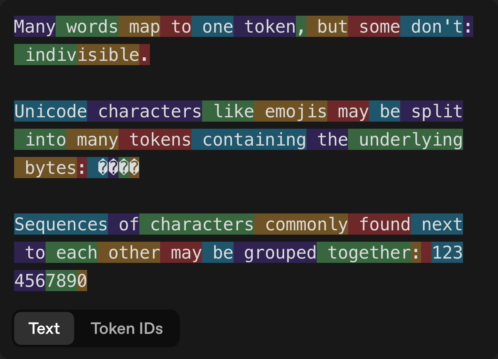

###### 彩色切塊：一句話被切成一顆顆 token

### Token IDs 視角

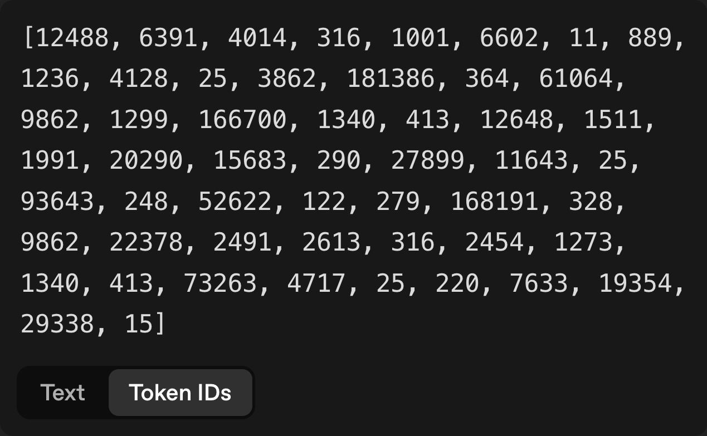

###### 每顆 token 一個編號，是座號不是語意

所以在模型眼中，只有 **token** 和它的編號。

<!--
講者備忘：強調左右是「同一句話」的兩種視角。追問：這些編號有大小關係嗎? 37271 比 2574「大」代表什麼嗎? 引導出答案：不代表任何東西，只是查表用的座號。
自學備註：token 的 id 只是一個編號，不是語意。id 相鄰不代表意思相近，id 大小也沒有意義，它純粹是「在詞表裡的第幾格」。正因為編號本身沒有語意，才需要下一步的 one-hot 與 embedding，把「編號」變成「有意義的數字」。
-->

---

# 細與多的折衷 _為什麼切成這樣?_

🔡

照字母切Character-level

'hello' → ['h', 'e', 'l', 'l', 'o']，切最細，一句話變超長。

📚

照整詞切Word-level

'祺煒' → [UNK]，詞表爆炸，還老是遇到新詞。

✂️

照字塊切Subword

'tokenizer' → ['token', 'izer']，長度與詞表兩邊都顧到。

<!--
講者備忘：三個膠囊逐步出現（fragment），一次講一種切法：先字母、再整詞、最後 subword 收在折衷。只講動機，不講 BPE 或歷史。三個膠囊都是先給例子再解釋。'祺煒' 是真的會 OOV 的人名，可以問在場同學：你的名字丟進去會不會也變成 [UNK]? 讓折衷感更具體。
自學備註：為什麼不照字母、也不照整詞? 照字母切，序列會變超長，模型很難讀完；照整詞切，詞表會爆炸，而且永遠有沒收錄過的新詞變成 [UNK]。subword 取中間：常用字整塊、罕見字拆成字塊，長度和詞表大小兩邊都顧到，這就是現在主流 tokenizer 的做法。
-->

---

<!-- _class: statement -->

# 編號，只是座號 _光有座號，還不夠_

編號只回答了「是哪個字」，

沒回答「**跟哪些字像**」。

_「貓」是 3711 號、「狗」是 890 號：從號碼完全看不出牠們有關係。_

<!--
講者備忘：verbatim spine：「編號只回答『是哪個字』，沒回答『跟哪些字像』。」這頁把「為什麼還要 embedding」立成一句話：座號查得到字，但字和字的關係全都不在號碼裡。丟一個問題：那要怎麼把「像不像」也塞進數字裡? 下一頁先看一個最直接、但失敗的做法（one-hot），再給解法。
自學備註：token id 是「詞表裡的第幾格」，純粹是座號，號碼相鄰不代表意思相近。可是語言任務需要的正是「這個字跟哪些字像」的資訊。接下來兩步：one-hot 是最直接的編碼法，但它保留不了任何「像」的資訊（這就是牆）；embedding 才把「像」變成「距離近」（這是解法）。
-->

---

# 從編號到有語意的數字 _一個失敗的做法 vs 一個成功的做法_

### 每個字自己一格

一整排 0，只有「這個字」那一格是 1。

###### 任兩個字的距離**全都一樣**，看不出誰跟誰比較像（這就是牆）

### 把意思變成位置

一排學出來的數字，位置就是意思。

###### 這個做法叫 **embedding**：意思相近的字，距離也近（這是解法）

<!--
講者備忘：左邊是牆，右邊是解法，一頁對照完；右欄是 fragment，先只給左欄（one-hot），問完「貓和狗的距離」那個問題、學生答完，再按出右欄。左欄先講白話：整排都是 0，只有這個字自己那一格是 1，等於只回答「是哪個字」，沒有回答「像哪個字」。指著左圖問：這樣編碼，「貓」和「狗」的距離，跟「貓」和「桌子」的距離一樣嗎? 答案是一樣，這就是問題。右圖不寫公式，重點一句：語意 = 學出來的位置，距離近 = 意思近。命名拍在右欄字幕：等距離近的圖看懂了，再唸出「這個做法叫 embedding」，名字最後才登場。
自學備註：左欄「每個字自己一格」的編法把每個 token 變成一排 0，只有自己那格是 1；這排數字（向量，就是一排數字的正式說法）長度等於整個詞表，又長又稀疏，且任兩個字的距離全都相等，看不出語意。這種編法的正式名稱叫 one-hot，想深入可以查。embedding 則用一張可學習的表，把 token 對應到一排較短較密的數字，這些數字是模型從語料學出來的，結果是語意相近的字位置也相近。
-->

---

# 這些位置是誰排的? _語意是怎麼學出來的_

沒有人動手排。位置是模型在海量文字上玩「猜字遊戲」玩出來的。

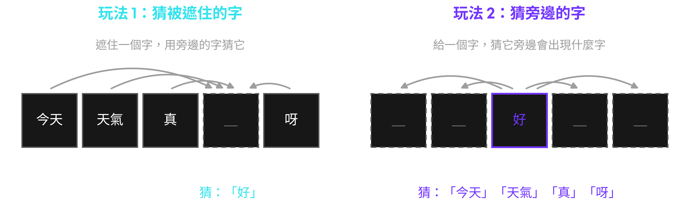

###### 圖：同一句話的兩種玩法，一種猜被遮住的字，一種猜旁邊的字

能在同一種句子裡互換的字，遊戲玩久了，就會被推到**相近的位置**：貓和狗就是這樣變成鄰居的。

<!--
講者備忘：verbatim spine：「沒有人動手排。位置是玩猜字遊戲玩出來的。」現場玩一輪：唸「今天天氣真＿」，讓學生喊答案，再點破：你們剛剛做的就是模型在做的事，差別是它玩了幾十億輪，而且每玩一輪就把字的位置微調一次。收尾埋伏筆：Loop 2 開場的「猜下一個字」遊戲，就是同一件事的放大版。這是約 2 分鐘的橋接頁，不進公式、不講 loss；面上刻意不出現 word2vec／CBOW／skip-gram 這些名字，有學生問再說。
自學備註：embedding 的位置不是人排的，是訓練出來的。做法是玩猜字遊戲：一種玩法遮住句子裡的一個字，用旁邊的字猜它；另一種反過來，給一個字，猜它旁邊會出現什麼字。模型每猜一次就把每個字的位置微調一點，在大量文字上玩幾十億輪之後，能在同一種句子裡互換的字（像 貓 和 狗，常出現在同一種句子裡）會被推到相近的位置。這就是下一站你會看到「距離即語意」的來源。這套做法最有名的版本叫 word2vec，兩種玩法的正式名字是 CBOW（猜被遮住的字）和 skip-gram（猜旁邊的字），想深入可以用這兩個關鍵字去查。
-->

---

# 換你動手 _Embedding 探索站_

<h4>你要動的旋鈕</h4>

打一個詞去搜，切 2D／3D 投影，調 Top K 看它的最近鄰

<h4>試試看</h4>

- 搜「貓」，看鄰居是誰，注意 cat、kitten 也擠在旁邊
- 搜「蘋果」或 apple，看兩種意思的鄰居混在一起
- 隨便打一個雲裡沒有的詞，GPU 會即時算出它的位置

<h4>你應該會看到</h4>

語意相近的字距離也近，而且跨語言成立，貓的旁邊就是 cat。

<h4>檢核點</h4>

我挑的字，最近鄰語意相近，連不同語言的詞也靠在一起。

🛠 講師畫面／各組電腦已開好 · <a href="https://camp.harrychang.me/embedding">/embedding</a>

<!-- STATION SPEC: Embedding 探索站 must render a 2D/3D projection of one shared bilingual (zh+en) embedding space, let the student type any word (in-vocab highlighted instantly, out-of-vocab embedded live by the GPU), adjust Top K, and hover or search to list that word's nearest neighbours with cosine scores so「距離即語意」and its cross-language consistency are directly observable. No analogy arithmetic here (that is the debrief slide). -->

<!--
講者備忘：本站 12 分鐘，其中 10 分鐘放手玩。教學發生在站上，別在這頁講解。巡場時建議學生試 貓／狗、國王／皇后 這類配對，看它們是不是真的靠在一起，讓他們自己逛出「距離即語意」的感覺。
自學備註：上一頁說 embedding 把語意壓進位置，這一站就是去驗證它。挑一個字看它的最近鄰，你會發現鄰居多半語意相關（貓的鄰居可能是狗、貓咪、寵物），這說明「語意」在這個空間裡是以「距離」呈現的。
-->

---

# 方向也有意義，連偏見一起學進來

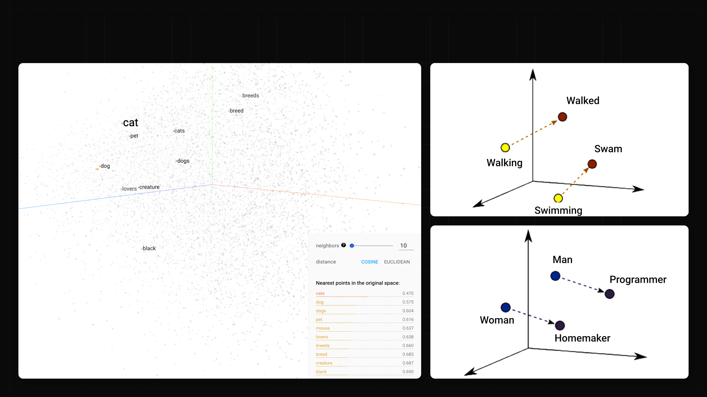

<!--
講者備忘：這是 Embedding 站的 debrief。左邊是學生剛玩過的最近鄰 recap，右邊兩張是站上沒有的新內容、教學重量在這裡：同一種語意變化（變過去式、加上皇室）在空間裡是同一個平移向量。可以現場帶一次 king 減 man 加 woman，讓學生猜結果落在哪。接著推一步：換個詞做同樣算術就會跑出刻板連結，這就是語料偏見。
自學備註：embedding 空間裡向量（就是每個字的那排數字）的方向也帶語意，從 man 到 king 的位移和從 woman 到 queen 幾乎平行，所以 king 減 man 加 woman 會落在 queen 附近。既然方向是從語料學來的，語料裡的偏見也一起被學進向量。Bolukbasi 等人 2016 年的論文示範了同樣的類比算術會得到帶刻板印象的結果，提醒我們 embedding 好的壞的一起學。
-->

---

# 文字，就這樣變成數字 _Loop 0 小結_

✂️

切詞成塊

一句話先切成一顆顆 token，才有能處理的單位。

🔢

編號無意

光給編號，任兩個字的距離都一樣，看不出誰像誰。

🧭

距離即語意

embedding 讓語意相近的字自然靠在一起。

⚖️

偏見殘留

語料裡藏著的偏見，也會一起被學進字的位置裡。

<!--
講者備忘：四個膠囊逐步出現（fragment），一拍一個，對到 Loop 0 的四個節拍：斷詞、one-hot、embedding 距離、bias。這頁刻意不放 lime，把唯一的強調留給下一頁的橋接問句。快速帶過，當作進 Loop 1 前的整理。
自學備註：回顧整個 Loop 0。文字先被 tokenizer 切成一顆顆 token（主流做法是 subword，常用字整塊、罕見字拆塊），成為能處理的單位；光給編號（one-hot）看不出語意；embedding 把語意壓成位置，讓距離和方向都有意義；但語料裡的偏見也一起被學進這些位置。四步走完，一句話就變成了一排排有語意的數字。
-->

---

<!-- _class: statement -->

<!-- 呼吸拍：Loop 0→1 cliffhanger，故意懸念收尾，不加視覺 -->

# 現在，每個字都是一排數字了

那……**就能餵給上一堂的 MLP 了嗎?**

_MLP：上一堂教的網路，一疊會學習的神經元，把一排數字變成答案_

<!--
講者備忘：這是 cliffhanger，故意不回答。丟出問句就停，讓懸念帶進 Loop 1。底下那行灰字是給忘記上一堂的人的救生圈：MLP 就是上一堂那顆網路，唸一次白話解釋再丟問句。學生若搶答「可以」，先不評論，下一個 Loop 會讓他們自己撞到順序的牆。
自學備註：每個字現在都是一排數字了，看起來就能直接餵給上一堂學過的 MLP。真的可以嗎? 這個開放問題正是 Loop 1 的起點，答案留到下一節揭曉。
-->

---

<!-- _class: divider -->
<!-- footer: MLP 吃文字 -->

<!-- ⏱ Loop 1：30 min · hands-on 14 ＋ ☕ 10 min -->

<!-- 分節文字（Section 02. 加問句「直接餵給 MLP，會怎樣?」）都烘在 divider-02.png 裡，這頁不要再放 h1／h2，否則會跟底圖的標題疊字。 -->

<!--
講者備忘：這一節是整堂課的核心 beat，也承接 Loop 0 結尾的懸念。上一堂已經知道文字能變成 token 與 embedding，這裡順著問下去：那就把它直接餵給上一堂教過的 MLP，會怎樣? 進場先把問句丟出來就好，先不要爆雷順序會撞牆，讓學生帶著「應該行得通吧」的期待往下走。
自學備註：divider 只有藝術底圖加一句問句，沒有內文、沒有 lime。footer 也在這裡切成「MLP 吃文字」，之後整節沿用。
-->

---

# 什麼都沒改就餵進去 _詞袋：把一句話拆成一袋字，不管順序，全部平均_

上一堂那顆 MLP 原封不動，一句話進去，情緒出來，它 **居然會動**。

###### 圖：一句話 → 查每個 token 的 embedding → 平均成一排數字 → 丟進上一堂的 MLP → 正面 / 負面

<!--
講者備忘：這頁是橋接，也是刻意安排的假安全感起點。做法很直接：一句話裡每個 token 各查一條 embedding，全部加起來取平均，一整句就縮成一個固定長度的向量，再丟進上一堂那顆分類 MLP，輸出正面或負面。強調模型一個字都沒改，我們只是在前面接了「取平均」這一步，它竟然真的跑得出情緒。先讓「居然會動」的驚訝落地，下一頁再往上加準度。
自學備註：把整句每個字的 embedding 平均成一排數字（一個向量，向量就是一排數字），這個做法叫詞袋，英文名字是 bag-of-embeddings，想深入可以查。圖裡那條 lime 邊框的向量是真的元素平均，用同一組 viridis 配色畫出來，所以「取平均」是誠實的，不是裝飾。這個平均之後也正是撞牆的原因。lime 只落在「居然會動」。
-->

---

# 而且準度，還不錯 _假安全感_

_🔗 Iyyer et al. 2015, Deep Unordered Composition Rivals Syntactic Methods, ACL_

| Model | RT | SST-fine | SST-bin | IMDB | Time (s) |
| --- | --- | --- | --- | --- | --- |
| DAN-ROOT | - | 46.9 | 85.7 | - | 31 |
| DAN-RAND | 77.3 | 45.4 | 83.2 | 88.8 | 136 |
| DAN | 80.3 | 47.7 | 86.3 | 89.4 | 136 |
| NBOW-RAND | 76.2 | 42.3 | 81.4 | 88.9 | 91 |
| NBOW | 79.0 | 43.6 | 83.6 | 89.0 | 91 |

那 **不就 MLP 就好了嗎?**

<!--
講者備忘：這頁把假安全感推到最高點。表裡的 DAN 和 NBOW 就是「詞袋平均加前饋網路」，跟我們剛剛做的 bag-of-embeddings 是同一套路，而這些是 Iyyer 等人 2015 年 ACL 論文裡真實發表的數字，不是我編的。準度看起來很體面，於是很自然會冒出「那不就 MLP 就好了嗎?」這個結論。下一頁馬上戳破它。
自學備註：橫欄是 RT、SST-fine、SST-binary、IMDB 四個資料集的準度，加上訓練秒數。「-」是論文自己沒跑的空格，不是漏填。lime 落在整句反問「不就 MLP 就好了嗎?」，故意讓它站上最高點。
-->

---

# 換你動手 _順序撞牆站_

<h4>你要動的旋鈕</h4>

拖曳詞塊重排；**打亂**隨機洗牌、**還原**回原句。可自己打一句（拆成詞塊，最多 12 個）或選預設句

<h4>試試看</h4>

- 選一個預設句，按「打亂」，盯著左邊的詞袋指紋色帶
- 比「不好」和「好不」，看右邊順序感知的通順度差多少
- 自己打一句，拖曳詞塊換順序，兩邊即時更新

<h4>你應該會看到</h4>

不管怎麼打亂，左邊詞袋指紋（整袋字的平均）動也不動；右邊順序感知的 Qwen（這堂課用的開源語言模型）通順度立刻跟著變。

<h4>檢核點</h4>

我看到打亂前後，詞袋指紋一模一樣，但順序感知的分數變了。

🛠 講師畫面／各組電腦已開好 · <a href="https://camp.harrychang.me/order-shuffle">/order-shuffle</a>

<!-- STATION SPEC: 順序撞牆站需支援拖曳重排與「打亂／還原」按鈕、自由輸入拆成詞塊、詞袋平均指紋（順序不變）與順序感知 Qwen 通順度／困惑度的即時並排對比（course-spec l.80「兩者即時對比」）。 -->

<!--
講者備忘：這是 hand-off，真正的教學發生在站上，投影片只負責把旋鈕與觀察點交代清楚。帶學生打開順序撞牆站後就閉嘴，讓他們自己拖曳、打亂。關鍵是讓他們親眼看到左邊詞袋指紋（平均向量）在打亂前後那條色帶動也不動，順序資訊被整個丟掉了；右邊順序感知那側是真的 Qwen，通順度與困惑度會跟著順序變，兩邊同時擺在一起對照。巡場時用「不好」對「好不」這種順序帶訊號的例子當提示。這站佔 16 分鐘，其中 14 分鐘讓他們動手。
自學備註：打亂會把 token 的順序隨機重排。因為詞袋指紋是把每個 token 的 embedding 取平均，任何排列的平均都一樣，所以那條色帶不會變；同一句話右邊送給 Qwen 這種順序感知的模型，通順度與困惑度（模型覺得這句話有多出乎意料的分數，越低代表越通順）就會跟著順序變，兩相對照就看得出「有沒有把順序吃進去」的差別。
-->

---

# 故事 vs. 事故 _同一袋字_

###### 圖：📖 故事 與 💥 事故 是同一袋「故」＋「事」，只換順序，平均後輸出完全相同

語意天差地遠，它卻 **分不出來**。

<!--
講者備忘：這頁把牆變具體。同樣是「故」和「事」兩個字，只是順序對調，語意天差地遠，一個是一則故事、一個是出事了。可是對 bag-of-embeddings 來說，兩者的平均向量一模一樣，MLP 收到的輸入完全相同，輸出當然也相同，圖裡兩排機率條刻意畫成一模一樣。
自學備註：兩排用同一組類別色（故＝青、事＝紫），只換位置，凸顯差別只在順序。取平均把順序抹掉後，「故事」和「事故」在模型眼中就是同一個輸入，所以它分不出來。機率條是示意，不是量測數字。lime 只留給「分不出來」。
-->

---

# 問題不在準度，在假設

MLP 沒有「順序」這個假設，一袋字怎麼排，平均都一樣。

###### 圖：詞袋把字丟成一堆（無序）· 序列讓字一個接一個（有序）

我們需要一個 **假設順序有意義** 的架構 → RNN。

_RNN：一次讀一個字、把記憶往後傳的網路，下一節的主角_

<!--
講者備忘：這頁把牆收束成一句話：問題不在準度不夠，而在假設。RNN 三個字母第一次出現，用底下那行灰字先給白話印象（一次讀一個字、記憶往後傳），細節留給下一節。MLP 這個架構本身就沒有「順序」這個概念，這不是 bug，是它的設計裡根本沒有這個假設，所以資料再多也補不回被抹掉的順序。唯一的出路是換一個「假設順序有意義」的架構，也就是 RNN。這句 lime 就是 Loop 2 的門。
自學備註：下面那條對照圖把兩種讀法擺在一起，左邊詞袋是一堆無序的字，右邊序列是一個接一個有順序。缺少順序假設跟訓練不足是兩回事。lime 落在「假設順序有意義」，直接接到下一節的 RNN。
-->

---

<!-- _class: statement -->

# 休息 10 分鐘 _喝口水，等等回來拆牆_

10 分鐘後回來，準時開始 RNN。

_實際回來時間由講師現場宣布。_

<!-- 呼吸拍：撞牆後的自然斷點，功能性的休息告示頁，只需告訴學生休息多久、回來要做什麼。 -->

<!--
講者備忘：Loop 1 撞完牆，正好是一個自然的斷點，讓大家喘口氣。宣布明確的回來時間（現場報一個整點時刻），回來直接進 Loop 2 的 RNN，不要拖。footer 仍是「MLP 吃文字」，下一張 Loop 2 divider 才會換成 RNN。
-->

---

<!-- _class: divider -->
<!-- footer: RNN -->

<!-- ⏱ Loop 2：46 min · hands-on 19 -->

<!-- 分節文字（Section 03. + 問句「怎麼把「順序」吃進去?」）都烘在 divider-03.png 裡。 -->

<!--
講者備忘：這頁同時是 10 分鐘休息後的回場點。開場先把 Loop 1 的結論重新掛上：
MLP 把整句攪成詞袋，沒有任何「順序」的假設，所以「狗咬人」和「人咬狗」在它眼裡
是同一句話。等這個牆重新落地，再把這一節的驅動問題丟出來：那我們該怎麼把順序
真的吃進模型裡?
自學備註：Section 03 要引入 RNN。核心是讓模型一次讀一個 token、並把「記憶」
往後帶，讓前後文的順序第一次開始有意義。
-->

---

<!-- _class: statement -->

# 先玩個遊戲 _猜下一個字_

## 今天天氣真 **＿＿**

_你腦中大概已經有答案了，可能是：_ 好／熱／冷

## 今天是夏天，溫度 40 度，今天天氣真 **＿＿**

_前文一多，答案立刻收斂：_ 熱

<!--
講者備忘：這頁用 fragment 分三步出現：候選答案、加長版的句子、收斂後的答案，配合兩拍節奏按。先不要講架構，直接玩，這頁有兩拍。第一拍：先只秀第一句，念出
「今天天氣真＿＿」，讓學生喊出答案（好、熱、冷……），等他們喊完再點破：
他們其實是用前面看過的字去押下一個字。第二拍：把前面補上「今天是夏天，
溫度 40 度，」再問一次，答案會瞬間收斂到「熱」。點出結論：前文越多，押得
越準，這就是語言模型整天在玩的遊戲，也是等一下站上要親手驗證的事。
自學備註：語言模型的核心任務就是 next-token prediction，給定目前為止的字，
預測下一個最可能的字。同一句「今天天氣真＿」，補上「夏天、40 度」的前文後，
答案從 好／熱／冷 收斂到 熱：前文越多，預測越有把握。這個直覺是這一節
之後所有架構的起點。
-->

---

# 換你動手 _next-token 站_

<h4>你要動的旋鈕</h4>

前文視窗（context）大小：模型能看到最後幾個 token；另有 Temperature／Top-k

<h4>試試看</h4>

- 輸入「今天天氣真」或任何一句話，看 GPU 上的 Qwen3 即時列出的候選 token
- 把前文視窗縮到只剩 1~2 個 token，再放寬，看候選字怎麼變
- 找一句「視窗小會押錯、放寬就押對」的話

<h4>你應該會看到</h4>

前文看得越多，押得**越有把握**，候選字的機率更集中。

<h4>檢核點</h4>

我看到前文視窗放寬後，候選字的機率變得更集中。

🛠 講師畫面／各組電腦已開好 · <a href="https://camp.harrychang.me/next-token">/next-token</a>

<!-- STATION SPEC: 自由輸入文字的逐字預測介面，GPU 上的 Qwen3-0.6B 即時算出真實 next-token 機率分布（機率條），主旋鈕為 context 視窗長度（截到最後 N 個 token），另備 Temperature／Top-k，讓「context 越長、機率越集中」可被學員直接觀察。 -->

<!--
講者備忘：這頁只負責把問題丟出去，站上是自由輸入一句話、GPU 上的 Qwen3 即時
列出候選 token 與機率，主旋鈕是 context 視窗（模型能看到最後幾個 token）。開站後
就閉嘴讓學生玩。巡場時給一個任務：找一句話，把 context 縮到只剩 1~2 個 token 會
押錯、放寬就押對，讓「看得越多越準」變成他們自己驗證出來的結論。Temperature、
Top-k 是次要旋鈕，時間夠再讓他們玩，這裡先不主打。
自學備註：context 視窗決定模型能看到多少前文。視窗越大，可用的線索越多，模型
對下一個字的把握（機率）就越集中。這頁鋪陳「前文有用」，也悄悄預告了「前文會
越來越長」這個下一頁要處理的問題。
-->

---

# 看得越多，越有把握 _可是句子會一直變長_

###### 圖：能看到的前文越長，下一個字押得越有把握（示意圖）

猜下一個字靠前文，可是句子會一直變長，得把前面 **記住** 、一路帶著走。

<!--
講者備忘：這是 next-token 站的收束。先用這張圖把站上玩到的現象定影：context
給得越長，把握越高，但會慢慢飽和。接著停一下，讓「句子會一直變長、不能每次
都從頭讀一遍」這個矛盾自己浮出來，再把需求命名為「記住、一路帶著走」。「記住」
兩個字要讓它落地，因為下一頁的 hidden state 就是這個需求的答案。
自學備註：曲線是示意圖，不是實測數字，只表達「單調上升後飽和」的趨勢。如果每
猜一個字都要把整段前文從頭讀過，計算量會隨句子長度暴增；比較好的做法是維持
一份可以更新、可以往後帶的「記憶」，這正是 RNN 的 hidden state 要做的事。
-->

---

# RNN _一次吃一個字，把記憶往後傳_

###### 圖：每讀一個字，更新記憶再傳下去；第一個字的資訊會沿途變淡

每讀一個字，就**更新一次記憶**，再把記憶傳給下一個字。

<!--
講者備忘：verbatim spine：「每讀一個字，就更新一次記憶，再把記憶傳給下一個字。」這是靜態版的解說，下一站會把它動畫化，所以這裡只要把鏈條講清楚：
每讀一個 token，就更新一次記憶（hidden state），再把記憶傳給下一步。強調每
一跳用的都是「同一條記憶通道」，這個一直往後傳、反覆更新的迴圈（recurrence）
就是 RNN 的全部把戲。底部那條由亮到暗的漸層先埋一個伏筆：第一個字的資訊會
沿途被沖淡，下一站就會親眼看到。
自學備註：RNN 逐一讀入 token，維持一個 hidden state 當作記憶。每一步用「當前
token + 上一步的 hidden state」算出新的 hidden state，再往後傳。因為每一步
共用同一組權重、同一條記憶通道，所以叫 recurrent（遞迴）。
-->

---

# 讀一個字，更新記憶，傳下去 _同一個網路，重複用四次_

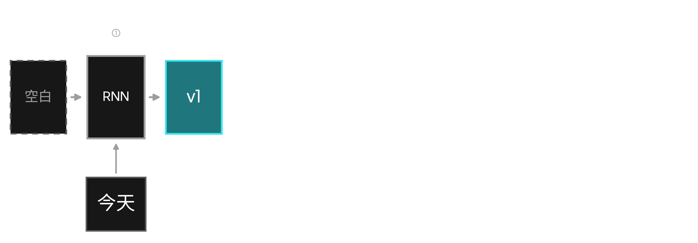

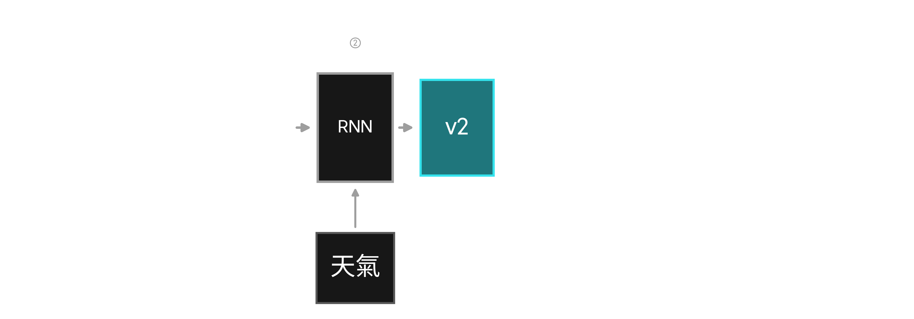

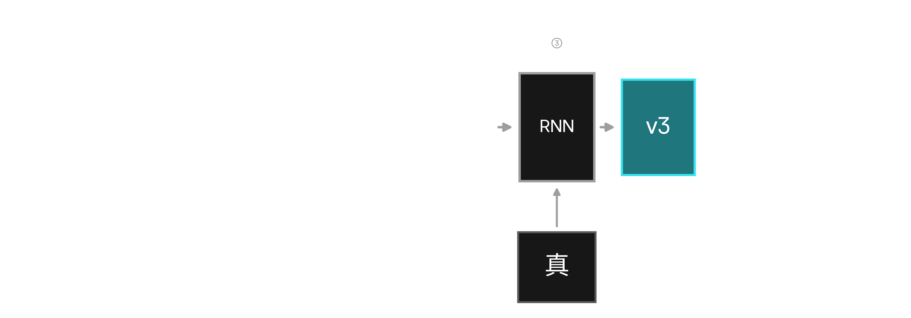

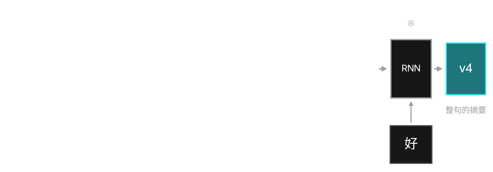

###### 圖：「今天天氣真好」切成四顆 token，一步吃一顆；記憶盒每一步都一樣大

上一步傳出來的記憶，**就是下一步的輸入**。

<!--
講者備忘：verbatim spine：「上一步傳出來的記憶，就是下一步的輸入。」這頁用 fragment 分四步，一步一拍。每按一下，都用同一句三拍口訣旁白：讀一個字、更新記憶、傳下去。第一拍：讀「今天」，記憶還是空白，網路把它變成記憶 v1。之後每一拍都指著那條橫向箭頭講：v1 進去、v2 出來，這條箭頭就是 RNN 的全部。按完第四步停一下，指著 v4 那格：整句話最後就活在這一格裡。兩件事要用嘴巴點破：四個 RNN 框是同一個網路重複用四次，這就是 recurrent 的意思；記憶盒每一步都一樣大，先不解釋為什麼重要。收尾交棒：等一下站上會看到同一件事在 heatmap 上一列一列發生。
自學備註：RNN 每一步做同一件事：把「這一步讀到的 token」和「上一步傳來的記憶」一起餵進同一個網路，算出新的記憶再往後傳。圖上的四個框不是四個網路，是同一個網路被重複使用四次，這正是 recurrent（遞迴）的意思。記憶（hidden state）是一排固定長度的數字，每次更新都是把新資訊混進舊記憶再往後傳；讀完最後一顆 token，v4 就是整句話的摘要。
-->

---

# 換你動手 _RNN 視覺化站_

<h4>你要動的旋鈕</h4>

拖曳滑桿逐 token 前進，看記憶（hidden state）一列列填進格子圖；也可自己打一句丟給 GPU 上的 RNN

<h4>試試看</h4>

- 短句、長句各打一次（或點預設句子）
- 盯住底下那條「影響」列，第一個字到句尾還剩多少
- 拖到句尾，看最早的 token 怎麼被逐漸沖淡

<h4>你應該會看到</h4>

記憶（hidden state）一格格往後填；句子一長，最早那個 token 在「影響」列幾乎**歸零**。

<h4>檢核點</h4>

我看到長句跑到句尾時，第一個字的資訊幾乎不見了。

🛠 講師畫面／各組電腦已開好 · <a href="https://camp.harrychang.me/rnn-viz">/rnn-viz</a>

<!-- STATION SPEC: 自己打句子（丟到 GPU 上訓練好的 GRU）或選預設句子，拖曳滑桿逐 token 前進，hidden state 在 heatmap 上一列列填出（每步可見記憶更新），底下「影響」列顯示每個先前 token 的參考強度，越早的 token 隨距離逐漸淡去。無 loss 曲線。 -->

<!--
講者備忘：一樣是純 hand-off，站上就是拖曳滑桿逐 token 前進的 heatmap，教學發生
在互動裡，不要在這裡先把牆講出來。巡場時埋一個觀察點讓學生自己看到：句子一長，
最前面的資訊會在底下那條「影響」列被一路沖淡到幾乎歸零。這就是下一頁要幫他們
命名的「記憶健忘」牆。訓練不穩那道牆站上沒有 loss 曲線可看，留到下一頁用示意圖帶。
自學備註：這一站把 hidden state 沿序列往後流動的過程視覺化，底下的「影響」列顯示
每個先前 token 對當前記憶的參考強度，越早的 token 隨距離逐漸淡去。先看到現象，
下一頁再解釋成因，學生會更有感。
-->

---

# RNN 撞到的兩道牆 _所以還需要下一個架構_

### 🧠 記憶健忘

_越長越記不住_

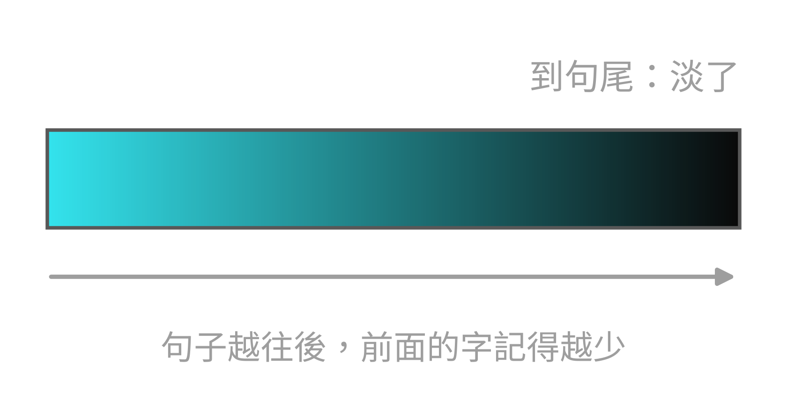

句子一長，前面的資訊被沖淡，長句記不住開頭。

### ⚡ 訓練不穩

_越練越亂跳_

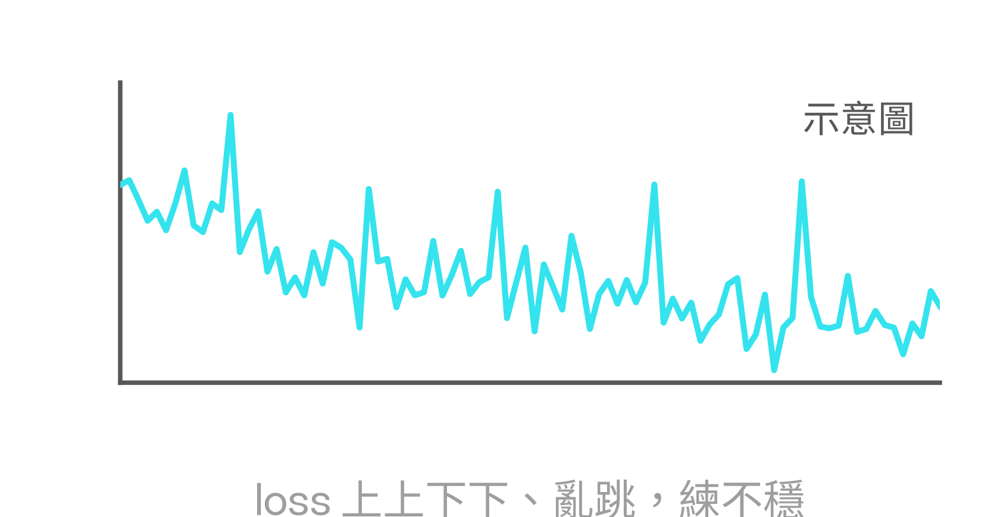

修正訊號沿著長鏈一路相乘，不是爆炸就是消失。

記憶得一站一站傳，那能不能讓每個字 **直接互看** ?

<!--
講者備忘：這頁把上一站看到的兩個現象命名成 RNN 的兩道牆。左邊是記憶健忘：
固定大小的 hidden state 是個瓶頸，句子一長，前面的資訊就被後來的內容一路沖淡。
右邊是訓練不穩：梯度要沿著整條鏈相乘往回傳，不是越乘越大而爆炸、就是越乘越
小而消失，反映在 loss 上就是亂跳、練不起來。收尾的橋接：RNN 把順序做對了，
但代價是記憶得一站一站傳，下一節就問，能不能讓每個字直接互看?這就帶出
Transformer。
自學備註：hidden state（記憶）是固定大小，等於用一個固定大小的容器裝越來越長
的歷史，早期資訊會被稀釋，這道牆的正式名字是 long-context forgetting。訓練不穩
那道牆：訓練時的梯度（每一步告訴網路該往哪修的訊號）要沿著整條鏈一路相乘往回
傳，不是越乘越大就是越乘越小，正式名字是 exploding / vanishing gradients，想
深入可以查這兩個關鍵字。這兩點正是 attention
與 Transformer 要解決的問題。右側 loss 曲線為示意圖。兩張小圖各自置中在
自己的欄位裡（rnn_wall_forget / rnn_wall_unstable，由 generate-rnn-walls.py
一次產出兩檔）。
-->

---

<!-- _class: divider -->
<!-- footer: Transformer -->

<!-- ⏱ Loop 3：36 min · hands-on 23 -->

<!-- 呼吸拍：Loop 3 進場，問句（能不能讓每個字直接看到所有字）烘在 divider-04.png 藝術裡，沒有 h1；直接回應 Loop 2 收在 RNN 的那道健忘牆。 -->

<!--
講者備忘：先把問題丟出來，讓學生停在「有沒有別條路」的懸念上，別急著給答案，
attention 這個詞留到下一張才揭曉。
自學備註：RNN 靠記憶一站一站往後傳，傳到句子後面就淡了。這裡問的是能不能換個
路子：讓每個字繞過接力，直接看到句子裡所有字。
-->

---

# 換個想法 _不用一站一站傳_

###### 左：RNN 記憶一站一站傳，越傳越淡；右：每個字直接連到所有字

與其接力傳記憶，不如讓每個字直接看所有字，這就是 **attention**（注意力）。

_用這一招疊出來的新架構，名字就叫 Transformer。_

<!--
講者備忘：一句話講完就好，不要展開任何數學。重點是把「直接連線」取代「逐站
接力」這個畫面種進學生腦裡；用左右對照把上一個 loop 的健忘牆視覺化回收掉。
兩個名字都在畫面看懂之後才登場：先 attention，再 Transformer，唸完就開站。
自學備註：RNN 的記憶沿時間軸一格一格往後搬，越搬越稀薄。attention 換掉這個
接力：句子裡每個字都拉一條線直接看到其他所有字，要參考誰就直接看誰，不必等
記憶慢慢傳過來。用 attention 當主角疊出來的架構就叫 Transformer，也就是
接下來整節的主角。
-->

---

# 換你動手 _Transformer 站・attention 連線_

<h4>你要動的旋鈕</h4>

滑過**注意力格子圖**，看某個字把多少注意力分給另一個字；再動 Layer × Head 換層換頭。

<h4>試試看</h4>

- 滑過格子圖，找代名詞那一列，看它把注意力分給誰
- 自己打一句有指代的句子，讓 GPU 真的跑一次，再看一次
- 動 Layer × Head，看不同層、不同頭的關注模式怎麼變

<h4>你應該會看到</h4>

每個字直接對整句算注意力，但只看得到自己左邊（右邊還沒出生），相關的字一格就連上，沒有逐站接力。

<h4>檢核點</h4>

我滑到一格，就看到某個字把注意力直接分給了相關的字。

🛠 講師畫面／各組電腦已開好 · <a href="https://camp.harrychang.me/transformer">/transformer</a>

<!-- STATION SPEC: Transformer 站：一條可橫向捲動的真實 forward pass 生產線（輸入 → tokenizer → embedding → attention matrix + MLP → next-token 機率）。數字全是真實 Qwen3-0.6B 輸出（預錄 preset，或打字即時送 GPU 跑）。可轉 Layer／Head／Temperature 三個轉盤；滑過 attention matrix 的格子會跨欄高亮 query／key 兩個 token 並顯示權重。瀏覽器不訓練，只對輸出 logits 做 softmax。此站 12 min、hands-on 10。 -->

<!--
講者備忘：開站後就閉嘴，讓學生自己點字玩約 10 分鐘。巡場時提示他們看一件事：
沒有任何「逐站傳遞」在發生，每個字是直接連到相關的字。用代名詞的例子最有感。
自學備註：在 Transformer 站點一個字，畫面會畫出它的 attention 連到哪些字。多換
幾個字，觀察連線怎麼跳；相關的字通常會被直接連上，而不是繞一大圈接力過來。
-->

---

# 剛剛動的 Head，到底是什麼? _多頭注意力 Multi-head_

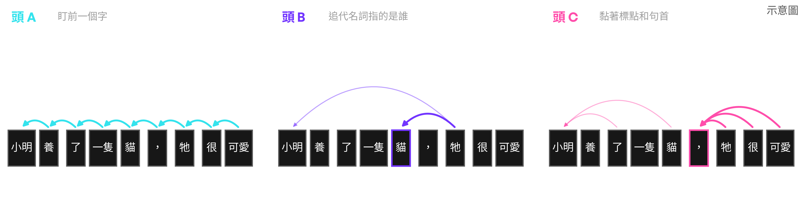

###### 圖：常見的頭大概長這幾種樣子；真實的頭更亂，找不到個性也正常

一個頭一次只能用一種眼光看「誰看誰」，所以 Transformer 開**好幾個頭，各看各的**，最後再合起來。

回站上獵頭：動 Layer × Head，找一個個性最明顯的頭，跟隔壁比誰找到的頭最有戲。

<!--
講者備忘：verbatim spine：「一個頭一次只能用一種眼光看誰看誰，所以 Transformer
開好幾個頭，各看各的，最後再合起來。」接回學生剛剛才摸過的 Layer × Head：
每一格就是一個真實的頭。講完就發任務：回 /transformer 獵頭約 3 分鐘，找個性
最明顯的頭，跟隔壁比。收回來抓一兩組分享找到的頭長什麼樣（常見的有盯前一個字、
黏標點的），順便講清楚：很多頭看不出個性，不是他們找錯，真實模型就長這樣。
自學備註：一個注意力矩陣一次只能表達一種「誰看誰」的關係，multi-head 就是
同一層裡放好幾組獨立的注意力，讓同一句話同時被好幾種眼光看，最後把每個頭
看到的合起來送進下一層。頭的分工是訓練中自己長出來的，沒有人指定哪個頭做
什麼；有的頭有明顯個性（盯前一個字、追代名詞、黏標點），更多頭看不出個性，
這很正常。到站上動 Layer × Head，每一格就是 Qwen3 的一個真實的頭。
-->

---

# 拼起來，就是 Transformer _這個 Loop 的三塊_

👀

注意機制Attention

每個字直接看到句子裡的所有字，不必逐站傳記憶。

🎭

多頭Multi-head

好幾個頭同時看同一句話，各看各的，最後再合起來。

🕶️

只看左邊Causal

接龍時右邊的字還沒出生，每個字只看得到自己左邊。

<!--
講者備忘：三個膠囊逐步出現（fragment），一拍一塊。收束用，把整個 Loop 3 拼回
一張圖：attention 讓每個字直接互看、多頭讓同一句話被好幾種眼光看、causal 讓
接龍只看左邊。最後一行指一下就好：工程補丁在附錄，課上不展開。收尾一句話預告
Loop 4：會把 MLP → RNN → Transformer 串成一條演進線，再帶到第三堂能拿這些
零件玩什麼。
自學備註：這個 Loop 教的 Transformer 是三塊拼起來的：attention 讓每個字直接
看所有字、multi-head 讓同一句話同時被好幾種眼光看、causal 遮罩讓生成時每個字
只看得到左邊。真正的 Transformer 還有幾塊工程補丁（位置怎麼塞回去、深層怎麼
訓練得穩、注意力怎麼決定看誰），整理在最後的附錄。下一個 loop 會把這三種架構
放在同一條演進線上看。
-->

---

<!-- _class: divider -->
<!-- footer: 架構即樂高 -->
<!-- ⏱ Loop 4：10 min · 收尾 -->

<!-- 分節文字（Section 05. + 問句「這些零件，能拼出什麼?」）都烘在 divider-05.png 裡。 -->

---

<!-- footer: 架構即樂高 -->

# 三個架構，其實是三個假設 _MLP → RNN → Transformer_

### MLP

沒有任何順序假設，句子在它眼中只是一袋字。

### RNN

假設順序有意義，用一份記憶把前文一路帶著走。

### Transformer

假設每個字都能直接互看，還開好幾個頭各看各的。

<!--
Loop 4（Section 05）由 divider-05 分節頁帶進來，是整堂的收尾，從上一段接下去。

自學備註：三個架構其實是三個對「語言」下的賭注。MLP 沒有順序假設，
把句子當成一袋字，「狗咬人」和「人咬狗」在它眼中是同一袋，
順序資訊在進模型前就消失了。RNN 賭順序有意義，用一個記憶狀態把前面的字
一路帶到後面，但帶得越遠、記憶越淡。Transformer 賭每個字都該直接互看，
用 attention 讓任意兩個字直接連線，還開好幾個頭，
讓同一句話同時被好幾種眼光看。

講者備忘：照著上面的圖從左唸到右，一袋字 → 記憶接力 → 直接互看，
整堂課就濃縮在這一條線裡；三個盒子 = 三個假設，先不點 lime，把亮點留給下一頁。
-->

---

<!-- _class: statement -->
<!-- 呼吸拍：final CTA，收尾亮點，不加視覺 -->

# 零件拼起來，就是大模型 _銜接第三堂_

切塊、語意即距離、記憶、直接互看，

這些零件拼起來，就是你正在用的大模型。

下一堂，我們拿它來**玩**：LoRA、生成、RL。

<!--
自學備註：這一頁的四個關鍵詞就是這堂課親手看過的四個零件：
切塊（tokenizer）、語意即距離（embedding）、記憶（RNN）、直接互看（attention）。
真正在用的大型語言模型，就是把這些同樣的零件疊得更深、規模放得更大而已，
沒有第五種魔法。

講者備忘：唸完四個零件後停一拍，再把「玩」這個 lime 字丟出去，
帶到第三堂：拿這些零件去做 LoRA 微調、文字生成、RL。
-->

---

<!-- _class: sparse -->

# 帶回家的對照表 _今天出現過的名字，每個一句話_

token
_句子先切成的小塊，模型閱讀的單位。_

tokenizer
_負責切塊的工具。_

embedding
_把字變成一排數字，位置就是意思。_

MLP
_上一堂的網路，把一排數字變成答案。_

RNN
_一次讀一個字，把記憶往後傳。_

attention
_每個字直接看所有字，決定看誰、看多重。_

multi-head
_好幾個頭各看各的，最後合起來。_

Transformer
_用 attention 疊出來的架構，大模型的骨架。_

<!--
講者備忘：收尾頁，不逐條唸。指一下說「今天聽到的名字都在這一頁，
之後忘了哪個是哪個，回來查就好」，然後直接下課。每個名字在課裡
都是先看過畫面才命名的，這頁只是把它們排在一起。
自學備註：這一頁是整堂課的名詞對照表，每個名字一句話。如果哪個名字
想不起來在講什麼，比起背這一句定義，更有用的是回去重看它出現的那一段：
token 和 tokenizer 在 Loop 0 的切塊站，embedding 在位置地圖站，
RNN 在記憶接力站，attention、multi-head 和 Transformer 在 Loop 3。
-->

---

<!-- _class: statement -->
<!-- footer: 附錄 -->

# 附錄 _給想深挖的你_

接下來這幾頁**課堂上不會講**，

是留給想自己深挖的你，回家慢慢看。

<!--
講者備忘：課上不進附錄，直接在上一頁收尾。只有時間多到爆、或被問到相關問題，
才跳回來帶其中一頁。
自學備註：附錄補的是 Transformer 的三塊工程細節：順序怎麼塞回去（positional
embedding）、深層怎麼訓練得穩（residual）、注意力怎麼決定看誰（Q/K/V）。
搭配正課的 attention 與多頭一起看，拼圖就完整了。
-->

---

# attention 的盲點 _為什麼需要位置資訊_

###### 圖：把同一堆字打散重排，attention 算出來一模一樣

它對**順序**無感，_就像 Loop 1 的詞袋牆：「故事」和「事故」看起來一樣。_

<!--
講者備忘：附錄頁，課上不講；只有時間多到爆或被問到「attention 不會搞混順序
嗎」，才回來帶。帶的話可以讓學生先猜：把句子重排，輸出會不會變。
自學備註：attention 只在意「哪些字彼此相關」，不在意「字排在第幾個」。所以把
同一堆字打散重排，它算出來的結果一模一樣。這其實是 Loop 1 詞袋牆在更高一層的
翻版，也是下一頁 positional embedding 要補的洞。
-->

---

# 補丁一：把順序塞回去 _Positional Embedding_

###### 圖：每個字的「詞資訊」加上「第幾個」，一起丟進 attention

attention 分不出誰前誰後，補一塊 **positional embedding** 把「第幾個」塞回去。

_想一想：如果不塞位置資訊，把句子打亂重排，attention 會不會算出一樣的結果?_

<!-- STATION SPEC: 概念投影片，站上目前無對應互動。Transformer 站沒有 PE on/off 開關，也沒有打亂順序鈕（現有轉盤只有 Layer／Head／Temperature）。若要「關 PE、打亂順序看輸出變不變」的動手驗證，需另行在站上實作。 -->

<!--
講者備忘：附錄頁，課上不講；只有時間多到爆或被問到才回來帶。帶的話重點放在
「補一塊把位置塞回去」的直覺，全程不碰公式。
自學備註：attention 看得到所有字，卻分不出誰在前、誰在後。positional embedding
補的就是這塊：把「第幾個」這個位置資訊塞回每個字裡。一個檢驗方式：沒有 PE 時
把句子打亂重排，attention 會算出一樣的結果；塞了 PE 之後再打亂，輸出就會不同，
代表順序資訊真的進去了。
-->

---

# 補丁二：給資訊一條捷徑 _Residual Connection_

###### 圖：捷徑繞過層；沒有它 loss 亂跳，有它就穩（示意圖）

網路疊得深，訓練就亂跳；補一條 **residual** 給資訊一條捷徑繞過層，訓練就穩。

_圖示：關掉捷徑，深層訓練亂跳；補上捷徑，就穩。_

<!-- STATION SPEC: 概念投影片，站上目前無對應互動。Transformer 站沒有 residual on/off 開關，也沒有 loss 曲線（現有轉盤只有 Layer／Head／Temperature），證據以 figures/residual_skip.png 示意。若要 loss 曲線播放的動手驗證，需另行在站上實作。 -->

<!--
講者備忘：附錄頁，課上不講；只有時間多到爆或被問到「層疊深會怎樣」才回來帶。
帶的話重點是「疊深會壞、捷徑救回」的因果。圖裡的曲線是示意圖，別報數字。
自學備註：想讓模型更聰明，直覺是把層疊更深，但疊深之後訓練變得不穩，
loss（模型每一步猜錯多少的分數）會亂跳。residual 補一條捷徑讓資訊繞過層，
訓練就穩下來。圖裡的示意曲線就是這個對比：沒有捷徑時 loss 亂跳，補上捷徑就穩，
深層也訓練得動。
-->

---

# attention 怎麼決定看誰 _Query · Key · Value_

###### 🔍 Query 我想找什麼　🏷️ Key 每個字的標籤　📦 Value 那個字的內容

一個字的問題對上哪把鑰匙，就多讀那個字的 **內容**。

🛠 poloclub.github.io/transformer-explainer

<!--
講者備忘：附錄頁，課上不講；只有時間多到爆或被問到「attention 怎麼決定看誰」
才回來帶。帶的話保持直覺版比喻：Query 是問題、Key 是標籤（鑰匙）、Value 是
內容，全程不寫任何公式。時間夠可直接開 transformer-explainer 現場點一個字給
大家看。
自學備註：每個字都發出一個 Query（我想找什麼），也帶著一個 Key（自己的標籤）。
attention 拿一個字的 Query 去比對每個字的 Key，對得越上，就越多去讀那個字的
Value（內容）。到 transformer-explainer 上看一個字的 Query 被拿去跟每個字的 Key
比對，比對越合、分到的注意力越多。
-->

