<!-- _class: cover -->

<!--
封面文字（課名、講者、日期）都在 assets/bg/cover.png 裡。
給 Harry 的 Affinity 排版意圖：
- Title L1（白）：機器，是怎麼讀懂一句話的?
- Title L2（灰）：從 MLP 到 Transformer 的演進
- Meta：Harry 張祺煒 · SITCON Camp 2026｜ML · 2026-07-10
-->

---

<!-- footer: Outline -->

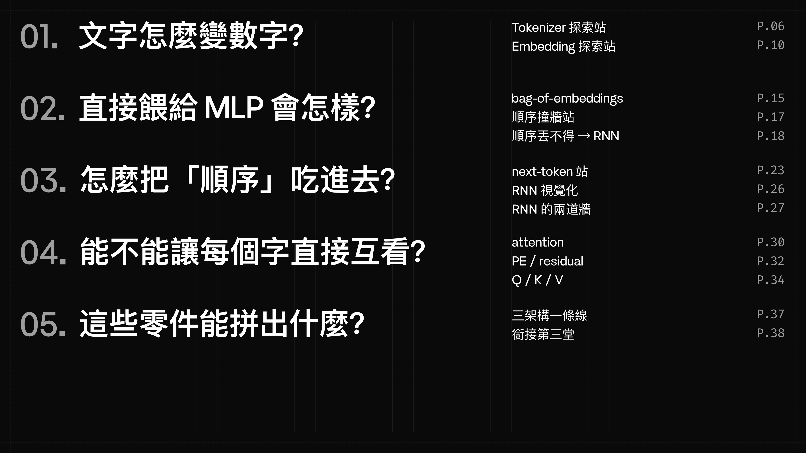

<!--
講者備忘：一頁把整堂的路線圖交代完，五個問題就是五個 Loop 的進場問句，之後每個 divider 會再單獨丟一次。這頁講快一點，讓學生知道「今天會從切字一路走到 Transformer」，不用細講每個子項。
自學備註：舊版大綱是烘進 assets/bg/toc.png 的靜態圖，頁碼已過期，因此改用 Markdown 重建，五組問句對應五個 Loop，子項是各 Loop 會經過的站與重點；Marp 會自動編頁碼，這裡刻意不寫頁碼。
-->

---

<!-- _class: divider -->
<!-- footer: 文字怎麼變數字 -->

<!-- 分節文字（Section 01. + 問句「文字，怎麼變成數字?」）都烘在 divider-01.png 裡。 -->

<!-- ⏱ Loop 0：42 min · hands-on 18 -->

<!--
講者備忘：這是 Loop 0 的進場。整個 Loop 一句話講完：先用 tokenizer 把句子切成 token，再用 embedding 把 token 變成有語意的數字，最後用 bias 例子收尾。這頁只丟問題，不給答案。
自學備註：這一節要回答的核心問題就是標題這句「文字怎麼變成數字」。模型內部只有數字，任何文字任務的第一步都是把字變成一排數字。接下來會依序拆解：tokenizer（切）、embedding（編碼與語意）、以及語意裡藏著的偏見。
-->

---

# 上一堂的模型，看不懂字 _模型只吃數字，這堂的輸入卻是一句話_

### 上一堂

餵進去的是一排數字。

`[5.1, 3.5, 1.4, 0.2]`

_花瓣長度、寬度，本來就字。_

### 這堂

餵進去的是**一句話**。

「今天天氣真好」

_模型看不懂字，得先把字變成數字。_

<!--
講者備忘：先點出落差再帶工具。問學生：上一堂餵的是一排數字，這堂想餵一句話，中間差了什麼? 讓他們自己說出「文字要先變成數字」。左邊放上一堂鳶尾花那種數值特徵向量，右邊放一句真的中文，對比才具體。
自學備註：上一堂 MLP 吃的是數值特徵（例如花瓣長寬），這堂的輸入卻是自然語言。這中間的鴻溝就是 Loop 0 要補的：把一句話轉成模型能吃的數字。這頁只負責把牆立起來，怎麼跨過去留給後面的站。
-->

---

# 換你動手 _Tokenizer 探索站_

<h4>你要動的旋鈕</h4>

輸入文字 → 看它切出來的 **token** 與 id

<h4>試試看</h4>

- 中英混寫：「我今天很 happy」
- 標點與空格：「你好！！！」
- 罕見詞／自己的名字：「祺煒」

<h4>你應該會看到</h4>

一個「字」常被拆成好幾塊，切法不直覺。

檢核點：我看到同一個字，換個位置或語言就被切成不同塊

🛠 講師畫面／各組電腦已開好（URL 開站後補）

<!-- STATION SPEC: Tokenizer 探索站 must accept free-text input (中英混寫、標點、空格、任意罕見詞／人名), and for that input display BOTH the coloured token segmentation and the numeric token id array live. -->

<!--
講者備忘：本站 10 分鐘，其中 8 分鐘放手讓學生玩，教學發生在工具裡不在這頁。開站後閉嘴，巡場時丟提示：空格和大小寫也算數、罕見字會被切得很碎、同一個詞在句首句中切法可能不同。
自學備註：tokenizer 是把原始文字切成一顆顆 token 的規則。重點是切法不直覺：一個中文「字」常被拆成好幾塊，英文長詞也會被拆成字塊。動手換不同輸入，就能親眼看到「模型讀到的單位」和「你以為的字」不一樣。
-->

---

# 模型眼中，只有 Token 和編號

### Text 視角

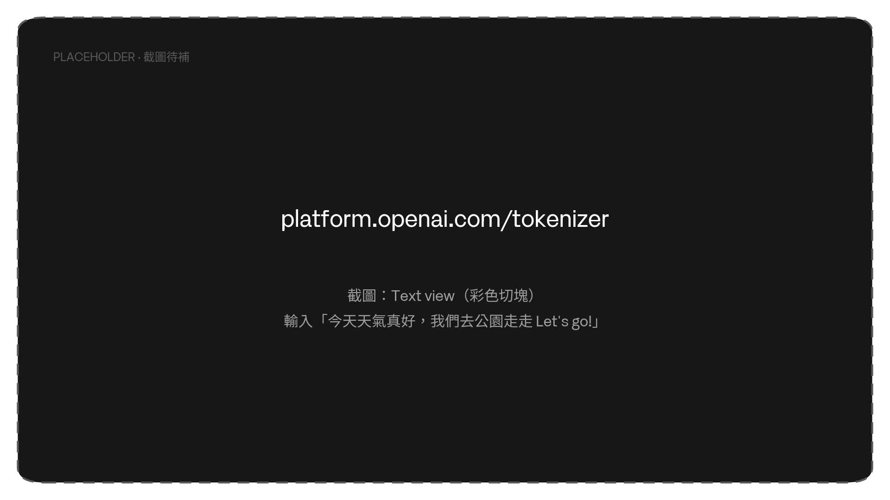

###### 彩色切塊：一句話被切成一顆顆 token

### Token IDs 視角

###### 每顆 token 一個編號，是座號不是語意

所以在模型眼中，只有 **token** 和它的編號。

<!-- ASSET TODO: placeholder_tokenizer_text.png — platform.openai.com/tokenizer，輸入「今天天氣真好 I am happy」，切到 Text 視角（彩色切塊），截整個切塊區。 -->
<!-- ASSET TODO: placeholder_tokenizer_ids.png — 同一頁同一句，切到 Token IDs 視角，截出 id 陣列。 -->

<!--
講者備忘：強調左右是「同一句話」的兩種視角。追問：這些編號有大小關係嗎? 37271 比 2574「大」代表什麼嗎? 引導出答案：不代表任何東西，只是查表用的座號。
自學備註：token 的 id 只是一個編號，不是語意。id 相鄰不代表意思相近，id 大小也沒有意義，它純粹是「在詞表裡的第幾格」。正因為編號本身沒有語意，才需要下一步的 one-hot 與 embedding，把「編號」變成「有意義的數字」。
-->

---

# 細與多的折衷 _為什麼切成這樣?_

🔡

照字母切Character-level

'hello' → ['h', 'e', 'l', 'l', 'o']，切最細，一句話變超長。

📚

照整詞切Word-level

'祺煒' → [UNK]，詞表爆炸，還老是遇到新詞。

✂️

照字塊切Subword

'tokenizer' → ['token', 'izer']，長度與詞表兩邊都顧到。

<!--
講者備忘：只講動機，不講 BPE 或歷史。三個膠囊都是先給例子再解釋。'祺煒' 是真的會 OOV 的人名，可以問在場同學：你的名字丟進去會不會也變成 [UNK]? 讓折衷感更具體。
自學備註：為什麼不照字母、也不照整詞? 照字母切，序列會變超長，模型很難讀完；照整詞切，詞表會爆炸，而且永遠有沒收錄過的新詞變成 [UNK]。subword 取中間：常用字整塊、罕見字拆成字塊，長度和詞表大小兩邊都顧到，這就是現在主流 tokenizer 的做法。
-->

---

# 從編號到有語意的數字 _One-hot vs Embedding_

### One-hot

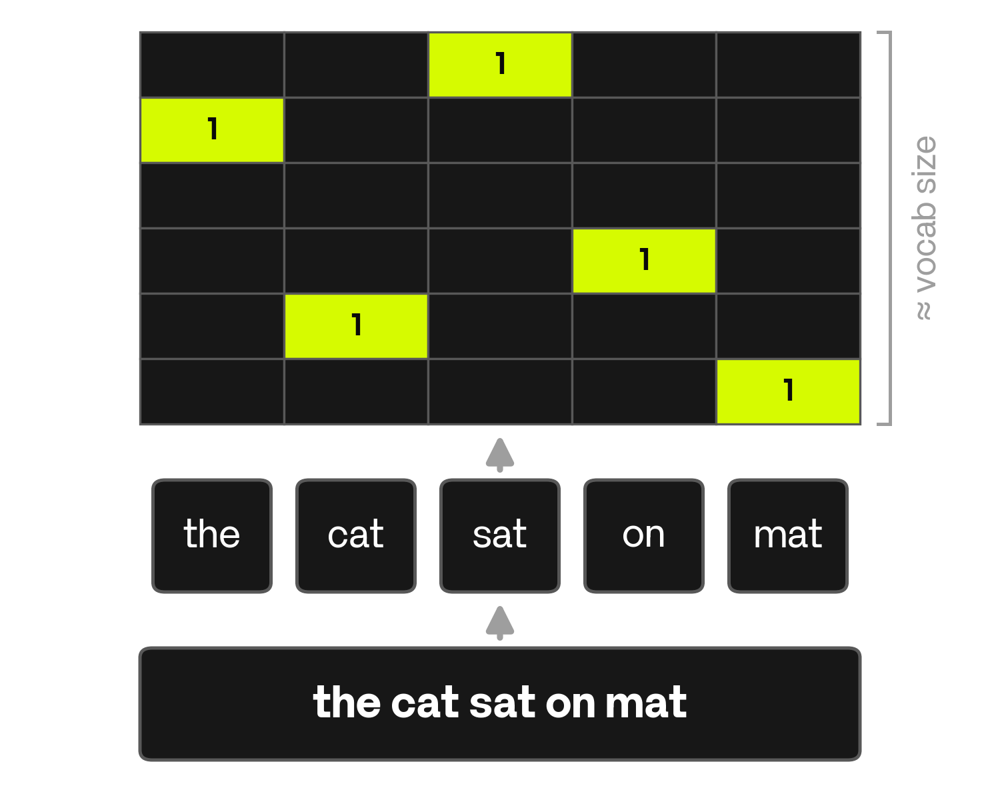

###### 跟字典一樣長，兩兩等距，看不出語意（這就是牆）

### Embedding

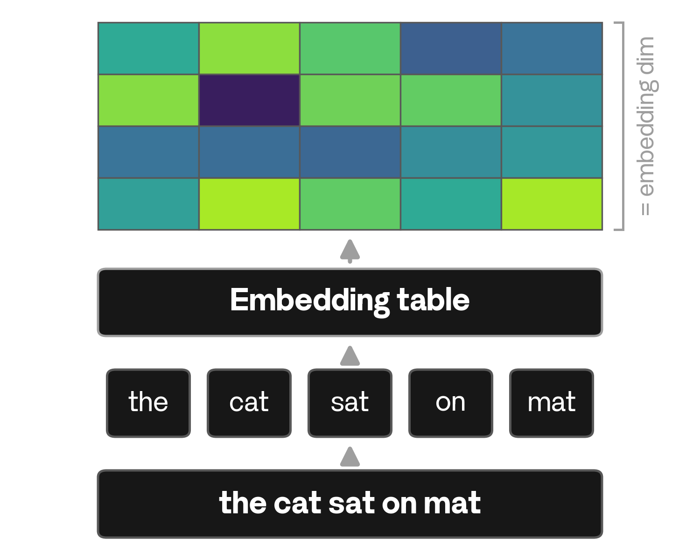

###### 壓短、變密，位置是**從資料學**出來的（這是解法）

<!--
講者備忘：左邊是牆，右邊是解法，一頁對照完。指著左圖問：這樣編碼，「貓」和「狗」的距離，跟「貓」和「桌子」的距離一樣嗎? 答案是一樣，這就是問題。右圖不寫公式，重點一句：語意 = 學出來的位置。
自學備註：one-hot 把每個 token 變成一排 0，只有自己那格是 1，向量長度等於整個詞表，又長又稀疏，且任兩個向量都互相垂直、距離相等，看不出語意。embedding 用一張可學習的表，把 token 對應到一排較短較密的數字，這些數字是模型從語料學出來的，結果是語意相近的字位置也相近。
-->

---

# 換你動手 _Embedding 探索站_

<h4>你要動的旋鈕</h4>

在 embedding space 2D／3D 投影裡逛，挑字看最近鄰

<h4>試試看</h4>

- 挑「貓」，看它的鄰居是誰
- 比一比「國王」和「皇后」
- 自己挑一個字，猜再看

<h4>你應該會看到</h4>

語意相近的字，在空間裡的距離也近。

檢核點：我挑的字，最近的鄰居語意也相近

🛠 講師畫面／各組電腦已開好（URL 開站後補）

<!-- STATION SPEC: Embedding 探索站 must render a 2D/3D projection of the embedding space, let the student select any word to highlight it, and list that word's nearest neighbours (cosine/euclidean) so「距離即語意」is directly observable. -->

<!--
講者備忘：本站 12 分鐘，其中 10 分鐘放手玩。教學發生在站上，別在這頁講解。巡場時建議學生試 貓／狗、國王／皇后 這類配對，看它們是不是真的靠在一起，讓他們自己逛出「距離即語意」的感覺。
自學備註：上一頁說 embedding 把語意壓進位置，這一站就是去驗證它。挑一個字看它的最近鄰，你會發現鄰居多半語意相關（貓的鄰居可能是狗、貓咪、寵物），這說明「語意」在這個空間裡是以「距離」呈現的。
-->

---

# 方向也有意義 _連偏見一起學進來_

### 最近鄰 _recap_

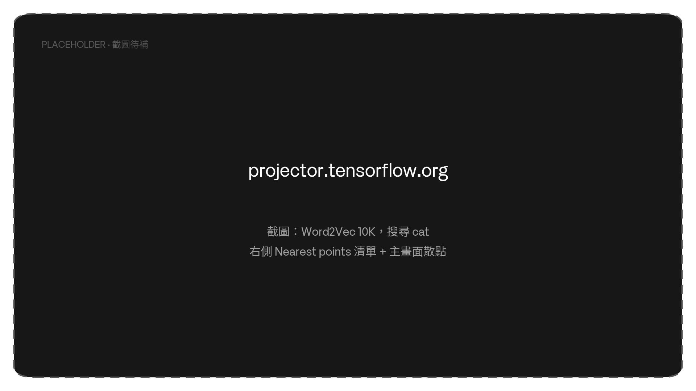

###### 語意相近 → 位置相近

### 方向類比

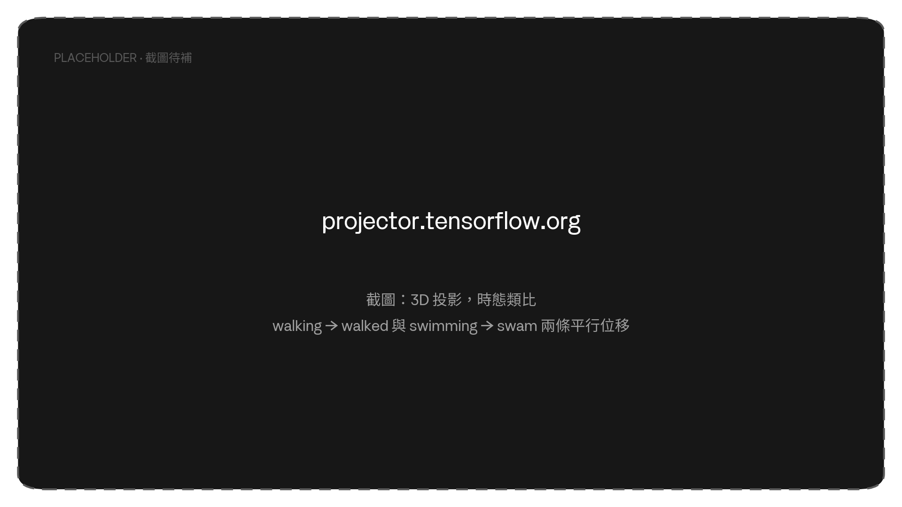

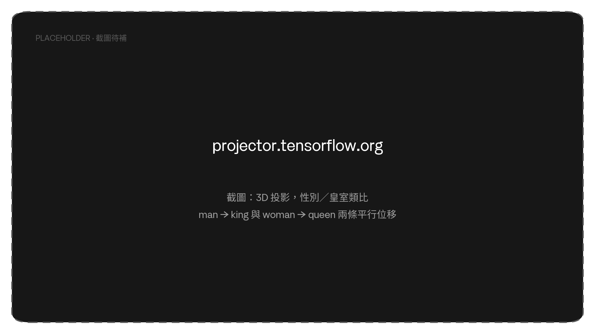

`king − man + woman ≈ queen`

方向是從語料學來的：embedding 學到語意，也學到 **偏見**。

_Bolukbasi et al., 2016 · arXiv 1607.06520_

<!-- ASSET TODO: placeholder_projector_neighbors.png — projector.tensorflow.org，選「cat」，截 Nearest points 面板（含 neighbors 滑桿與 cosine/euclidean 切換）。 -->
<!-- ASSET TODO: placeholder_projector_tense.png — projector 3D 投影，時態類比 walking→walked || swimming→swam，兩條平行位移。 -->
<!-- ASSET TODO: placeholder_projector_royal.png — projector 3D 投影，性別／皇室類比 man→king || woman→queen，兩條平行位移。 -->

<!--
講者備忘：這是 Embedding 站的 debrief。左邊是學生剛玩過的最近鄰 recap，右邊兩張是站上沒有的新內容、教學重量在這裡：同一種語意變化（變過去式、加上皇室）在空間裡是同一個平移向量。可以現場帶一次 king 減 man 加 woman，讓學生猜結果落在哪。接著推一步：換個詞做同樣算術就會跑出刻板連結，這就是語料偏見。
自學備註：embedding 空間裡向量的方向也帶語意，從 man 到 king 的位移和從 woman 到 queen 幾乎平行，所以 king 減 man 加 woman 會落在 queen 附近。既然方向是從語料學來的，語料裡的偏見也一起被學進向量。Bolukbasi 等人 2016 年的論文示範了同樣的類比算術會得到帶刻板印象的結果，提醒我們 embedding 好的壞的一起學。
-->

---

# 文字，就這樣變成數字 _Loop 0 小結_

✂️

切詞成塊

一句話先切成 subword，才有能處理的單位。

🔢

編號無意

one-hot 只給編號，字和字之間距離都一樣。

🧭

距離即語意

embedding 讓語意相近的字自然靠在一起。

⚖️

偏見殘留

語料裡的偏見，也一起被學進向量。

<!--
講者備忘：四個膠囊對到 Loop 0 的四個節拍：斷詞、one-hot、embedding 距離、bias。這頁刻意不放 lime，把唯一的強調留給下一頁的橋接問句。快速帶過，當作進 Loop 1 前的整理。
自學備註：回顧整個 Loop 0。文字先被 tokenizer 切成 subword，成為能處理的單位；one-hot 只是給編號，看不出語意；embedding 把語意壓成位置，讓距離和方向都有意義；但語料裡的偏見也一起被學進向量。四步走完，一句話就變成了一排排有語意的數字。
-->

---

<!-- _class: statement -->

<!-- 呼吸拍：Loop 0→1 cliffhanger，故意懸念收尾，不加視覺 -->

# 現在，每個字都是一排數字了

那……**就能餵給上一堂的 MLP 了嗎?**

<!--
講者備忘：這是 cliffhanger，故意不回答。丟出問句就停，讓懸念帶進 Loop 1。學生若搶答「可以」，先不評論，下一個 Loop 會讓他們自己撞到順序的牆。
自學備註：每個字現在都是一排數字了，看起來就能直接餵給上一堂學過的 MLP。真的可以嗎? 這個開放問題正是 Loop 1 的起點，答案留到下一節揭曉。
-->

---

<!-- _class: divider -->
<!-- footer: MLP 吃文字 -->

<!-- ⏱ Loop 1：30 min · hands-on 14 ＋ ☕ 10 min -->

<!-- 分節文字（Section 02. 加問句「直接餵給 MLP，會怎樣?」）都烘在 divider-02.png 裡，這頁不要再放 h1／h2，否則會跟底圖的標題疊字。 -->

<!--
講者備忘：這一節是整堂課的核心 beat，也承接 Loop 0 結尾的懸念。上一堂已經知道文字能變成 token 與 embedding，這裡順著問下去：那就把它直接餵給上一堂教過的 MLP，會怎樣? 進場先把問句丟出來就好，先不要爆雷順序會撞牆，讓學生帶著「應該行得通吧」的期待往下走。
自學備註：divider 只有藝術底圖加一句問句，沒有內文、沒有 lime。footer 也在這裡切成「MLP 吃文字」，之後整節沿用。
-->

---

# 什麼都沒改就餵進去 _bag-of-embeddings_

上一堂那顆 MLP 原封不動，一句話進去，情緒出來，它 **居然會動**。

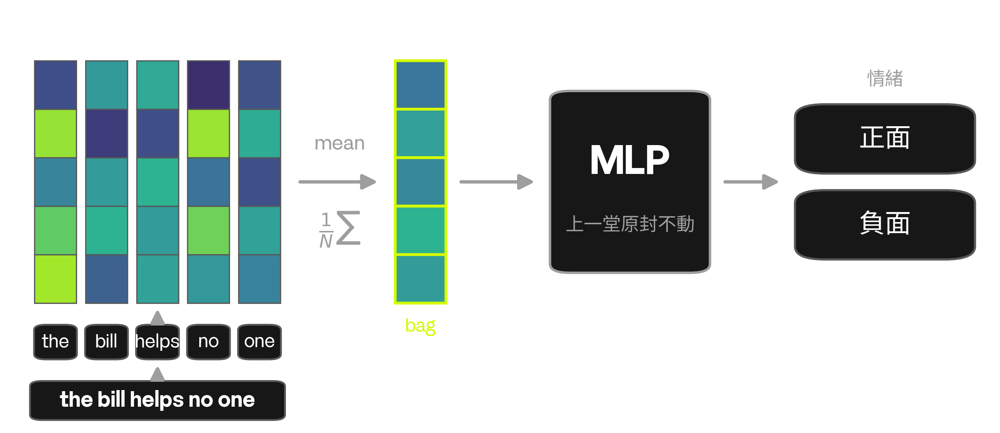

###### 圖：一句話 → 查每個 token 的 embedding → 取平均成一個向量 → 丟進上一堂的 MLP → 正面 / 負面

<!--
講者備忘：這頁是橋接，也是刻意安排的假安全感起點。做法很直接：一句話裡每個 token 各查一條 embedding，全部加起來取平均，一整句就縮成一個固定長度的向量，再丟進上一堂那顆分類 MLP，輸出正面或負面。強調模型一個字都沒改，我們只是在前面接了「取平均」這一步，它竟然真的跑得出情緒。先讓「居然會動」的驚訝落地，下一頁再往上加準度。
自學備註：把整句壓成一個平均向量就叫 bag-of-embeddings，一袋字。圖裡那條 lime 邊框的向量是真的元素平均，用同一組 viridis 配色畫出來，所以「取平均」是誠實的，不是裝飾。這個平均之後也正是撞牆的原因。lime 只落在「居然會動」。
-->

---

# 而且準度，還不錯 _假安全感_

_🔗 Iyyer et al. 2015, Deep Unordered Composition Rivals Syntactic Methods, ACL_

| Model | RT | SST-fine | SST-bin | IMDB | Time (s) |
| --- | --- | --- | --- | --- | --- |
| DAN-ROOT | - | 46.9 | 85.7 | - | 31 |
| DAN-RAND | 77.3 | 45.4 | 83.2 | 88.8 | 136 |
| DAN | 80.3 | 47.7 | 86.3 | 89.4 | 136 |
| NBOW-RAND | 76.2 | 42.3 | 81.4 | 88.9 | 91 |
| NBOW | 79.0 | 43.6 | 83.6 | 89.0 | 91 |

那 **不就 MLP 就好了嗎?**

<!--
講者備忘：這頁把假安全感推到最高點。表裡的 DAN 和 NBOW 就是「詞袋平均加前饋網路」，跟我們剛剛做的 bag-of-embeddings 是同一套路，而這些是 Iyyer 等人 2015 年 ACL 論文裡真實發表的數字，不是我編的。準度看起來很體面，於是很自然會冒出「那不就 MLP 就好了嗎?」這個結論。下一頁馬上戳破它。
自學備註：橫欄是 RT、SST-fine、SST-binary、IMDB 四個資料集的準度，加上訓練秒數。「-」是論文自己沒跑的空格，不是漏填。lime 落在整句反問「不就 MLP 就好了嗎?」，故意讓它站上最高點。
-->

---

# 換你動手 _順序撞牆站_

<h4>你要動的旋鈕</h4>

**shuffle** 開關；MLP(bag) ↔ RNN 切換

<h4>試試看</h4>

- 輸入「這部電影不好看」，開 shuffle 再跑一次
- 比「不好」和「好不」，看兩邊分數差多少
- 切成 RNN，同一句、同樣 shuffle，再跑一次

<h4>你應該會看到</h4>

MLP(bag) 在 shuffle 前後輸出逐字相同；RNN 的輸出會變。

檢核點：我看到 shuffle 前後 MLP 輸出一模一樣。

🛠 講師畫面／各組電腦已開好（URL 開站後補）

<!-- STATION SPEC: 順序撞牆站需支援 shuffle on/off 開關、MLP(bag) ↔ RNN 模型切換、同一句 shuffle 前後與兩模型的準度即時對比（course-spec l.80「兩者準度即時對比」）。 -->

<!--
講者備忘：這是 hand-off，真正的教學發生在站上，投影片只負責把旋鈕與觀察點交代清楚。帶學生打開順序撞牆站後就閉嘴，讓他們自己動旋鈕。關鍵是讓他們親眼看到 MLP(bag) 在 shuffle 前後輸出逐字相同，順序資訊被整個丟掉了；再切 RNN 對照。巡場時用「不好」對「好不」這種順序帶訊號的例子當提示。這站佔 16 分鐘，其中 14 分鐘讓他們動手。
自學備註：shuffle 會把 token 的順序隨機打亂。因為 bag-of-embeddings 取平均，任何排列的平均都一樣，所以 MLP(bag) 的輸出不會變；切到 RNN 重跑，就能對照出「有沒有把順序吃進去」的差別。
-->

---

# 故事 vs. 事故 _同一袋字_

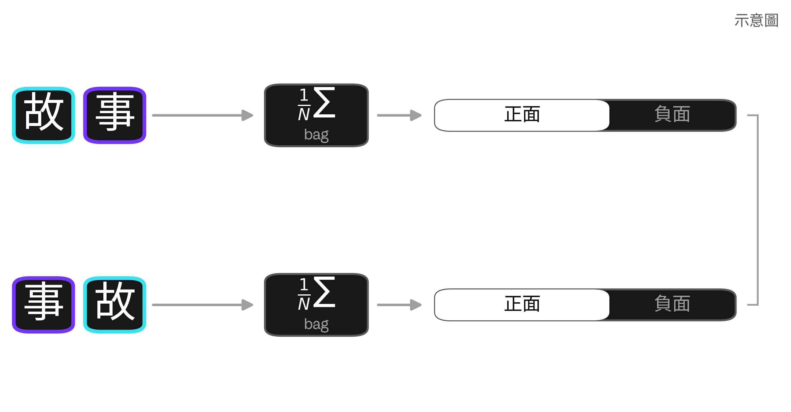

###### 圖：📖 故事 與 💥 事故 是同一袋「故」＋「事」，只換順序，平均後輸出完全相同

語意天差地遠，它卻 **分不出來**。

<!--
講者備忘：這頁把牆變具體。同樣是「故」和「事」兩個字，只是順序對調，語意天差地遠，一個是一則故事、一個是出事了。可是對 bag-of-embeddings 來說，兩者的平均向量一模一樣，MLP 收到的輸入完全相同，輸出當然也相同，圖裡兩排機率條刻意畫成一模一樣。
自學備註：兩排用同一組類別色（故＝青、事＝紫），只換位置，凸顯差別只在順序。取平均把順序抹掉後，「故事」和「事故」在模型眼中就是同一個輸入，所以它分不出來。機率條是示意，不是量測數字。lime 只留給「分不出來」。
-->

---

# 問題不在準度，在假設

MLP 沒有「順序」這個假設，一袋字怎麼排，平均都一樣。

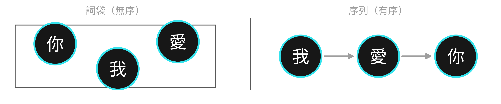

###### 圖：詞袋把字丟成一堆（無序）· 序列讓字一個接一個（有序）

我們需要一個 **假設順序有意義** 的架構 → RNN。

<!--
講者備忘：這頁把牆收束成一句話：問題不在準度不夠，而在假設。MLP 這個架構本身就沒有「順序」這個概念，這不是 bug，是它的設計裡根本沒有這個假設，所以資料再多也補不回被抹掉的順序。唯一的出路是換一個「假設順序有意義」的架構，也就是 RNN。這句 lime 就是 Loop 2 的門。
自學備註：下面那條對照圖把兩種讀法擺在一起，左邊詞袋是一堆無序的字，右邊序列是一個接一個有順序。缺少順序假設跟訓練不足是兩回事。lime 落在「假設順序有意義」，直接接到下一節的 RNN。
-->

---

<!-- _class: statement -->

# 休息 10 分鐘 _喝口水，等等回來拆牆_

10 分鐘後回來，準時開始 RNN。

_實際回來時間由講師現場宣布。_

<!-- 呼吸拍：撞牆後的自然斷點，功能性的休息告示頁，只需告訴學生休息多久、回來要做什麼。 -->

<!--
講者備忘：Loop 1 撞完牆，正好是一個自然的斷點，讓大家喘口氣。宣布明確的回來時間（現場報一個整點時刻），回來直接進 Loop 2 的 RNN，不要拖。footer 仍是「MLP 吃文字」，下一張 Loop 2 divider 才會換成 RNN。
-->

---

<!-- _class: divider -->
<!-- footer: RNN -->

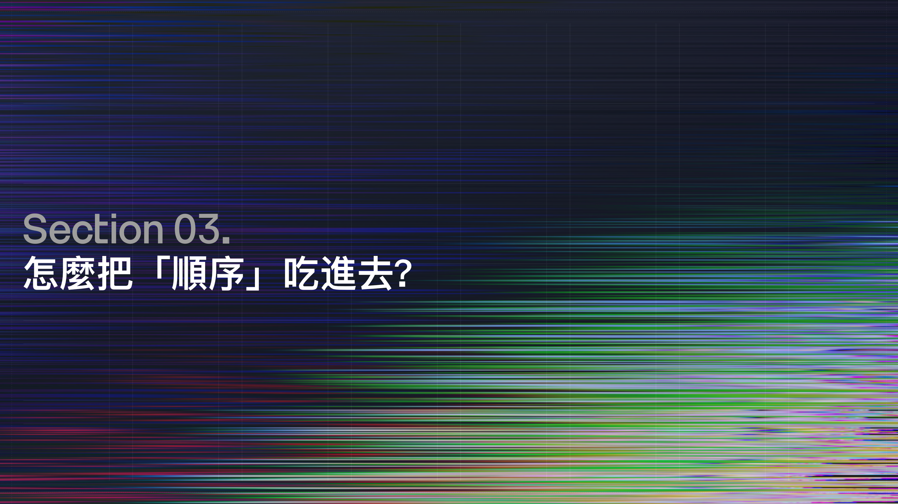

<!-- ⏱ Loop 2：43 min · hands-on 19 -->

<!-- 分節文字（Section 03. + 問句「怎麼把「順序」吃進去?」）都烘在 divider-03.png 裡。 -->

<!--
講者備忘：這頁同時是 10 分鐘休息後的回場點。開場先把 Loop 1 的結論重新掛上：
MLP 把整句攪成詞袋，沒有任何「順序」的假設，所以「狗咬人」和「人咬狗」在它眼裡
是同一句話。等這個牆重新落地，再把這一節的驅動問題丟出來：那我們該怎麼把順序
真的吃進模型裡?
自學備註：Section 03 要引入 RNN。核心是讓模型一次讀一個 token、並把「記憶」
往後帶，讓前後文的順序第一次開始有意義。
-->

---

# 先玩個遊戲 _猜下一個字_

## 今天天氣真 **＿＿**

_你腦中大概已經有答案了，可能是：_

好 熱 冷

<!--
講者備忘：先不要講架構，直接玩。念出「今天天氣真＿＿」，讓學生喊出答案
（好、熱、冷……），等他們喊完再點破：他們其實是用前面看過的字去押下一個字。
接著幫這個遊戲取名字：前文決定下一個字，這就是語言模型整天在玩的遊戲。
自學備註：語言模型的核心任務就是 next-token prediction，給定目前為止的字，
預測下一個最可能的字。前文決定下一個字，這個直覺是這一節之後所有架構的起點。
-->

---

# 換你動手 _next-token 站_

<h4>你要動的旋鈕</h4>

context 視窗大小（模型能看到多少前文）

<h4>試試看</h4>

- 輸入「今天天氣真」，看它列出的候選字
- 把 context 縮到只剩 1~2 個字，再看一次
- 找一句「視窗小會押錯、放寬就押對」的話

<h4>你應該會看到</h4>

看得越多，押得**越有把握**，候選字的機率更集中。

檢核點：我看到 context 放寬後，候選字的機率變得更集中

🛠 講師畫面／各組電腦已開好

<!-- STATION SPEC: 可調 context 視窗長度的逐字預測介面（context 滑桿）＋每個候選字的機率顯示（機率條），讓「context 越長、機率越集中」可被學員直接觀察。 -->

<!--
講者備忘：這頁只負責把問題丟出去，介面參考 Brilliant 的 next-token 互動，
開站後就閉嘴讓學生玩。巡場時給一個任務：找一個句子，讓很小的 context 視窗
押錯、但把視窗放寬後就押對，讓「看得越多越準」變成他們自己驗證出來的結論。
自學備註：context 視窗決定模型能看到多少前文。視窗越大，可用的線索越多，
模型對下一個字的把握（機率）就越集中。這頁鋪陳「前文有用」，也悄悄預告了
「前文會越來越長」這個下一頁要處理的問題。
-->

---

# 看得越多，越有把握 _可是句子會一直變長_

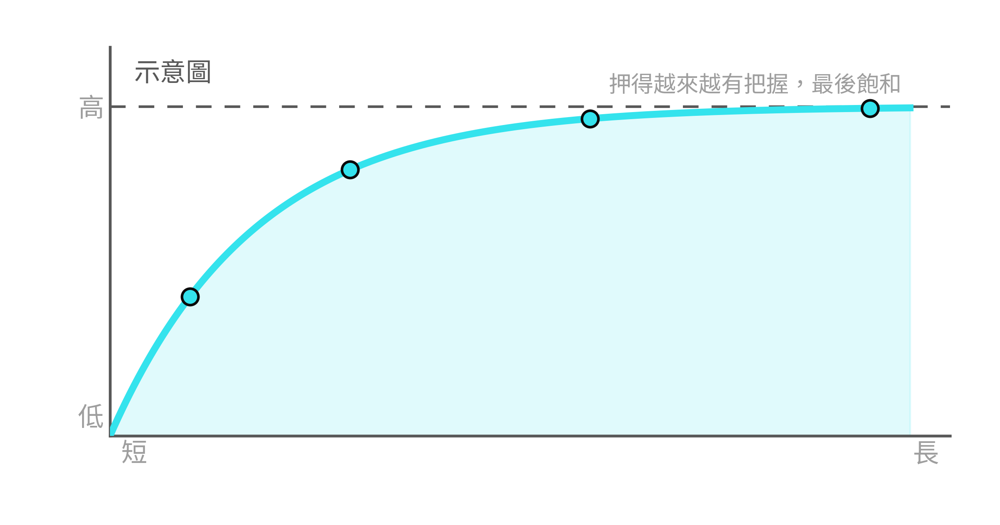

###### 圖：能看到的前文越長，下一個字押得越有把握（示意圖）

猜下一個字靠前文，可是句子會一直變長，得把前面 **記住** 、一路帶著走。

<!--
講者備忘：這是 next-token 站的收束。先用這張圖把站上玩到的現象定影：context
給得越長，把握越高，但會慢慢飽和。接著停一下，讓「句子會一直變長、不能每次
都從頭讀一遍」這個矛盾自己浮出來，再把需求命名為「記住、一路帶著走」。「記住」
兩個字要讓它落地，因為下一頁的 hidden state 就是這個需求的答案。
自學備註：曲線是示意圖，不是實測數字，只表達「單調上升後飽和」的趨勢。如果每
猜一個字都要把整段前文從頭讀過，計算量會隨句子長度暴增；比較好的做法是維持
一份可以更新、可以往後帶的「記憶」，這正是 RNN 的 hidden state 要做的事。
-->

---

# RNN _一次吃一個字，把記憶往後傳_

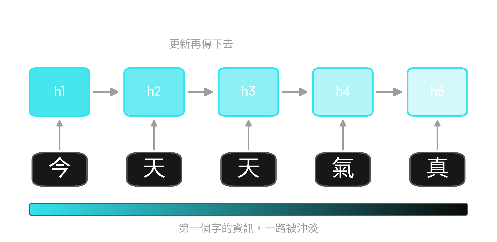

###### 圖：每讀一個字，更新記憶再傳下去；第一個字的資訊會沿途變淡

<!--
講者備忘：這是靜態版的解說，下一站會把它動畫化，所以這裡只要把鏈條講清楚：
每讀一個 token，就更新一次記憶（hidden state），再把記憶傳給下一步。強調每
一跳用的都是「同一條記憶通道」，這個一直往後傳、反覆更新的迴圈（recurrence）
就是 RNN 的全部把戲。底部那條由亮到暗的漸層先埋一個伏筆：第一個字的資訊會
沿途被沖淡，下一站就會親眼看到。
自學備註：RNN 逐一讀入 token，維持一個 hidden state 當作記憶。每一步用「當前
token + 上一步的 hidden state」算出新的 hidden state，再往後傳。因為每一步
共用同一組權重、同一條記憶通道，所以叫 recurrent（遞迴）。
-->

---

# 換你動手 _RNN 視覺化站_

<h4>你要動的旋鈕</h4>

播放／步進，看 hidden state 沿句子流動；順便盯 loss

<h4>試試看</h4>

- 短句、長句各跑一次
- 盯住第一個字的資訊，到句尾還剩多少
- 看訓練的 loss 曲線動起來

<h4>你應該會看到</h4>

記憶一站站往後傳；句子一長前面被**沖淡**；loss 會亂跳。

檢核點：我看到長句跑到句尾時，第一個字的資訊幾乎不見了

🛠 講師畫面／各組電腦已開好

<!-- STATION SPEC: hidden state 沿序列逐步流動的播放／步進動畫（每步可見記憶更新、且早期資訊隨距離變淡）＋同步顯示訓練 loss 曲線亂跳的不穩動畫。 -->

<!--
講者備忘：一樣是純 hand-off，動畫本身就是教學，不要在這裡先把牆講出來。
巡場時埋兩個觀察點讓學生自己看到：一是句子一長，最前面的資訊會被一路沖淡；
二是訓練時的 loss 會亂跳。這兩個觀察就是下一頁要幫他們命名的兩道牆。
自學備註：這一站把 hidden state 沿序列往後流動的過程視覺化，同時顯示訓練時
的 loss 曲線。先看到現象，下一頁再解釋成因，學生會更有感。
-->

---

# RNN 撞到的兩道牆 _所以還需要下一個架構_

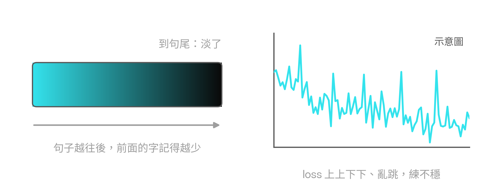

### 🧠 記憶健忘

_long-context forgetting_

句子一長，前面的資訊被一路沖淡，長句記不住開頭。

### ⚡ 訓練不穩

_exploding / vanishing gradients_

梯度一路相乘，不是爆炸就是消失，loss 亂跳。

記憶得一站一站傳，那能不能讓每個字 **直接互看** ?

<!--
講者備忘：這頁把上一站看到的兩個現象命名成 RNN 的兩道牆。左邊是記憶健忘：
固定大小的 hidden state 是個瓶頸，句子一長，前面的資訊就被後來的內容一路沖淡。
右邊是訓練不穩：梯度要沿著整條鏈相乘往回傳，不是越乘越大而爆炸、就是越乘越
小而消失，反映在 loss 上就是亂跳、練不起來。收尾的橋接：RNN 把順序做對了，
但代價是記憶得一站一站傳，下一節就問，能不能讓每個字直接互看?這就帶出
Transformer。
自學備註：hidden state 是固定維度，等於用一個固定大小的容器裝越來越長的歷史，
早期資訊會被稀釋，這是 long-context forgetting。訓練時 backprop through time
會讓梯度沿鏈連乘，導致 exploding / vanishing gradients。這兩點正是 attention
與 Transformer 要解決的問題。右側 loss 曲線為示意圖。
-->

---

<!-- _class: divider -->
<!-- footer: Transformer -->

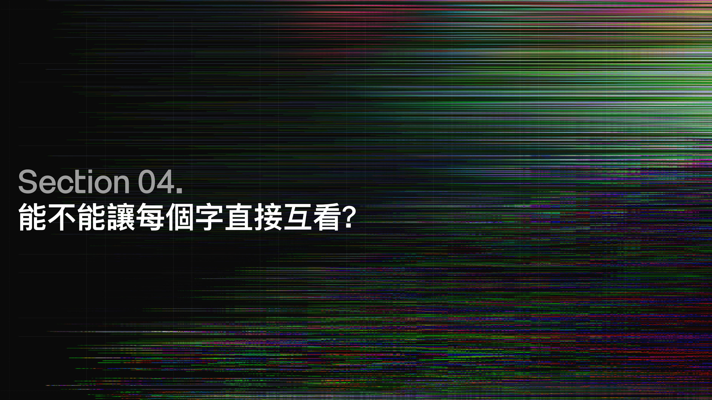

<!-- ⏱ Loop 3：42 min · hands-on 20（PE/residual 可壓縮，共 −10）-->

<!-- 呼吸拍：Loop 3 進場，問句（能不能讓每個字直接看到所有字）烘在 divider-04.png 藝術裡，沒有 h1；直接回應 Loop 2 收在 RNN 的那道健忘牆。 -->

<!--
講者備忘：先把問題丟出來，讓學生停在「有沒有別條路」的懸念上，別急著給答案，
attention 這個詞留到下一張才揭曉。
自學備註：RNN 靠記憶一站一站往後傳，傳到句子後面就淡了。這裡問的是能不能換個
路子：讓每個字繞過接力，直接看到句子裡所有字。
-->

---

# 換個想法 _不用一站一站傳_

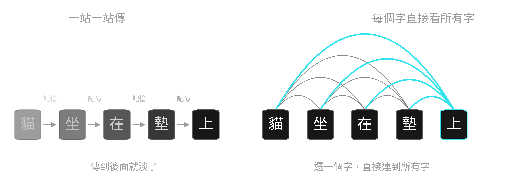

###### 左：RNN 記憶一站一站傳，越傳越淡；右：每個字直接連到所有字

與其接力傳記憶，不如讓每個字直接看所有字，這就是 **attention**。

<!--
講者備忘：一句話講完就好，不要展開任何數學。重點是把「直接連線」取代「逐站
接力」這個畫面種進學生腦裡；用左右對照把上一個 loop 的健忘牆視覺化回收掉。
自學備註：RNN 的記憶沿時間軸一格一格往後搬，越搬越稀薄。attention 換掉這個
接力：句子裡每個字都拉一條線直接看到其他所有字，要參考誰就直接看誰，不必等
記憶慢慢傳過來。這就是 Transformer 的核心想法。
-->

---

# 換你動手 _Transformer 站・attention 連線_

<h4>你要動的旋鈕</h4>

點一個字，看它的 **attention** 連到哪些字。

<h4>試試看</h4>

- 點句子裡的代名詞，看它連到誰
- 換一句有指代的句子，再點一次
- 換不同的字，看連線怎麼跳

<h4>你應該會看到</h4>

相關的字被直接連上，沒有逐站傳遞。

檢核點：我點一個字，就看到它直接連到相關的字

🛠 講師畫面／各組電腦已開好（URL 開站後補）

<!-- STATION SPEC: Transformer 站：點選任一 token，畫出它到所有 token 的 attention 權重連線（權重以線粗細或不透明度呈現）；同一站另備 PE on/off、residual on/off 兩組開關與一條 loss 曲線（見後兩張）。此站 12 min、hands-on 10。 -->

<!--
講者備忘：開站後就閉嘴，讓學生自己點字玩約 10 分鐘。巡場時提示他們看一件事：
沒有任何「逐站傳遞」在發生，每個字是直接連到相關的字。用代名詞的例子最有感。
自學備註：在 Transformer 站點一個字，畫面會畫出它的 attention 連到哪些字。多換
幾個字，觀察連線怎麼跳；相關的字通常會被直接連上，而不是繞一大圈接力過來。
-->

---

# attention 的盲點 _下一道牆_

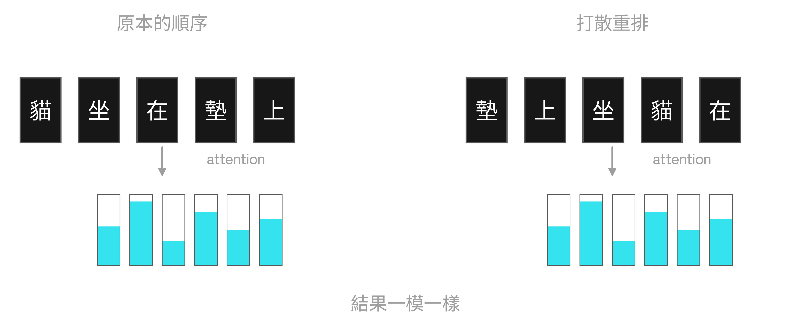

###### 圖：把同一堆字打散重排，attention 算出來一模一樣

它對**順序**無感，_就像 Loop 1 的詞袋牆：「故事」和「事故」看起來一樣。_

<!--
講者備忘：先肯定 attention 補好了健忘（每個字都看得到所有字），再翻面點出它的
盲點，帶出下一道牆。可以讓學生先猜：把句子重排，輸出會不會變。
自學備註：attention 只在意「哪些字彼此相關」，不在意「字排在第幾個」。所以把
同一堆字打散重排，它算出來的結果一模一樣。這其實是 Loop 1 詞袋牆在更高一層的
翻版，也是接下來 positional embedding 要補的洞。
-->

---

# 補丁一：把順序塞回去 _Positional Embedding_

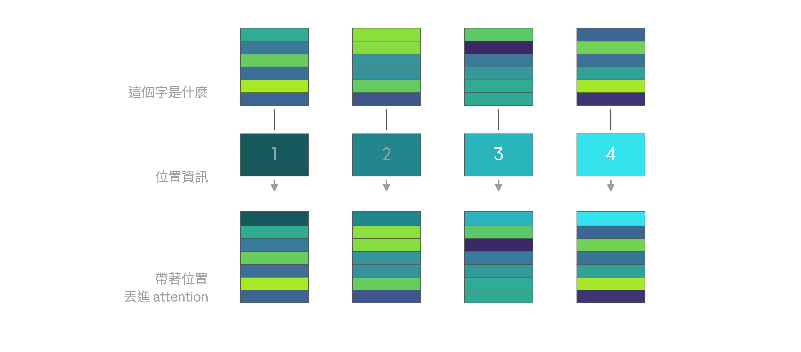

###### 圖：每個字的「詞資訊」加上「第幾個」，一起丟進 attention

attention 分不出誰前誰後，補一塊 **positional embedding** 把「第幾個」塞回去。

_動手：關掉 PE、打亂順序，看輸出變不變。_

<!-- 可壓縮 -->

<!-- STATION SPEC: Transformer 站：PE on/off 開關 + 順序打亂鈕；PE 開時打亂順序輸出會變，PE 關時打亂輸出不變。 -->

<!--
講者備忘：這是可壓縮段的第一塊，時間夠才鋪。重點放在「補一塊把位置塞回去」的
直覺，全程不碰公式。動手驗證讓「順序真的被塞回去了」變成學生自己看到的事。
自學備註：attention 看得到所有字，卻分不出誰在前、誰在後。positional embedding
補的就是這塊：把「第幾個」這個位置資訊塞回每個字裡。PE 開著把順序打亂、輸出
會跟著變；PE 關掉再打亂、輸出卻不變，證明順序資訊真的被塞回去了。
-->

---

# 補丁二：給資訊一條捷徑 _Residual Connection_

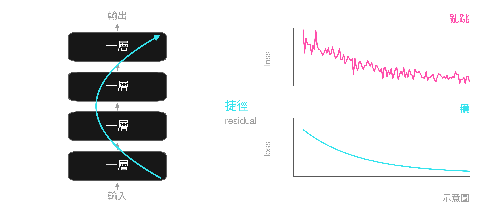

###### 圖：捷徑繞過層；沒有它 loss 亂跳，有它就穩（示意圖）

疊深之後 loss 亂跳，補一條 **residual** 給資訊一條捷徑繞過層，訓練就穩。

_動手：切換 residual on/off，看 loss 穩不穩。_

<!-- 可壓縮 -->

<!-- STATION SPEC: Transformer 站：residual on/off 開關 + 訓練 loss 曲線；關掉時 loss 亂跳、開起來就穩。曲線可播放預算好的 loss 紀錄，瀏覽器不訓練。 -->

<!--
講者備忘：可壓縮段的第二塊，和 PE 那張同進退。重點是「疊深會壞、捷徑救回」的
因果，用站上的 loss 曲線當證據。圖裡的曲線是示意圖，別報數字。
自學備註：想讓模型更聰明，直覺是把層疊更深，但疊深之後訓練變得不穩，loss 亂跳。
residual 補一條捷徑讓資訊繞過層，訓練就穩下來。站上的證據是 loss 曲線：關掉
residual 時 loss 亂跳，開起來就穩，深層也訓練得動。
-->

---

# attention 怎麼決定看誰 _Query · Key · Value_

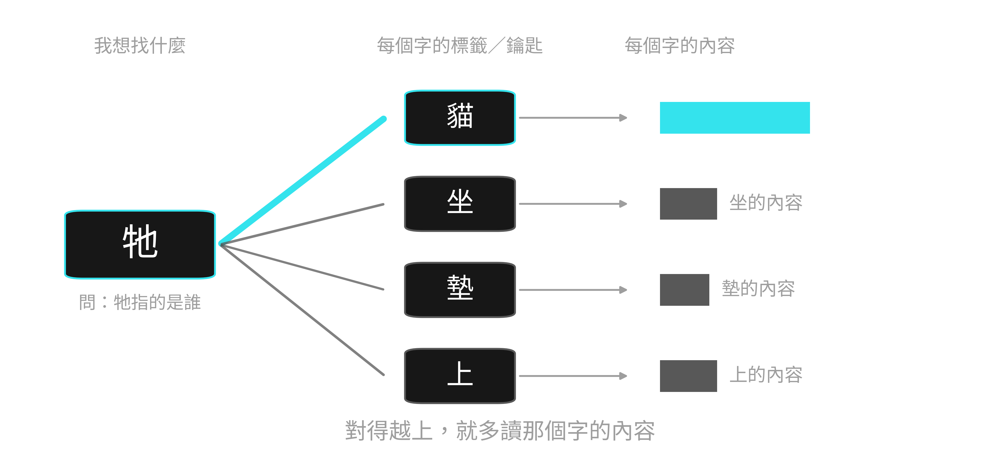

###### 🔍 Query 我想找什麼　🏷️ Key 每個字的標籤　📦 Value 那個字的內容

一個字的問題對上哪把鑰匙，就多讀那個字的 **內容**。

🛠 poloclub.github.io/transformer-explainer

<!-- ASSET TODO: placeholder_transformer_explainer.png：poloclub.github.io/transformer-explainer，滑鼠停在一個 token 上顯示它連到其他字的 attention 線；此張以 qkv_diagram 為主視覺、chip 帶連結，未內嵌圖（避免溢出），開站時可改連 explainer 現場演示。 -->

<!--
講者備忘：QKV 一定要留，砍掉的話 attention 到底怎麼決定看誰就沒解釋了。保持
直覺版比喻：Query 是問題、Key 是標籤（鑰匙）、Value 是內容，全程不寫任何公式。
時間夠可直接開 transformer-explainer 現場點一個字給大家看。
自學備註：每個字都發出一個 Query（我想找什麼），也帶著一個 Key（自己的標籤）。
attention 拿一個字的 Query 去比對每個字的 Key，對得越上，就越多去讀那個字的
Value（內容）。到 transformer-explainer 上看一個字的 Query 被拿去跟每個字的 Key
比對，比對越合、分到的注意力越多。
-->

---

# 拼起來，就是 Transformer _attention ＋ 三塊補丁_

👀

注意機制Attention

每個字直接看所有字，不必逐站傳記憶。

📍

位置編碼Positional Embedding

把「第幾個」塞回去，補上順序。

🔗

殘差連接Residual Connection

給資訊一條捷徑繞過層，訓練更穩。

🔑

Q／K／VQuery · Key · Value

問題對上鑰匙，決定注意力看誰。

<!--
講者備忘：收束用，把整個 Loop 3 拼回一張圖：一個機制（attention）加三塊補丁
（PE、residual、QKV）。收尾一句話預告 Loop 4：會把 MLP → RNN → Transformer
串成一條演進線，再帶到第三堂能拿這些零件玩什麼。
自學備註：Transformer 不是憑空的魔法，而是這幾塊拼起來的：attention 讓每個字
直接看所有字、positional embedding 補回順序、residual 讓深層訓練得穩、Q/K/V
決定注意力看誰。下一個 loop 會把這三種架構放在同一條演進線上看。
-->

---

<!-- _class: divider -->
<!-- footer: 架構即樂高 -->
<!-- ⏱ Loop 4：10 min · 收尾 -->

<!-- 分節文字（Section 05. + 問句「這些零件，能拼出什麼?」）都烘在 divider-05.png 裡。 -->

---

<!-- footer: 架構即樂高 -->

# 三個架構，其實是三個假設 _MLP → RNN → Transformer_

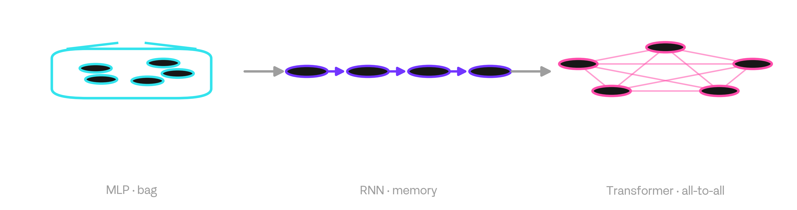

### MLP

沒有順序假設，句子只是一袋字。

### RNN

假設順序有意義，用記憶一路帶著走。

### Transformer

假設每個字直接互看，再補上位置與捷徑。

<!--
Loop 4（Section 05）由 divider-05 分節頁帶進來，是整堂的收尾，從上一段接下去。

自學備註：三個架構其實是三個對「語言」下的賭注。MLP 沒有順序假設，
把句子當成一袋字，「狗咬人」和「人咬狗」在它眼中是同一袋，
順序資訊在進模型前就消失了。RNN 賭順序有意義，用一個記憶狀態把前面的字
一路帶到後面，但帶得越遠、記憶越淡。Transformer 賭每個字都該直接互看，
用 attention 讓任意兩個字直接連線，再補上位置編碼把順序加回來、
用殘差連接讓深層網路撐得住。

講者備忘：照著上面的圖從左唸到右，一袋字 → 記憶接力 → 直接互看，
整堂課就濃縮在這一條線裡；三個盒子 = 三個假設，先不點 lime，把亮點留給下一頁。
-->

---

<!-- _class: statement -->
<!-- 呼吸拍：final CTA，收尾亮點，不加視覺 -->

# 零件拼起來，就是大模型 _銜接第三堂_

記憶、直接互看、位置、捷徑，

這些零件拼起來，就是你正在用的大模型。

下一堂，我們拿它來**玩**：LoRA、生成、RL。

<!--
自學備註：這一頁的四個關鍵詞就是這堂課親手看過的四個零件：
記憶（RNN）、直接互看（attention）、位置（positional encoding）、捷徑（residual）。
真正在用的大型語言模型，就是把這些同樣的零件疊得更深、規模放得更大而已，
沒有第五種魔法。

講者備忘：唸完四個零件後停一拍，再把「玩」這個 lime 字丟出去，
帶到第三堂：拿這些零件去做 LoRA 微調、文字生成、RL。
-->

---
