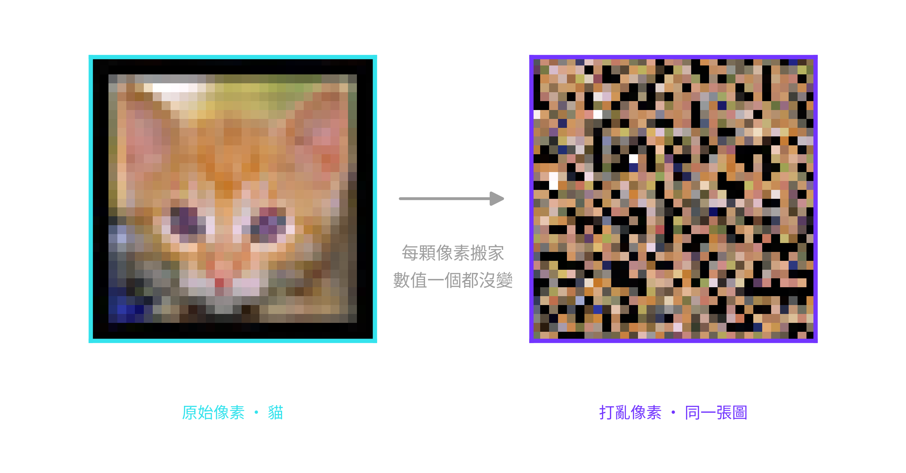

<!-- _class: cover -->

<!--
封面文字（課名、講者、日期）都在 assets/bg/cover.png 裡。
給 Harry 的 Affinity 排版意圖：
- Title L1（白）：機器，是怎麼讀懂一句話的?
- Title L2（灰）：從 MLP 到 Transformer 的演進
- Meta：Harry 張祺煒 · SITCON Camp 2026｜ML · 2026-07-10
-->

---

<!-- _class: sparse -->
<!-- footer: 關於我 -->

# 帶課的人 _Harry 張祺煒_

- 臺大資工準新生（特殊選才）
- 奧義智慧（CyCraft）研究實習生
- 研究「怎麼讓 AI 更安全」：發過兩篇論文（TMLR、EACL）
- SITCON 2025、2026 年會講者
- 下課想聊的都歡迎：攝影、剪片、英文辯論

<!--

-->

---

<!-- footer: Outline -->

<!-- ASSET TODO: assets/bg/toc.png: Group 02（直接餵給 MLP 會怎樣?）的三個子項還是舊 Loop 1（bag-of-embeddings／順序撞牆站／順序丟不得 → RNN），需要在 Affinity 重烘成新 arc：「攤平與打賭 ……… P.18」「像素撞牆站 ……… P.20」「問題不在準度，在假設 → RNN ……… P.23」；其他 group 的頁碼也請對一次目前 46 頁的版（Tokenizer 站 P.07、Embedding 站 P.13、next-token 站 P.27、RNN 視覺化 P.31、RNN 兩道牆 P.32、attention P.34、三架構 P.39）。 -->

<!--
講者備忘：一頁把整堂的路線圖交代完，五個問題就是五個 Loop 的進場問句，之後每個 divider 會再單獨丟一次。這頁講快一點，讓學生知道「今天會從切字一路走到 Transformer」，不用細講每個子項。
-->

---

<!-- _class: statement -->

<!-- 呼吸拍：開場約定，建立「隨時舉手」的課堂規範 -->

# 開始之前，一個約定 _有問題，隨時舉手_

今天的東西，第一次聽卡住很正常。

有任何聽不懂的地方，**隨時舉手打斷我**。

_「這個詞沒聽過」「這張圖在畫什麼」「太快了，再講一次」，都是舉手的好理由。_

_你卡住的地方，旁邊的人多半也卡住了。_

<!--
講者備忘：verbatim spine：「今天的東西，第一次聽卡住很正常。有任何聽不懂的地方，隨時舉手打斷我。」開場先把規範立起來：舉手不用等我講完一段，被打斷是這堂課設計的一部分。把三個例子唸出來，特別是「這個詞沒聽過」：今天會出現很多新名詞，沒聽過就是舉手的訊號，不用覺得不好意思。順帶預告：投影片最後有一頁帶回家的名詞對照表，聽過忘記的詞都可以回去查。講完停一拍再進 Loop 0。
-->

---

<!-- _class: divider -->
<!-- footer: 文字怎麼變數字 -->

<!-- 分節文字（Section 01. + 問句「文字，怎麼變成數字?」）都烘在 divider-01.png 裡。 -->

<!-- ⏱ Loop 0：42 min · hands-on 18 -->

<!--
講者備忘：這是 Loop 0 的進場。整個 Loop 一句話講完：先用 tokenizer 把句子切成 token，再用 embedding 把 token 變成有語意的數字，最後用 bias 例子收尾。這頁只丟問題，不給答案。
-->

---

<!-- _class: sparse -->

# 上一堂的模型，看不懂字 _模型只吃數字，這堂的輸入卻是一句話_

### 上一堂

餵進去的是一排數字。

`[5.1, 3.5, 1.4, 0.2]`

_花瓣長度、寬度，本來就是數字。_

### 這堂

餵進去的是**一句話**。

「今天天氣真好」

_模型看不懂字，得先把字變成數字。_

差的那一步，就是**把文字變成數字**。

<!--
講者備忘：verbatim spine：「上一堂餵的是一排數字，這堂想餵一句話，差的那一步，就是把文字變成數字。」先點出落差再帶工具。問學生：中間差了什麼? 讓他們自己說出「文字要先變成數字」。左邊放上一堂鳶尾花那種數值特徵向量，右邊放一句真的中文，對比才具體。
-->

---

<!-- _class: statement -->

# 第一步：先切成小塊 _為什麼要先切塊?_

句子有無限多種，沒辦法一句一句對應到數字。

先把句子**切成一小塊一小塊**，這些小塊就叫 token。

_塊的種類是有限的，每一塊才能在詞表裡有自己的編號。_

_負責切塊的工具，就叫 tokenizer，下一站就去玩它。_

<!--
講者備忘：verbatim spine：「句子有無限多種，但塊只有固定那幾萬種。先切塊，每一塊才有辦法給編號。」這頁把「為什麼需要 tokenizer」講白：整句直接對應到數字做不到，因為句子是無限的；切成有限的單位，才能一塊對一個編號。可以用查字典類比：先斷詞，才查得到。講完直接開站。
問全班：「『今天天氣真好』整句給它一個編號，行不行?」有人說行的話追問：「那『今天天氣真好嗎』呢? 『今天天氣真的很好』呢?」→ 每多一種說法就要多一個編號，永遠編不完；切成有限的塊，才編得完。
-->

---

# 換你動手 _Tokenizer 探索站_

<h4>你要動的旋鈕</h4>

輸入任意文字，切換**切分方式**（字元／詞／BPE），看同一句話切出不同的 **token** 與 id

<h4>試試看</h4>

- 中英混寫「機器學習的 tokenization」，字元／詞／BPE 各按一次
- 標點與空格「你好！！！」，看空格怎麼被標記
- 罕見詞、自己的名字「祺煒」，在字元／詞模式看會不會變成 [UNK]（沒看過的詞）

<h4>你應該會看到</h4>

換一種切法，同一句話就變成不同數量、不同邊界的 token。

<h4>檢核點</h4>

我按過三種切法，看到同一句話的 token 數和切分邊界都不一樣。

🛠 講師畫面／各組電腦已開好 · <a href="https://camp.harrychang.me/tokenizer">/tokenizer</a>

<!-- STATION SPEC: Tokenizer 探索站 must accept free-text input (中英混寫、標點、空格、任意罕見詞／人名) and a 切分方式 toggle (字元／詞／BPE), and for that input display the coloured token segmentation, the numeric token id under each chip, and live token counts. BPE runs the live Qwen tokenizer (server) with a rule-based fallback; 字元／詞 are rule-based in-browser. -->

<!--
講者備忘：本站 10 分鐘，其中 8 分鐘放手讓學生玩，教學發生在工具裡不在這頁。開站後閉嘴，巡場時丟提示：空格和大小寫也算數、罕見字會被切得很碎、同一個詞在句首句中切法可能不同。
帶站流程（台上示範）：
1. 指認介面：上方輸入框、中間 字元／詞／BPE 三顆切換鈕、下方彩色 token 塊與每塊的編號。
2. 示範一：畫面預設句「機器學習的 tokenization 是一種切分方式」，字元→詞→BPE 各按一次，唸出 token 數怎麼變；BPE 下指出 tokenization 被切成 token｜ization。
3. 示範二：清空改打「你好！！！」，指出標點自己占 token、空格也有標記。
4. 交棒放手 8 分鐘；巡場丟「祺煒」或學生自己的名字，看字元／詞模式跑出 [UNK]。
-->

---

# 模型眼中，只有 Token 和編號

### Text 視角

###### 彩色切塊：一句話被切成一顆顆 token

### Token IDs 視角

###### 每顆 token 一個編號，是座號不是語意

所以在模型眼中，只有 **token** 和它的編號。

<!--
講者備忘：強調左右是「同一句話」的兩種視角。追問：這些編號有大小關係嗎? 37271 比 2574「大」代表什麼嗎? 引導出答案：不代表任何東西，只是查表用的座號。
-->

---

# 細與多的折衷 _為什麼切成這樣?_

🔡

照字母切Character-level

'hello' → ['h', 'e', 'l', 'l', 'o']，切最細，一句話變超長。

📚

照整詞切Word-level

'祺煒' → [UNK]，詞表爆炸，還老是遇到新詞。

✂️

照字塊切Subword

'tokenizer' → ['token', 'izer']，長度與詞表兩邊都顧到。

<!--
講者備忘：三個膠囊逐步出現（fragment），一次講一種切法：先字母、再整詞、最後 subword 收在折衷。只講動機，不講 BPE 或歷史。三個膠囊都是先給例子再解釋。'祺煒' 是真的會 OOV 的人名，可以問在場同學：你的名字丟進去會不會也變成 [UNK]? 讓折衷感更具體。
-->

---

<!-- _class: statement -->

# 編號，只是座號 _光有座號，還不夠_

編號只回答了「是哪個字」，

沒回答「**跟哪些字像**」。

_「貓」是 3711 號、「狗」是 890 號：從號碼完全看不出牠們有關係。_

<!--
講者備忘：verbatim spine：「編號只回答『是哪個字』，沒回答『跟哪些字像』。」這頁把「為什麼還要 embedding」立成一句話：座號查得到字，但字和字的關係全都不在號碼裡。丟一個問題：那要怎麼把「像不像」也塞進數字裡? 下一頁先看一個最直接、但失敗的做法（one-hot），再給解法。
-->

---

# 從編號到有語意的數字 _一個失敗的做法 vs 一個成功的做法_

### 每個字自己一格

一整排 0，只有「這個字」那一格是 1。

###### 任兩個字的距離**全都一樣**，看不出誰跟誰比較像（這就是牆）

### 把意思變成位置

一排學出來的數字，位置就是意思。

###### 這個做法叫 **embedding**：意思相近的字，距離也近（這是解法）

<!--
講者備忘：左邊是牆，右邊是解法，一頁對照完；右欄是 fragment，先只給左欄（one-hot），問完問題、學生答完，再按出右欄。左欄先講白話：整排都是 0，只有這個字自己那一格是 1，等於只回答「是哪個字」，沒有回答「像哪個字」。右圖不寫公式，重點一句：語意 = 學出來的位置，距離近 = 意思近。命名拍在右欄字幕：等距離近的圖看懂了，再唸出「這個做法叫 embedding」，名字最後才登場。
問全班（按出右欄前，等真的有人答再往下）：
1. 指著左圖：「這樣編碼，『貓』和『狗』的距離，跟『貓』和『桌子』的距離，哪個比較近?」→ 會有人憑直覺答「貓狗近」，正解是一樣遠：每個字都只有自己那格是 1，任兩個字都長得一樣不像。答錯正好，這就是這頁要打掉的直覺。
2. 追問：「那『貓跟狗比較像』這件事，被放進數字裡了嗎?」→ 沒有，這就是牆。停一拍，按出右欄。
3. 按出右欄後：「要讓距離代表像不像，這些數字該誰來填?」→ 不是人工填的，是從大量語料學出來的；下一站就去逛這個學出來的空間。
-->

---

# 這些位置是誰排的? _語意是怎麼學出來的_

沒有人動手排。位置是模型在海量文字上玩「猜字遊戲」玩出來的。

###### 圖：同一句話的兩種玩法，一種猜被遮住的字，一種猜旁邊的字

能在同一種句子裡互換的字，遊戲玩久了，就會被推到**相近的位置**：貓和狗就是這樣變成鄰居的。

<!--
講者備忘：verbatim spine：「沒有人動手排。位置是玩猜字遊戲玩出來的。」現場玩一輪：唸「今天天氣真＿」，讓學生喊答案，再點破：你們剛剛做的就是模型在做的事，差別是它玩了幾十億輪，而且每玩一輪就把字的位置微調一次。收尾埋伏筆：Loop 2 開場的「猜下一個字」遊戲，就是同一件事的放大版。這是約 2 分鐘的橋接頁，不進公式、不講 loss；面上刻意不出現 word2vec／CBOW／skip-gram 這些名字，有學生問再說。
-->

---

# 換你動手 _Embedding 探索站_

<h4>你要動的旋鈕</h4>

打一個詞去搜，切 2D／3D 投影，調 Top K 看它的最近鄰

<h4>試試看</h4>

- 搜「貓」，看鄰居是誰，注意 cat、dog 也擠在旁邊
- 搜「蘋果」，鄰居全是 iphone、微軟：語料裡的「蘋果」是公司，不是水果
- 隨便打一個雲裡沒有的詞（例如「狗」），GPU 會即時算出它的位置

<h4>你應該會看到</h4>

語意相近的字距離也近，而且跨語言成立，貓的旁邊就是 cat。

<h4>檢核點</h4>

我挑的字，最近鄰語意相近，連不同語言的詞也靠在一起。

🛠 講師畫面／各組電腦已開好 · <a href="https://camp.harrychang.me/embedding">/embedding</a>

<!-- STATION SPEC: Embedding 探索站 must render a 2D/3D projection of one shared bilingual (zh+en) embedding space, let the student type any word (in-vocab highlighted instantly, out-of-vocab embedded live by the GPU), adjust Top K, and hover or search to list that word's nearest neighbours with cosine scores so「距離即語意」and its cross-language consistency are directly observable. No analogy arithmetic here (that is the debrief slide). -->

<!--
講者備忘：本站 12 分鐘，其中 10 分鐘放手玩。教學發生在站上，別在這頁講解。巡場時建議學生試 貓、國王／皇后 這類配對，看它們是不是真的靠在一起，讓他們自己逛出「距離即語意」的感覺。「狗」不在預載的點雲裡，打進去會走 GPU 即時算，正好示範第三個 bullet。「蘋果」的鄰居全是 iphone、微軟、三星這類公司，一個水果都沒有：順勢點一句「模型學到的語意來自語料，語料談蘋果多半在談公司」，幫 debrief 的 bias 鋪路。
帶站流程（台上示範）：
1. 指認介面：搜尋框（點進去有預設詞可選）、2D／3D 切換、Top K 滑桿、側欄的最近鄰列表。
2. 示範一：搜「貓」→ 鄰居是 動物、cats、獅子、cat，點出跨語言也靠在一起；順手拖一下 Top K 看圈圈變大。
3. 示範二：搜「蘋果」→ 全是 iphone、微軟、三星，一個水果都沒有：語料裡的「蘋果」是公司。
4. 示範三：打「狗」（點雲裡沒有）→ 稍等 GPU 即時算出位置、亮出鄰居。
5. 交棒放手 10 分鐘；巡場建議 國王／皇后。
-->

---

# 方向也有意義，連偏見一起學進來

<!--
講者備忘：這是 Embedding 站的 debrief。左邊是學生剛玩過的最近鄰 recap，右邊兩張是站上沒有的新內容、教學重量在這裡：同一種語意變化（變過去式、加上皇室）在空間裡是同一個平移向量。可以現場帶一次 king 減 man 加 woman，讓學生猜結果落在哪。接著推一步：換個詞做同樣算術就會跑出刻板連結，這就是語料偏見。
問全班：
1. 「king 減 man 加 woman，會落在哪個字附近?」→ 讓他們先猜再揭曉 queen；點出「方向」也是學出來的。
2. 「這些位置和方向是從語料學來的。那如果語料裡『醫生』常常跟『他』一起出現、『護理師』常常跟『她』一起出現，這個空間會長成什麼樣子?」→ 讓一兩個人說完再收：語料裡的習慣（包括偏見）會原封不動變成幾何關係，模型分不出這是事實還是偏見。剛剛的「蘋果＝公司」是同一件事的無害版。
-->

---

# 文字，就這樣變成數字 _Loop 0 小結_

✂️

切詞成塊

一句話先切成一顆顆 token，才有能處理的單位。

🔢

編號無意

光給編號，任兩個字的距離都一樣，看不出誰像誰。

🧭

距離即語意

embedding 讓語意相近的字自然靠在一起。

⚖️

偏見殘留

語料裡藏著的偏見，也會一起被學進字的位置裡。

<!--
講者備忘：四個膠囊逐步出現（fragment），一拍一個，對到 Loop 0 的四個節拍：斷詞、one-hot、embedding 距離、bias。這頁刻意不放 lime，把唯一的強調留給下一頁的橋接問句。快速帶過，當作進 Loop 1 前的整理。
-->

---

<!-- _class: statement -->

<!-- 呼吸拍：Loop 0→1 cliffhanger，故意懸念收尾，不加視覺 -->

# 現在，每個字都是一排數字了

那……**就能餵給上一堂的 MLP 了嗎?**

_MLP：上一堂教的網路，一疊會學習的神經元，把一排數字變成答案_

<!--
講者備忘：這是 cliffhanger，故意不回答。丟出問句就停，讓懸念帶進 Loop 1。底下那行灰字是給忘記上一堂的人的救生圈：MLP 就是上一堂那顆網路，唸一次白話解釋再丟問句。學生若搶答「可以」，先不評論，下一個 Loop 會讓他們自己撞到順序的牆。
-->

---

<!-- _class: divider -->
<!-- footer: MLP 吃文字 -->

<!-- ⏱ Loop 1：30 min · hands-on 14 ＋ ☕ 10 min -->

<!-- 分節文字（Section 02. 加問句「直接餵給 MLP，會怎樣?」）都烘在 divider-02.png 裡，這頁不要再放 h1／h2，否則會跟底圖的標題疊字。 -->

<!--
講者備忘：這一節是整堂課的核心 beat，也承接 Loop 0 結尾的懸念。上一堂已經知道文字能變成 token 與 embedding，這裡順著問下去：那就把它直接餵給上一堂教過的 MLP，會怎樣? 進場先把問句丟出來就好，先不要爆雷順序會撞牆，讓學生帶著「應該行得通吧」的期待往下走。
-->

---

# 早上那顆 MLP，看到的不是「圖」 _先回頭看清楚它拿到什麼_

今天早上，你們親手訓練了一顆 MLP 認 CIFAR-10。

它拿到的不是圖：一張圖先**攤平成 3,072 個數字**，排成一排才餵進去。

_文字也剛剛變成一排數字。先弄清楚：一排數字進去，MLP 到底「看」到什麼?_

<!--
講者備忘：verbatim spine：「今天早上你們親手訓練的那顆 MLP，看到的從來不是圖，是一張圖攤平成的 3,072 個數字。」這頁接住 Loop 0 結尾的懸念：文字變成數字了，但先別急著餵，回頭看清楚 MLP 拿到一排數字之後到底「看」到什麼。回收早上的畫面幫大家對齊記憶：早上的訓練場（英文介面那個）選了 CIFAR-10、按 ▶ 開練、滑到隱藏神經元上會看到它學到的權重樣板；等一下的站長得很像，只是一次開兩顆。「攤平」是這頁唯一要立住的字：32×32 的圖被拉直成一排，位置從「左上角」變成「第 1 號、第 2 號輸入線」。
問全班：「一張 32×32 的彩色圖，攤平之後是幾個數字?」→ 32×32×3 = 3,072：每顆像素三個數值（RGB），一排排好。答對的人順便幫全班複習了圖的形狀。
-->

---

<!-- _class: statement -->

# 先跟你打個賭 _把每一顆像素都打亂_

把每張圖的 1,024 顆像素全部搬家，**所有圖都用同一種亂法**，訓練和考試都是。

你，還認得嗎?

它，還學得會嗎?

<!--
講者備忘：verbatim spine：「把每一顆像素都打亂，所有圖都用同一種亂法。你還認得嗎? 它還學得會嗎?」這是新的假安全感頁，只是方向反過來：不是先給體面準度再戳破，而是先讓全班押錯邊。條件要講清楚再開賭：同一種亂法（固定的排列），每一張圖、訓練和考試都用它，不是每張各亂各的。押完不揭曉，直接開站，讓結果自己打臉。
問全班（正式舉手表決，兩題都問）：
1. 「打亂後的圖，你自己還認得出是貓是狗嗎?」→ 幾乎全場會說認不得，對，等一下站上你看到的就是雜訊。
2. 「那 MLP 呢? 它還學得會嗎? 覺得學不會的舉手。」→ 多數會押學不會。記住這個比例，debrief 要回收：對你是雜訊，對它是同一袋數字，只是編號換了。有人押學得會的話，追問理由，講出「反正它只看數字」的人已經拿到答案了。
-->

---

# 換你動手 _像素撞牆站_

<h4>你要動的旋鈕</h4>

「▶ 訓練」讓兩顆一樣的 MLP 同時開練；「圖片 ‹ ›」換驗證圖；點神經元看權重樣板；按「還原排列 π⁻¹」

<h4>試試看</h4>

- 按「▶ 訓練」，盯著兩條 loss 曲線，等它自己跑完
- 用「圖片 ‹ ›」多換幾張，對照「你看到的」和「模型看到的」
- 按「⏸ 暫停」，點兩邊網路圖上同一顆隱藏神經元，再按「還原排列 π⁻¹」

<h4>你應該會看到</h4>

兩條 loss 曲線疊在一起，收在同一個準度，參考曲線終點 **38% 對 38%**；還原排列之後，打亂那顆的權重樣板跟原始那顆長得一樣。

<h4>檢核點</h4>

我看到打亂像素那顆 MLP，學得跟原始那顆一模一樣好。

🛠 講師畫面／各組電腦已開好 · <a href="https://camp.harrychang.me/pixel-shuffle">/pixel-shuffle</a>

<!-- STATION SPEC: 像素撞牆站（/pixel-shuffle）：兩顆一樣的 MLP（3072 → 64 → 10，早上訓練場的預設）在 Web Worker 裡現場訓練，A 吃原始 CIFAR-10（早上同一批 2,000+200 張），B 吃「每顆像素照同一個固定排列 π 搬家」的同一批圖。B 的初始權重是 A 照 π 重新接線的複本、每步吃同一批次，所以兩條曲線逐位元一致。介面：dock 的「訓練（▶ 訓練／⏸ 暫停／單步／↺ 重來）」與「圖片（‹ › 🎲）」、雙 lane「你看到的／模型看到的」、點神經元看第一層權重樣板、「還原排列 π⁻¹」把打亂網的樣板換回原位、loss 曲線與 val 準度（含先跑好的虛線參考曲線）。資料包與 π 仍是預先算好的 artifact（camp-precompute pixel-shuffle），訓練上限 4000 步自動停。 -->

<!--
講者備忘：這是 hand-off，真正的教學發生在站上，投影片只負責把旋鈕與觀察點交代清楚。學生早上已經玩過幾乎一樣的訓練台，所以介面不用多教，重點是「兩顆一起練、隨時垂直對照」。開站後就閉嘴讓他們玩；巡場時把賭局撿回來：剛剛押「學不會」的人，看一下右邊 val 準度。這站佔 16 分鐘，其中 14 分鐘讓他們動手。
帶站流程（台上示範）：
1. 指認介面：01 輸入圖片（上「你看到的」、下「模型看到的」）、03 兩顆一樣的 MLP、04 訓練的 loss 曲線與 val 準度、dock 的「▶ 訓練」和「圖片」鈕。
2. 示範一：按「▶ 訓練」→ 兩條曲線從第一步就疊在一起（實測逐位元一致，畫面上就是一條線）。跑滿 4000 步約 2 分多鐘（瀏覽器裡約每秒 30 步），val 大約 1 分鐘後就穩下來；先開著讓它跑，往下講。
3. 示範二：按「⏸ 暫停」，點兩邊網路圖同一顆隱藏神經元 → 原始那顆的樣板隱約有形狀，打亂那顆的是雜訊；按「還原排列 π⁻¹」→ 雜訊變回跟上面同一張樣板。這是全站最重的一拍，講慢一點。
4. 收尾看數字：虛線參考曲線終點是原始 38% 對 打亂 38%（先在電腦上跑好的同一個實驗）；live 跑的 val 通常落在 33~38%，每次不同，但兩顆永遠一模一樣。
5. 交棒放手 14 分鐘；巡場提示：用「圖片 ‹ ›」換圖對照 05 輸出的機率條，兩邊連猜錯的方式都一樣。
（注意一：別把虛線參考曲線說成「你們的曲線該跟它重合」，那是另一次亂數的同實驗，只有終點準度對得上；重點是兩條 live 曲線彼此重合。注意二：別加碼讓它練超過 4000 步，站會自動停在那裡，這個配方再跑下去會不穩。）
-->

---

# 你看到的 vs. 它看到的 _同一張圖_

###### 圖：站上同一張驗證圖（貓），右邊每顆像素照同一個固定排列 π 搬家，數值一個都沒變

對 MLP，位置只是**編號**；把編號換掉，題目沒變。

<!--
講者備忘：verbatim spine：「對 MLP，位置只是編號；把編號換掉，題目沒變。」這是站後第一拍 debrief，把剛剛的實驗收成一句話。圖是真的資料、真的 π（跟站上同一個排列），不是修圖。攤平那頁在這裡回收：攤平之後，「左上角」這種資訊本來就不存在，每顆像素只是 3,072 條輸入線裡的一條；π 只是把線的編號換了，第一層的權重跟著換編號，之後整顆網路一模一樣，這就是站上「還原排列」揭曉的事。
問全班：「兩顆 MLP 連猜錯的圖都一樣。它是不是很厲害，『克服』了打亂?」→ 不是克服，是從頭到尾沒發現。它的設計裡沒有「排列」這個概念，所以也沒有東西需要克服。這個答案直接鋪下一頁：對這種模型，什麼東西「只是編號」的，還有詞序。
-->

---

# 故事 vs. 事故 _換到文字，同一道牆_

圖的排列、句子的詞序，對這種模型都只是編號。

###### 圖：📖 故事 與 💥 事故 是同一袋「故」＋「事」，順序對調，一袋字的模型輸出完全相同

語意天差地遠，它卻 **分不出來**。

<!--
講者備忘：verbatim spine：「圖的排列、句子的詞序，對這種模型都只是編號。」這頁把像素的牆轉寫到文字上。同樣是「故」和「事」兩個字，順序對調，語意天差地遠，一個是一則故事、一個是出事了；可是對一個不把順序當回事的模型，它們就是同一袋字，模型連題目都拿到同一份，就像剛剛兩顆 MLP 拿到同一袋像素。
機制備援（面上不講，被問「一句話要怎麼餵給 MLP」才用）：最簡單的餵法是把每個字的 embedding 平均成一個向量（bag-of-embeddings）再丟進去；平均正好把順序整個抹掉，任何排列的平均都相同，所以圖裡兩排輸出畫成一模一樣。順帶一提，這條「詞袋平均 + 前饋網路」的路線是真的能動的：Iyyer et al. 2015（Deep Unordered Composition Rivals Syntactic Methods, ACL）的 DAN／NBOW 在情感分類拿到很體面的準度，正是「準度不錯、假設卻缺一塊」的原型，下一頁收束就踩在這句上。
問全班（秀圖前先問）：「『故事』和『事故』，你分得出來嗎? 那一個不把順序當回事的模型呢?」→ 兩袋字一模一樣，它拿到的題目就是同一份；讓學生自己把「像素被打亂它沒感覺」接到「詞序被打亂它也不會有感覺」。
-->

---

# 問題不在準度，在假設

準度一分都沒掉：MLP 的設計裡，根本沒有「排列有意義」這個假設。

###### 圖：詞袋把字丟成一堆（無序）· 序列讓字一個接一個（有序）

我們需要一個 **假設順序有意義** 的架構 → RNN。

_RNN：一次讀一個字、把記憶往後傳的網路，下一節的主角_

<!--
講者備忘：verbatim spine：「準度一分都沒掉。牆不在準度，在 MLP 的設計裡根本沒有『排列有意義』這個假設。」這一版的收束比舊版更利：站上親眼看到打亂前後準度一分都沒掉，所以牆真的不在準度，在假設。這不是 bug，是它的設計裡根本沒有這個假設；它從沒收到「排列」這個資訊，資料再多也補不回它從沒收到的東西。唯一的出路是換一個「假設順序有意義」的架構，也就是 RNN。RNN 三個字母第一次出現，用底下那行灰字先給白話印象（一次讀一個字、記憶往後傳），細節留給下一節。這句 lime 就是 Loop 2 的門。
問全班：「這是資料不夠的問題嗎? 再餵一百萬張打亂的圖，它會發現圖被打亂過嗎? 再餵一百萬句，它分得出『故事』和『事故』嗎?」→ 不會、分不出：排列的資訊在它的假設裡根本不存在，進模型之前就沒了，資料再多也救不回來，只能換架構。這題答對，這一節就到位了。
-->

---

<!-- _class: statement -->

# 休息 10 分鐘 _喝口水，等等回來拆牆_

10 分鐘後回來，準時開始 RNN。

_實際回來時間由講師現場宣布。_

<!-- 呼吸拍：撞牆後的自然斷點，功能性的休息告示頁，只需告訴學生休息多久、回來要做什麼。 -->

<!--
講者備忘：Loop 1 撞完牆，正好是一個自然的斷點，讓大家喘口氣。宣布明確的回來時間（現場報一個整點時刻），回來直接進 Loop 2 的 RNN，不要拖。footer 仍是「MLP 吃文字」，下一張 Loop 2 divider 才會換成 RNN。
-->

---

<!-- _class: divider -->
<!-- footer: RNN -->

<!-- ⏱ Loop 2：46 min · hands-on 19 -->

<!-- 分節文字（Section 03. + 問句「怎麼把「順序」吃進去?」）都烘在 divider-03.png 裡。 -->

<!--
講者備忘：這頁同時是 10 分鐘休息後的回場點。開場先把 Loop 1 的結論重新掛上：
像素全被打亂，MLP 從頭到尾沒發現，因為它的設計裡沒有「排列有意義」這個假設；
詞序對它也一樣只是編號，所以「狗咬人」和「人咬狗」在它眼裡是同一袋字。等這個牆
重新落地，再把這一節的驅動問題丟出來：那我們該怎麼把順序真的吃進模型裡?
-->

---

<!-- _class: statement -->

# 先玩個遊戲 _猜下一個字_

## 今天天氣真 **＿＿**

_你腦中大概已經有答案了，可能是：_ 好／熱／冷

## 今天是夏天，溫度 40 度，今天天氣真 **＿＿**

_前文一多，答案立刻收斂：_ 熱

<!--
講者備忘：這頁用 fragment 分三步出現：候選答案、加長版的句子、收斂後的答案，配合兩拍節奏按。先不要講架構，直接玩，這頁有兩拍。第一拍：先只秀第一句，念出
「今天天氣真＿＿」，讓學生喊出答案（好、熱、冷……），等他們喊完再點破：
他們其實是用前面看過的字去押下一個字。第二拍：把前面補上「今天是夏天，
溫度 40 度，」再問一次，答案會瞬間收斂到「熱」。點出結論：前文越多，押得
越準，這就是語言模型整天在玩的遊戲，也是等一下站上要親手驗證的事。這兩句
都做成了 next-token 站的預設句，站上點兩下就能重現這一頁（實測 Qwen3：短句
「好」64%、「熱」只有 6%；加上前文後「熱」45% 衝上第一、「好」42%）。
-->

---

# 換你動手 _next-token 站_

<h4>你要動的旋鈕</h4>

前文視窗（context）大小：模型能看到最後幾個 token；另有 Temperature／Top-k

<h4>試試看</h4>

- 點預設句「今天天氣真」，看 Qwen3 列出的候選字；再點 40 度的加長版，看「熱」怎麼衝上第一
- 把前文視窗縮到只剩 1~2 個 token，再放寬，看候選字怎麼變
- 找一句「視窗小會押錯、放寬就押對」的話

<h4>你應該會看到</h4>

前文看得越多，押得**越有把握**，候選字的機率更集中。

<h4>檢核點</h4>

我看到前文視窗放寬後，候選字的機率變得更集中。

🛠 講師畫面／各組電腦已開好 · <a href="https://camp.harrychang.me/next-token">/next-token</a>

<!-- STATION SPEC: 自由輸入文字的逐字預測介面，GPU 上的 Qwen3-0.6B 即時算出真實 next-token 機率分布（機率條），主旋鈕為 context 視窗長度（截到最後 N 個 token），另備 Temperature／Top-k，讓「context 越長、機率越集中」可被學員直接觀察。 -->

<!--
講者備忘：這頁只負責把問題丟出去，站上是自由輸入一句話、GPU 上的 Qwen3 即時
列出候選 token 與機率，主旋鈕是 context 視窗（模型能看到最後幾個 token）。
「今天天氣真」和 40 度加長版都是站上的預設句，一鍵重現上一頁的遊戲。開站後
就閉嘴讓學生玩。巡場時給一個任務：找一句話，把 context 縮到只剩 1~2 個 token 會
押錯、放寬就押對，讓「看得越多越準」變成他們自己驗證出來的結論。Temperature、
Top-k 是次要旋鈕，時間夠再讓他們玩，這裡先不主打。
帶站流程（台上示範）：
1. 指認介面：輸入框、上下文視窗滑桿、下方候選字機率條；Temperature／Top-k 先不碰。
2. 示範一：點預設句「今天天氣真」→ 好 64%、熱只有 6%，呼應上一頁第一拍。
3. 示範二：點預設句「今天是夏天，溫度 40 度，今天天氣真」→ 熱 45% 衝上第一；再把視窗縮到只剩最後幾個 token（等於只看得到「今天天氣真」）→ 冠軍變回 好，放寬又變回 熱。
4. 交棒放手；巡場任務：找一句「視窗小會押錯、放寬就押對」的話。
-->

---

# 看得越多，越有把握 _可是句子會一直變長_

###### 圖：能看到的前文越長，下一個字押得越有把握（示意圖）

猜下一個字靠前文，可是句子會一直變長，得把前面 **記住** 、一路帶著走。

<!--
講者備忘：這是 next-token 站的收束。先用這張圖把站上玩到的現象定影：context
給得越長，把握越高，但會慢慢飽和。接著停一下，讓「句子會一直變長、不能每次
都從頭讀一遍」這個矛盾自己浮出來，再把需求命名為「記住、一路帶著走」。「記住」
兩個字要讓它落地，因為下一頁的 hidden state 就是這個需求的答案。
問全班：「前文越多越準，可是句子會一直變長。每猜一個字都把前面全部重讀一遍，你覺得行嗎?」→ 讓他們說出「太慢／讀不完」，再接：「所以需要一個什麼樣的東西?」→ 引到「記住」：一份帶著走、邊讀邊更新的記憶。
-->

---

# RNN _一次吃一個字，把記憶往後傳_

###### 圖：每讀一個字，更新記憶再傳下去；第一個字的資訊會沿途變淡

每讀一個字，就**更新一次記憶**，再把記憶傳給下一個字。

<!--
講者備忘：verbatim spine：「每讀一個字，就更新一次記憶，再把記憶傳給下一個字。」這是靜態版的解說，下一站會把它動畫化，所以這裡只要把鏈條講清楚：
每讀一個 token，就更新一次記憶（hidden state），再把記憶傳給下一步。強調每
一跳用的都是「同一條記憶通道」，這個一直往後傳、反覆更新的迴圈（recurrence）
就是 RNN 的全部把戲。底部那條由亮到暗的漸層先埋一個伏筆：第一個字的資訊會
沿途被沖淡，下一站就會親眼看到。
-->

---

# 讀一個字，更新記憶，傳下去 _同一個網路，重複用四次_

###### 圖：「今天天氣真好」切成四顆 token，一步吃一顆；記憶盒每一步都一樣大

上一步傳出來的記憶，**就是下一步的輸入**。

<!--
講者備忘：verbatim spine：「上一步傳出來的記憶，就是下一步的輸入。」這頁用 fragment 分四步，一步一拍。每按一下，都用同一句三拍口訣旁白：讀一個字、更新記憶、傳下去。第一拍：讀「今天」，記憶還是空白，網路把它變成記憶 v1。之後每一拍都指著那條橫向箭頭講：v1 進去、v2 出來，這條箭頭就是 RNN 的全部。按完第四步停一下，指著 v4 那格：整句話最後就活在這一格裡。兩件事要用嘴巴點破：四個 RNN 框是同一個網路重複用四次，這就是 recurrent 的意思；記憶盒每一步都一樣大，先不解釋為什麼重要。收尾交棒：等一下站上會看到同一件事在 heatmap 上一列一列發生。
-->

---

# 換你動手 _RNN 視覺化站_

<h4>你要動的旋鈕</h4>

拖曳滑桿逐 token 前進，看記憶（hidden state）一列列填進格子圖；也可自己打一句丟給 GPU 上的 RNN

<h4>試試看</h4>

- 點預設句：短句「the cat sat」、長句「the cat sat by the door…」各跑一次
- 盯住底下那條「影響」列，第一個字到句尾還剩多少
- 拖到句尾，看最早的 token 怎麼被逐漸沖淡

<h4>你應該會看到</h4>

記憶（hidden state）一格格往後填；句子一長，最早那個 token 在「影響」列幾乎**歸零**。

<h4>檢核點</h4>

我看到長句跑到句尾時，第一個字的資訊幾乎不見了。

🛠 講師畫面／各組電腦已開好 · <a href="https://camp.harrychang.me/rnn-viz">/rnn-viz</a>

<!-- STATION SPEC: 自己打句子（丟到 GPU 上訓練好的 GRU）或選預設句子，拖曳滑桿逐 token 前進，hidden state 在 heatmap 上一列列填出（每步可見記憶更新），底下「影響」列顯示每個先前 token 的參考強度，越早的 token 隨距離逐漸淡去。無 loss 曲線。 -->

<!--
講者備忘：一樣是純 hand-off，站上就是拖曳滑桿逐 token 前進的 heatmap，教學發生
在互動裡，不要在這裡先把牆講出來。巡場時埋一個觀察點讓學生自己看到：句子一長，
最前面的資訊會在底下那條「影響」列被一路沖淡到幾乎歸零。這就是下一頁要幫他們
命名的「記憶健忘」牆。訓練不穩那道牆站上沒有 loss 曲線可看，留到下一頁用示意圖帶。
帶站流程（台上示範）：
1. 指認介面：上方滑桿（逐 token 前進）、中間 hidden state 格子圖（一步填一列）、最底下的「影響」列。
2. 示範：點短句預設「the cat sat」，慢慢拖到句尾，指出影響列裡第一個字 the 還亮著。只示範短句就好，長句的「歸零」留給學生自己發現。
3. 交棒放手；巡場提示他們點最長的預設句拖到句尾，對照短句的影響列。
-->

---

# RNN 撞到的兩道牆 _所以還需要下一個架構_

### 🧠 記憶健忘

_越長越記不住_

句子一長，前面的資訊被沖淡，長句記不住開頭。

### ⚡ 訓練不穩

_越練越亂跳_

修正訊號沿著長鏈一路相乘，不是爆炸就是消失。

記憶得一站一站傳，那能不能讓每個字 **直接互看** ?

<!--
講者備忘：這頁把上一站看到的兩個現象命名成 RNN 的兩道牆。左邊是記憶健忘：
固定大小的 hidden state 是個瓶頸，句子一長，前面的資訊就被後來的內容一路沖淡。
右邊是訓練不穩：梯度要沿著整條鏈相乘往回傳，不是越乘越大而爆炸、就是越乘越
小而消失，反映在 loss 上就是亂跳、練不起來。收尾的橋接：RNN 把順序做對了，
但代價是記憶得一站一站傳，下一節就問，能不能讓每個字直接互看?這就帶出
Transformer。
問全班（進這頁先回收站上的觀察）：「剛剛在站上，長句拖到句尾，第一個字剩多少?」→ 幾乎歸零，讓他們自己說。收尾那句 lime 也真的問出來：「記憶得一站一站傳才會沖淡，那能不能干脆不要傳，讓每個字直接互看?」丟完就切 divider，不給答案。
-->

---

<!-- _class: divider -->
<!-- footer: Transformer -->

<!-- ⏱ Loop 3：36 min · hands-on 23 -->

<!-- 呼吸拍：Loop 3 進場，問句（能不能讓每個字直接看到所有字）烘在 divider-04.png 藝術裡，沒有 h1；直接回應 Loop 2 收在 RNN 的那道健忘牆。 -->

<!--
講者備忘：先把問題丟出來，讓學生停在「有沒有別條路」的懸念上，別急著給答案，
attention 這個詞留到下一張才揭曉。
-->

---

# 換個想法 _不用一站一站傳_

###### 左：RNN 記憶一站一站傳，越傳越淡；右：每個字直接連到所有字

與其接力傳記憶，不如讓每個字直接看所有字，這就是 **attention**（注意力）。

_用這一招疊出來的新架構，名字就叫 Transformer。_

<!--
講者備忘：一句話講完就好，不要展開任何數學。重點是把「直接連線」取代「逐站
接力」這個畫面種進學生腦裡；用左右對照把上一個 loop 的健忘牆視覺化回收掉。
兩個名字都在畫面看懂之後才登場：先 attention，再 Transformer，唸完就開站。
-->

---

# 換你動手 _Transformer 站・attention 連線_

<h4>你要動的旋鈕</h4>

滑過**注意力格子圖**，看某個字把多少注意力分給另一個字；再動 Layer × Head 換層換頭。

<h4>試試看</h4>

- 點預設句「我的媽媽說她很開心」，找「她」那一列，看注意力分給誰
- 自己打一句有指代的句子，讓 GPU 跑一次真實 pipeline，再看一次
- 轉 Layer／Head，看不同層、不同頭的關注模式怎麼變

<h4>你應該會看到</h4>

每個字直接對整句算注意力，但只看得到自己左邊（右邊還沒出生），相關的字一格就連上，沒有逐站接力。

<h4>檢核點</h4>

我滑到一格，就看到某個字把注意力直接分給了相關的字。

🛠 講師畫面／各組電腦已開好 · <a href="https://camp.harrychang.me/transformer">/transformer</a>

<!-- STATION SPEC: Transformer 站：一條可橫向捲動的真實 forward pass 生產線（輸入 → tokenizer → embedding → attention matrix + MLP → next-token 機率）。數字全是真實 Qwen3-0.6B 輸出（預錄 preset，或打字即時送 GPU 跑）。可轉 Layer／Head／Temperature 三個轉盤；滑過 attention matrix 的格子會跨欄高亮 query／key 兩個 token 並顯示權重。瀏覽器不訓練，只對輸出 logits 做 softmax。此站 12 min、hands-on 10。 -->

<!--
講者備忘：開站後就閉嘴，讓學生自己點字玩約 10 分鐘。巡場時提示他們看一件事：
沒有任何「逐站傳遞」在發生，每個字是直接連到相關的字。用代名詞的例子最有感。
帶站流程（台上示範）：
1. 指認介面：整條生產線先往右捲一遍（輸入 → 切詞 → embedding → 注意力矩陣 → 下一個字的機率），再回到中間的注意力矩陣和 Layer × Head 選擇器。
2. 示範一：點預設句「我的媽媽說她很開心」，把 Layer × Head 轉到 L10・H3，滑到「她」那一列 → 注意力約 0.89 直接落在「媽媽」：代名詞一格連回本尊，沒有逐站接力。
3. 示範二：切到 L2・H12 → 「她」幾乎只看前一個字「說」：不同的頭學到不同的模式。
4. 交棒放手 10 分鐘；巡場提示找代名詞那一列、多轉幾組 Layer／Head。
-->

---

# 剛剛動的 Head，到底是什麼? _多頭注意力 Multi-head_

###### 圖：常見的頭大概長這幾種樣子；真實的頭更亂，找不到個性也正常

一個頭一次只能用一種眼光看「誰看誰」，所以 Transformer 開**好幾個頭，各看各的**，最後再合起來。

回站上獵頭：動 Layer × Head，找一個個性最明顯的頭，跟隔壁比誰找到的頭最有戲。

<!--
講者備忘：verbatim spine：「一個頭一次只能用一種眼光看誰看誰，所以 Transformer
開好幾個頭，各看各的，最後再合起來。」接回學生剛剛才摸過的 Layer × Head：
每一格就是一個真實的頭。講完就發任務：回 /transformer 獵頭約 3 分鐘，找個性
最明顯的頭，跟隔壁比。收回來抓一兩組分享找到的頭長什麼樣（常見的有盯前一個字、
黏標點的），順便講清楚：很多頭看不出個性，不是他們找錯，真實模型就長這樣。
-->

---

# 拼起來，就是 Transformer _這個 Loop 的三塊_

👀

注意機制Attention

每個字直接看到句子裡的所有字，不必逐站傳記憶。

🎭

多頭Multi-head

好幾個頭同時看同一句話，各看各的，最後再合起來。

🕶️

只看左邊Causal

接龍時右邊的字還沒出生，每個字只看得到自己左邊。

<!--
講者備忘：三個膠囊逐步出現（fragment），一拍一塊。收束用，把整個 Loop 3 拼回
一張圖：attention 讓每個字直接互看、多頭讓同一句話被好幾種眼光看、causal 讓
接龍只看左邊。最後一行指一下就好：工程補丁在附錄，課上不展開。收尾一句話預告
Loop 4：會把 MLP → RNN → Transformer 串成一條演進線，再帶到第三堂能拿這些
零件玩什麼。
-->

---

<!-- _class: divider -->
<!-- footer: 架構即樂高 -->
<!-- ⏱ Loop 4：10 min · 收尾 -->

<!-- 分節文字（Section 05. + 問句「這些零件，能拼出什麼?」）都烘在 divider-05.png 裡。 -->

---

<!-- footer: 架構即樂高 -->

# 三個架構，其實是三個假設 _MLP → RNN → Transformer_

### MLP

沒有任何順序假設，句子在它眼中只是一袋字。

### RNN

假設順序有意義，用一份記憶把前文一路帶著走。

### Transformer

假設每個字都能直接互看，還開好幾個頭各看各的。

<!--
Loop 4（Section 05）由 divider-05 分節頁帶進來，是整堂的收尾，從上一段接下去。

講者備忘：照著上面的圖從左唸到右，一袋字 → 記憶接力 → 直接互看，
整堂課就濃縮在這一條線裡；三個盒子 = 三個假設，先不點 lime，把亮點留給下一頁。
-->

---

<!-- _class: statement -->
<!-- 呼吸拍：final CTA，收尾亮點，不加視覺 -->

# 零件拼起來，就是大模型 _銜接第三堂_

切塊、語意即距離、記憶、直接互看，

這些零件拼起來，就是你正在用的大模型。

下一堂，我們拿它來**玩**：LoRA、生成、RL。

<!--
講者備忘：唸完四個零件後停一拍，再把「玩」這個 lime 字丟出去，
帶到第三堂：拿這些零件去做 LoRA 微調、文字生成、RL。
-->

---

<!-- _class: sparse -->

# 帶回家的對照表 _今天出現過的名字，每個一句話_

token
_句子先切成的小塊，模型閱讀的單位。_

tokenizer
_負責切塊的工具。_

embedding
_把字變成一排數字，位置就是意思。_

MLP
_上一堂的網路，把一排數字變成答案。_

RNN
_一次讀一個字，把記憶往後傳。_

attention
_每個字直接看所有字，決定看誰、看多重。_

multi-head
_好幾個頭各看各的，最後合起來。_

Transformer
_用 attention 疊出來的架構，大模型的骨架。_

<!--
講者備忘：收尾頁，不逐條唸。指一下說「今天聽到的名字都在這一頁，
之後忘了哪個是哪個，回來查就好」，然後直接下課。每個名字在課裡
都是先看過畫面才命名的，這頁只是把它們排在一起。
-->

---

<!-- _class: statement -->
<!-- footer: 附錄 -->

# 附錄 _給想深挖的你_

接下來這幾頁**課堂上不會講**，

是留給想自己深挖的你，回家慢慢看。

<!--
講者備忘：課上不進附錄，直接在上一頁收尾。只有時間多到爆、或被問到相關問題，
才跳回來帶其中一頁。
-->

---

# attention 的盲點 _為什麼需要位置資訊_

###### 圖：把同一堆字打散重排，attention 算出來一模一樣

它對**順序**無感，_就像 Loop 1 的詞袋牆：「故事」和「事故」看起來一樣。_

<!--
講者備忘：附錄頁，課上不講；只有時間多到爆或被問到「attention 不會搞混順序
嗎」，才回來帶。帶的話可以讓學生先猜：把句子重排，輸出會不會變。
-->

---

# 補丁一：把順序塞回去 _Positional Embedding_

###### 圖：每個字的「詞資訊」加上「第幾個」，一起丟進 attention

attention 分不出誰前誰後，補一塊 **positional embedding** 把「第幾個」塞回去。

_想一想：如果不塞位置資訊，把句子打亂重排，attention 會不會算出一樣的結果?_

<!-- STATION SPEC: 概念投影片，站上目前無對應互動。Transformer 站沒有 PE on/off 開關，也沒有打亂順序鈕（現有轉盤只有 Layer／Head／Temperature）。若要「關 PE、打亂順序看輸出變不變」的動手驗證，需另行在站上實作。 -->

<!--
講者備忘：附錄頁，課上不講；只有時間多到爆或被問到才回來帶。帶的話重點放在
「補一塊把位置塞回去」的直覺，全程不碰公式。
-->

---

# 補丁二：給資訊一條捷徑 _Residual Connection_

###### 圖：捷徑繞過層；沒有它 loss 亂跳，有它就穩（示意圖）

網路疊得深，訓練就亂跳；補一條 **residual** 給資訊一條捷徑繞過層，訓練就穩。

_圖示：關掉捷徑，深層訓練亂跳；補上捷徑，就穩。_

<!-- STATION SPEC: 概念投影片，站上目前無對應互動。Transformer 站沒有 residual on/off 開關，也沒有 loss 曲線（現有轉盤只有 Layer／Head／Temperature），證據以 figures/residual_skip.png 示意。若要 loss 曲線播放的動手驗證，需另行在站上實作。 -->

<!--
講者備忘：附錄頁，課上不講；只有時間多到爆或被問到「層疊深會怎樣」才回來帶。
帶的話重點是「疊深會壞、捷徑救回」的因果。圖裡的曲線是示意圖，別報數字。
-->

---

# attention 怎麼決定看誰 _Query · Key · Value_

###### 🔍 Query 我想找什麼　🏷️ Key 每個字的標籤　📦 Value 那個字的內容

一個字的問題對上哪把鑰匙，就多讀那個字的 **內容**。

🛠 poloclub.github.io/transformer-explainer

<!--
講者備忘：附錄頁，課上不講；只有時間多到爆或被問到「attention 怎麼決定看誰」
才回來帶。帶的話保持直覺版比喻：Query 是問題、Key 是標籤（鑰匙）、Value 是
內容，全程不寫任何公式。時間夠可直接開 transformer-explainer 現場點一個字給
大家看。
-->

